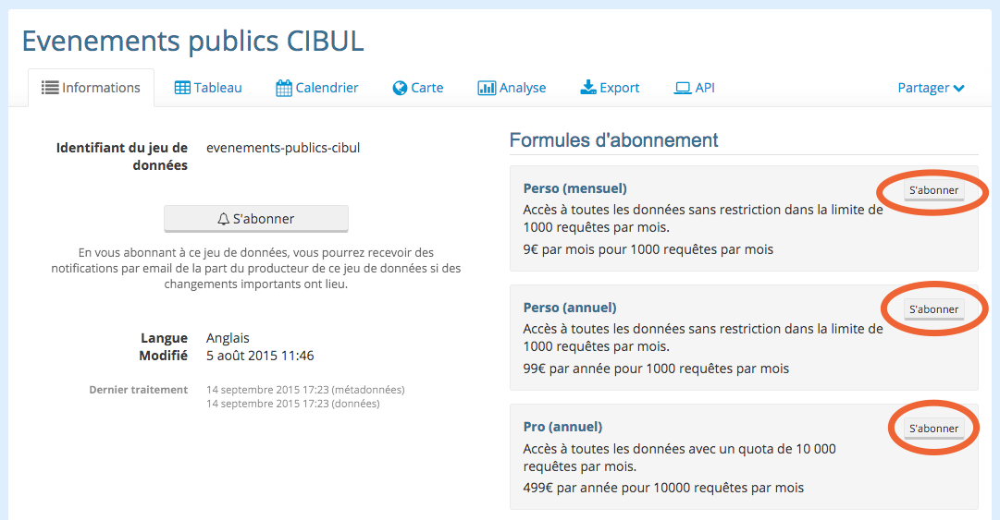
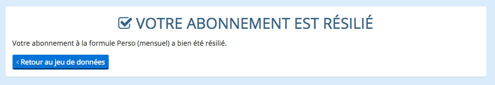
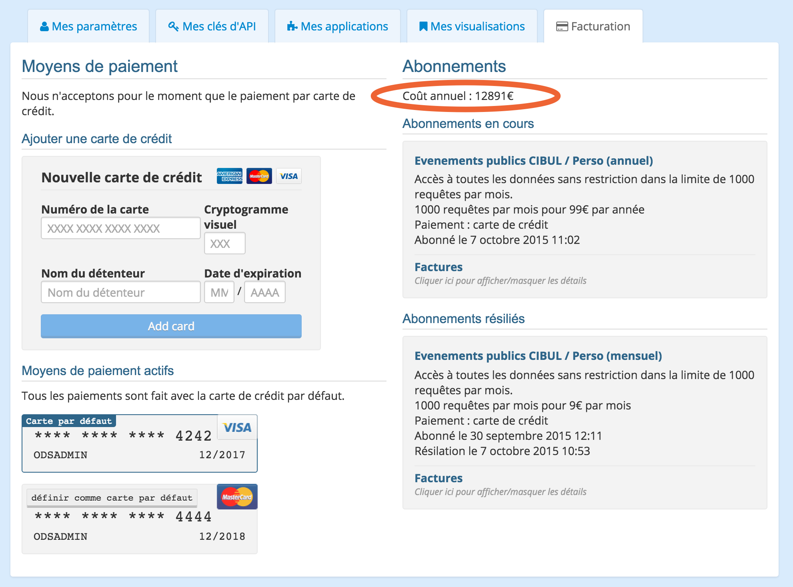
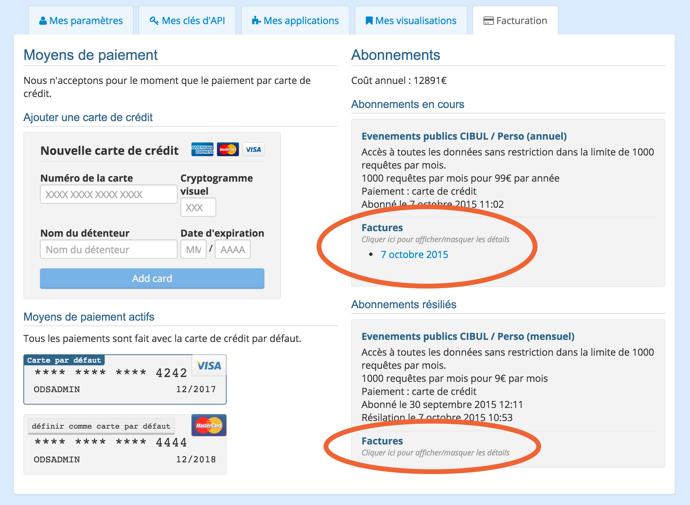

Les abonnements
===============

Sur la page catalogue de la plateforme (onglet Explorer), les jeux de données accessible à travers un abonnement sont
notifiés par un petit message dans la fiche du jeu de données. Il est également possible de filtrer sur ces jeux de
données grace aux filtres sur les vues.

.. image:: billing-subscriptions--explore.png

S'abonner
---------

En arrivant sur la page d'un jeu de données, la colonne de droite de la page information liste les formules
d'abonnement disponibles et propose pour chaque formule un bouton "s'abonner".

Dans le cas où l'utilisateur n'aurait pas encore de carte de crédit configurée, les boutons "s'abonner" sont remplacés
par des liens invitant l'utilisateur à :doc:`ajouter une carte <client_accounts>`.

.. image:: billing-subscriptions--dataset-page-no-card.png

Abonnons-nous maintenant à la formule Perso (mensuel). Le clic sur "s'abonner" nous fait rentrer dans un tunnel
d'abonnement. Celui commence par récapituler la formule d'abonnement à laquelle on compte s'abonner et le moyen de
paiement avec lequel on compte le faire.

.. image:: billing-subscriptions--subscription-tunnel-confirm.png

Afin de valider cette étape, il faut d'une part accepter les conditions de ventes de la plateforme et d'autre part
confirmer qu'on a bien compris que le paiement de la première facture aura lieu immédiatement.

Une fois l'étape validée, un message nous confirme que tout s'est bien passé.

.. image:: billing-subscriptions--subscription-tunnel-success.png

Et il est alors possible de revenir au jeu de données qui mentionne alors que nous sommes abonnés à la formule
"Perso (mensuel)"

.. image:: billing-subscriptions--dataset-page-subscribed.png

Se désabonner
-------------

Toujours depuis la page du jeu de données, si nous voulions nous désabonner, il nous faudrait cliquer sur le bouton
"se désabonner", qui, tout comme le bouton "s'abonner", nous emmène dans un tunnel de résiliation d'abonnement.

.. image:: billing-subscriptions--cancellation-tunnel-confirm.png

Tunnel qui lui aussi se fait en deux étapes, et qui après avoir demandé de confirmer l'intention de résilier
l'abonnement confirme que tout s'est bien passé.

Les factures
------------

Supposons maintenant que nous nous soyons abonnés puis désabonnés au plan Perso (mensuel) pour souscrire au plan
Perso (annuel), plus économique au vu de nos besoins.

En allant sur la page "mon compte" sur la plateforme, nous voyons dans l'onglet "facturation" en colonne de droite la
liste des abonnements en cours et passés. En tête de colonne, une ligne nous rappelle le coût annuel des abonnements en
cours.

Pour chacun de ces abonnement, il est possible de voir la liste des factures en cliquant sur "Factures". Après un petit
temps de chargement, des liens apparaissent vers toutes les factures.

Un clic sur le lien ouvrira dans un nouvel onglet la facture en question, prête à être imprimée.

.. image:: billing-subscriptions--invoice.png

