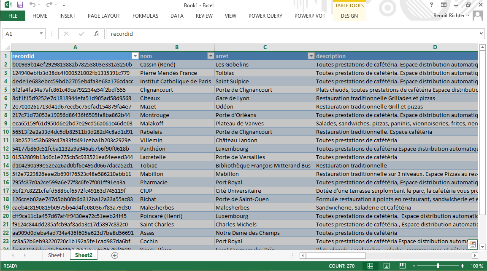
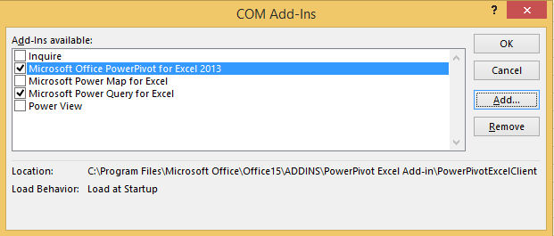
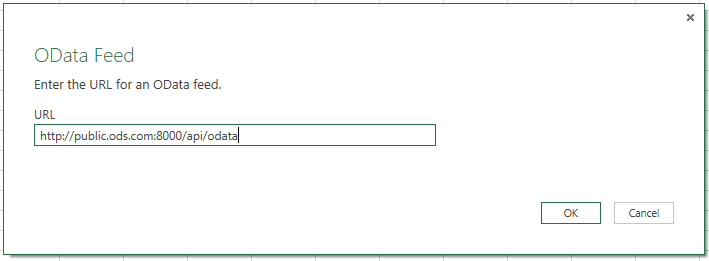

# Intégration dans Microsoft Excel

Dans le présent article, nous allons voir comment récupérer les données d'un service OData OpenDataSoft dans Microsoft Excel. Pour cela, il existe 3 façons de faire.
Tout d'abord, pour la version 2013 de Microsoft Excel, il est possible d'utiliser l'intégration OData native pour récupérer les données. Ensuite, pour les versions 2010 et 2013, il est possible d'utiliser les extensions Microsoft PowerPivot et Microsoft PowerQuery pour récupérer ces données.

## Intégration native

Voici les étapes permettant d'importer des données à partir de l'intégration OData native de Microsoft Excel.

* Pour importer des données depuis le service OData, ouvrez Microsoft Excel, et cliquez sur l'onglet nommé "DATA". Ceci fait, cliquez sur le bouton "From Other Source" pour voir la liste des sources de données supportées. Choisissez "From OData Feed".

* Entrez ensuite l'adresse du service dans la barre d'adresse de la fenêtre qui s'est ouverte. Dans la plateforme OpenDataSoft, l'adresse relative du service OData est "/api/odata/".

* Choisissez ensuite la ou les tables qui serviront de source de données en cliquant sur le petit carré à gauche de l'identifiant du ou des jeu(x) de données qui vous intéresse(nt).

* Après validation, la fenêtre de sélection de destination s'ouvrira, cliquez sur "Ok".

* Vos données apparaissent maintenant dans les cellules de Microsoft Excel.

## PowerPivot

Voici les étapes permettant d'importer des données à partir de PowerPivot pour Microsoft Excel.

* Avant d'utiliser PowerPivot, il est nécessaire de l'activer. Pour cela, rendez vous dans les options de Microsoft Excel, dans l'onglet "Add-Ins". Dans la boîte de sélection multiple nommée "Manage", choisissez "COM Add-ins" et cliquez sur "Go...".

* Dans la fenêtre qui s'ouvre, selectionnez "Microsoft PowerPivot for Excel 2013" si vous utilisez Microsoft Excel 2013, ou "Microsoft PowerPivot for Excel 2010" si vous utilisez Microsoft Excel 2010.

* De retour dans la fenêtre principale de Microsoft Excel, cliquez sur l'onglet "POWERPIVOT" pour afficher la barre de menu PowerPivot. Dans celui-ci, cliquez sur le bouton "Manage" pour afficher la fenêtre de gestion des sources de données PowerPivot.

* Dans la fenêtre de gestion des sources de données PowerPivot, cliquez sur "Get External Data", puis, dans le menu qui apparaît, sur "From Data Service", et dans le deuxième menu qui apparaît, sur "From OData Data Feed".

* Dans la fenêtre d'import qui s'ouvre, entrez l'adresse du service OData de OpenDataSoft dans la barre d'adresse.

* Dans la fenêtre de sélection de tables, sélectionnez la ou les jeu(x) de données qui vous intéressent en cliquant sur le carré à droite de l'identifiant de celle(s)-ci, et cliquez sur "Finish".

* Lorsque la fenêtre de transfert montre un indicateur de succès, fermez la en cliquant sur le bouton "Close" en bas à droite.

* Vous pouvez vérifier l'intégrité de vos données dans la fenêtre de gestion des sources de données, qui montre maintenant les données importées du service OData OpenDataSoft.

* Cliquez sur "PivotTable", puis, dans la liste qui apparaît, sur "PivotTable" pour afficher vos données dans la fenêtre principale de Microsoft Excel.

* Dans la fenêtre de sélection de destination qui apparaît, choisissez la feuille de calcul de destination dans laquelle importer vos données.

## Power Query

Voici les étapes permettant d'importer des données à partir de Power Query pour Microsoft Excel.

* Avant de pouvoir utiliser Microsoft Power Query pour Microsoft Excel, il est nécessaire de le télécharger et de l'activer. Son téléchargement peut être fait sur le site officiel de Microsoft à [cette adresse](http://www.microsoft.com/en-us/download/details.aspx?id=39379). Pour l'activation de l'add-in, veuillez suivre les instructions des points 1.2.1 et 1.2.2.

* Une fois l'add-in téléchargé et activé, retournez sur la fenêtre principale de Microsoft Excel, cliquez sur l'onglet "POWER QUERY" pour afficher la barre de menu Power Query. Dans celle-ci, cliquez sur le bouton "From Other Sources" pour afficher la liste des sources de données supportées dans Power Query.

* Dans la fenêtre qui s'affiche, entrez l'adresse du service OData d'OpenDataSoft et cliquez sur "OK".

* Ceci fait, une fenêtre de navigation Power Query s'affiche sur la droite de la fenêtre principale de Microsoft. Dans celle ci, cliquez sur l'identifiant de la table qui vous intéresse.

* Vos données apparaissent maintenant dans les cellules de Microsoft Excel.
