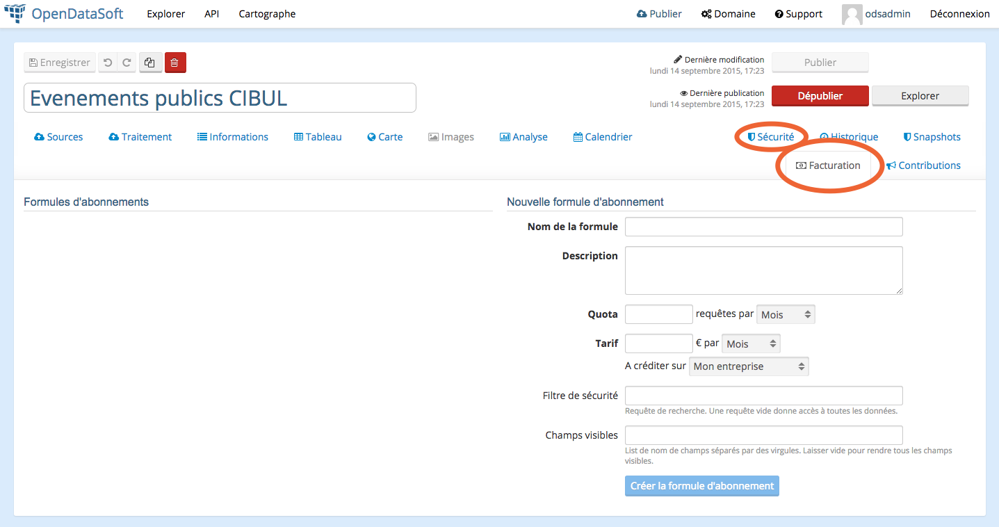
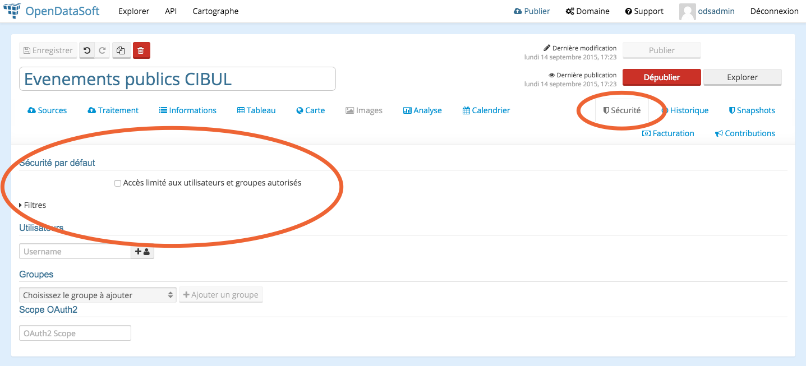

Les formules d'abonnement
=========================

En vous connectant à l'espace de publication d'un jeu de donnée en tant qu'administrateur, vous verrez l'apparition
d'un onglet facturation. C'est dans cet onglet que vous pourrez mettre en place vos formules d'abonnement. Vous verrez
également un onglet sécurité dans lequel vous pourrez instaurer des restrictions pour les utilisateurs non abonnés.

Création d'une formule d'abonnement
-----------------------------------

Pour chaque formule que vous créerez, vous pourrez définir des à la fois un mode de facturation et des restrictions
associées à cette formule. Les futurs abonnés, s'ils ont bien accès à la tarification n'ont en revanche aucune vue sur
les restrictions techniques associées à chaque formule. Il est donc impératif que vous mettiez en place un nom et une
description les plus explicites possibles.

Dans la mesure où la première facturation a lieu lors de la souscription à l'abonnement, il faut que l'utilisateur soit
pleinement conscient de ce à quoi il souscrit.

Facturation
^^^^^^^^^^^

Le formulaire vous permet de définir pour chaque formule un tarif et une fréquence de facturation.

Cela permet en particulier de gérer les cas ou pour des mêmes restrictions on veut proposer plusieurs mode de
facturation. Par exemple 9€ par mois / 99€ par ans, une manière classique d'encourager les utilisateurs à s'inscrire à
des formules les engageant sur un plus long terme.

Restrictions
^^^^^^^^^^^^

Comme pour le reste de la sécurité sur la plateforme OpenDataSoft, il existe 3 leviers pour mettre en place des
restrictions :

* Imposer un quota journalier/hebdomadaire/mensuel/annuel sur le nombre de requêtes.
* Filtrer les enregistrements du jeu de données via une requête de recherche (voir
`la documentation de l'API <query_language_and_geo_filtering>`_ relative à ce sujet). Une requête laissée vide n'impose
aucune restriction. Pour ne rien lister, il suffit de rentrer une requête ne renvoyant aucun résultat.
* n'afficher qu'un sous ensemble des champs du jeu de données en listant les champs visibles (sous forme de noms
séparés par des virgules)

Utilisateurs non abonnés
------------------------

Des utilisateurs non abonnés vont également vouloir accéder à votre jeu de données. Il faut définir pour eux des
restrictions spécifiques dans l'onglet sécurité.

En cliquant sur le bouton "Filtres" vous ferez apparaitre deux champs vous permettant de définir une requête de
recherche (pour filtrer les enregistrements) et la liste des champs visibles. Ce sont les mêmes restrictions que celles
offertes par les formules d'abonnement mais elles s'appliquent à tous les utilisateurs non abonnés.

Lorsqu'un utilisateur s'abonne, les restrictions "par défaut" sont alors remplacées par les restrictions liées à
l'abonnement.

Cas des jeu de données privés
^^^^^^^^^^^^^^^^^^^^^^^^^^^^^

Vous pouvez également décider de définir le jeu de données comme privé en cochant la case "Accès limité aux
utilisateurs et groupes autorisés". Ce faisant le jeu de données ne sera plus ni visible ni accessible que par les
utilisateurs explicitement autorisés à le faire. Pour ces utilisateurs, les restrictions par défaut (celles définies
pour les utilisateurs non abonnés) s'appliquent.

Il est également possible de définir des restrictions (toujours via les mêmes leviers : liste des champs et filtre de
recherche) pour chacun des utilisateurs que vous avez ainsi explicitement autorisé. Celles-ci s'appliquent alors à
l'utilisateur tant qu'il ne souscrit pas à un abonnement. Auquel cas les restrictions de l'abonnement sont celles qui
s'appliquent.

Modification d'une formule d'abonnement
---------------------------------------

Suppression d'une formule d'abonnement
--------------------------------------

Impacts sur le cycle de vie d'un jeu de données
-----------------------------------------------

Impossible de modifier ?
Impossible de dépublier ?

