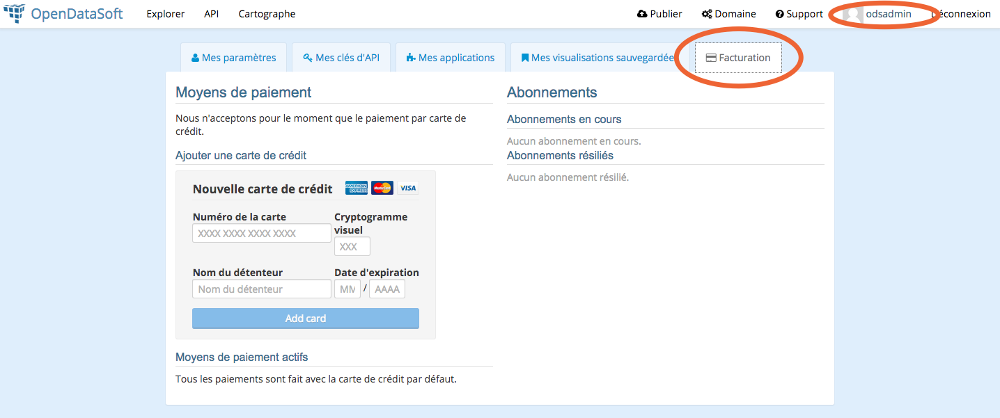
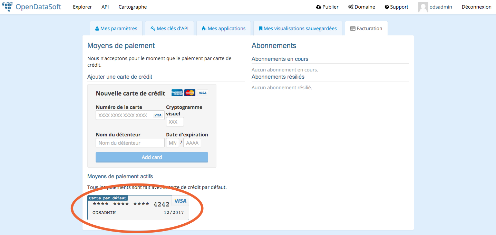

Les comptes clients
===================

Tout utilisateur sur la plateforme dispose automatiquement d'un compte client. Celui-ci est accessible dans la page de
gestion du compte utilisateur, onglet facturation.

Dans cet onglet vous pouvez configurer des cartes de crédit qui serviront à vous abonner aux différentes formules
offertes sur les jeux de données.

Confidentialité et sécurité
---------------------------

Il se peut que vous ne voyiez pas dans la barre d'adresse de votre navigateur le petit cadenas indiquant que la
connexion avec le serveur est chiffrée. Cela n'impacte en rien la sécurité et la confidentialité de vos informations.
En effet, celles-ci ne transitent jamais sur nos serveurs. Elles sont communiquées directement depuis votre machine à
Stripe via une connexion hautement sécurisée. Stripe en retour ne nous communique qu'un token nous permettant d'utiliser
cette carte pour vos abonnements.

Une fois les informations de carte bancaire rentrées, un résumé est affiché. Ce résumé contient la totalité des
informations que Stripe met à notre disposition : les seuls 4 derniers chiffres du code de carte, la date d'expiration
et le nom du titulaire.

Pour plus d'informations sur le fonctionnement des paiements sécurisés avec Stripe, vous pouvez consulter leur
`très complète documentation (en anglais) <https://stripe.com/docs>`_

La carte par défaut
-------------------

Bien qu'il soit possible de configurer dans votre compte plusieurs cartes bancaires pour vos abonnements, seule la carte
par défaut est utilisée pour payer les factures. Vous pouvez changer à tout moment votre carte par défaut en cliquant
sur le bouton prévu à cet effet.

.. image:: client-account--multiple-cards.png

Abonnements et factures
-----------------------

La colonne de droite liste vos abonnements actifs et résiliés. Pour en savoir plus, rendez vous sur
:doc:`la page de documentation dédiée aux abonnements<billing_subscriptions>`.
