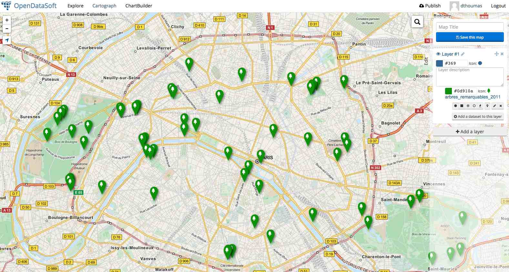

# Visualizing Datasets

OpenDataSoft lets you explore datasets content with a rich search based experience. It also makes it possible to visualize datasets content on charts and maps.

### Displaying dataset content on a map

This can be achieved simply by switching to the *map tab* in the dataset explore console. For that tab to be available, your dataset must contain a *geo point* or a *geo shape* field. 

### Displaying dataset content on a chart

This can be achieved by switching to the *analysis tab* in the dataset explore console. For that tab to be available, your dataset must contain facets or date(time) fields.

### Building advanced geo mashups

**Cartograph** lets you build advanced geo mashups, combining various datasets on the same map and finely tuning their representation. Cartograph can either be accessed from the main menu links (if they have been configured by the domain administrator) or from its direct URL: *http://mydomain.opendatasoft.com/map*.

### Building advanced charts

**ChartBuilder** lets you build advanced charts, combining on the same chart various datasets. ChartBuilder only supports time series representation for now. It can be accessed either from the menu links (if they have been configured by the domain administrator) or from its direct URL: *http://mydomain.opendatasoft.com/chart*.

### Reusing a visualization

Any visualization built with OpenDataSoft can easily be reused as is.

The above widget, which is made available within any of the data visualization authoring tools, let's you share a visualization in various ways:

* As a *Share* link, to share a direct access to the visualization
* As an *Embed* code, to embed the visualization in an iframe on a remote web site
* As a *Widget* code, to integrate the visualization as a widget in a content page using the OpenDataSoft ods-widgets framework

### Saving a visualization

Cartograph and ChartBuilder based data visualizations can be saved. The save option is only available to users with an account on the domain.

Saved visualizations can be accessed from the user profile (top menu link).

