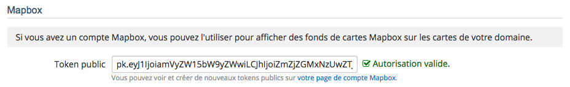
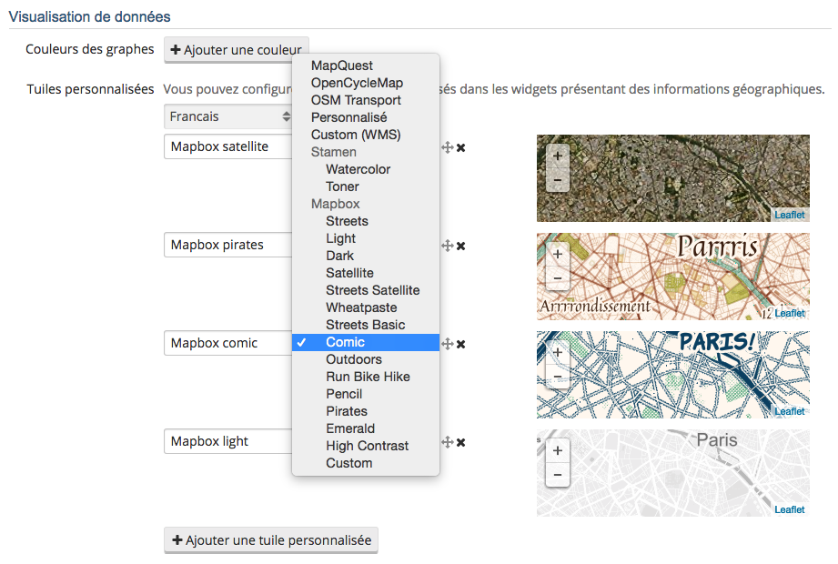

# Intégration Mapbox

[Mapbox](https://www.mapbox.com/) est une plateforme de cartographie permettant de construire et dessiner ses propres 
cartes. Cette plateforme met également à disposition de tous une dizaine de fonds de carte. Si vous avez un compte 
Mapbox, vous pouvez configurer la plateforme OpenDataSoft afin que vos utilisateurs puissent utiliser ces fonds de carte
dans leurs propres cartes.

Si vous n'avez pas de compte sur Mapbox, vous pouvez en créer un gratuitement. Attention, celui-ci ne permet qu'un 
nombre limité de vues. Vous pouvez vous référer aux [abonnements Mapbox](https://www.mapbox.com/plans/) pour plus 
d'information.

Une fois connecté sur le site de Mapbox avec votre compte, allez sur 
[votre page profil](https://www.mapbox.com/account/apps/) et copiez-y une de vos clefs (Token) publiques 
("Default Public Token" ou tout autre "Public acess token"). C'est ce token qui permettra à OpenDataSoft d'utiliser 
les fonds de carte Mapbox.

Allez maintenant sur votre page de configuration de domaine, onglet *Intégrations*. Vous y trouverez un formulaire de 
configuration Mapbox où vous pourrez entrer votre token. Un message vous confirmera alors que celui-ci 
est valide (ou invalide le cas échéant).

En allant alors dans l'onglet *Personnalisation* vous pourrez configurer les *tuiles personnalisées*. Vous pourrez 
sélectionner les fonds de carte Mapbox, ceux par défaut comme ceux que vous aurez créés (il faudra alors juste entrer 
le code identifiant ce fond de carte).

