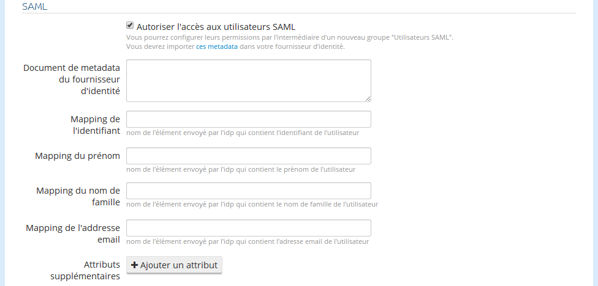

# Support SAML

La plateforme OpenDataSoft supporte le standard SAMLv2.
Ce support permet de créer une fédération d'identité entre votre domaine, qui joue le rôle de fournisseur de service, et un fournisseur d'identité que vous maîtrisez.
Cette fédération permettra aux utilisateurs de votre domaine de se connecter auprès du fournisseur d'identité configuré, et, le cas échéant de réutiliser leur connexion active auprès de celui-ci afin de créer une authentification unique (SSO).

### Configurer son domaine avec un fournisseur d'identité

1. Rendez vous sur la page de configuration des intégrations du domaine.

    

2. Activez l'option "Autoriser l'accès aux utilisateurs SAML".

    

3. Collez le document de metadata de votre fournisseur d'identité dans le champ "Document de metadata de l'IDP".

4. Renseignez les mappings d'attributs pour le nom d'utilisateur, le nom de famille, le prenom et l'adresse email.

    Il s'agit ici de remplir les champs correspondant avec le nom de l'attribut tel qu'envoyé par le fournisseur d'identité.
    Par exemple, si votre fournisseur d'identité renseigne le prénom de l'utilisateur qui se connecte en appellant cet attribut "FirstName", c'est ce qu'il faudra écrire dans le champ "prénom".
    Si certaines de ces informations ne sont pas fournies par votre fournisseur d'identité, laissez les champs vides. La plateforme les génerera automatiquement sur base des autres attributs définis.

5. Renseignez les mappings et types des autres attributs éventuellement renvoyés par votre fournisseur d'identité. 

    Si par exemple votre fournisseur d'identité envoie en plus des éléments de base la liste des allergies des utilisateurs connectés sous le nom d'attribut "Allergies", vous pouvez déclarer un mapping d'attribut au nom "Allergies" et au type "Liste". Cela vous permettra de créer des filtres de données intéressant en combinaison avec la fonction `attr`.

### Configurer le fournisseur d'identité

La configuration du fournisseur d'identité dépend de l'implémentation de celui-ci, mais elle consiste toujours en l'import du document de metadata du fournisseur de service.
Vous pouvez télécharger le document de metadata du fournisseur de services OpenDataSoft en vous rendant sur https://\<VOTRE DOMAINE\>.opendatasoft.com/saml2/metadata.xml

