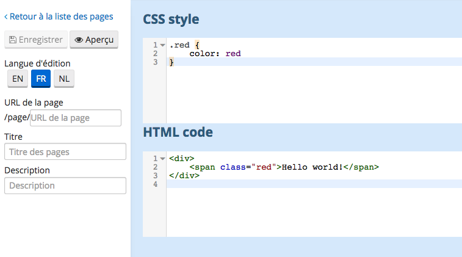

# Les pages de contenu

Not only the OpenDataSoft platform allows you to browse and explore configured datasets. You can also use it to build 
fully customized content pages, mixing editorial content as well as data visualizations built from your domain's datasets.

La plateforme OpenDataSoft ne se contente pas de vous permettre d'explorer des jeux de données préconfigurés. Elle vous 
permet aussi de créer des pages de contenu totalement personnalisées mélangeant contenu éditorial et visualisations des 
jeux de données de votre domaine.

Les pages de contenu peuvent servir à :

* Compléter et organiser votre portail de données en configurant une page d'accueil et en ajoutant des pages dédiées à 
des sujets spécifiques.
* Construire et publier (en lien direct ou en embarqué au sein d'un autre site) des pages éditoriales riches.
* Créer des tableau de bord dynamic

## Création d'une nouvelle page de contenu

Pour créer une nouvelle page de contenu, il vous faut aller sur *Domaine > Portail > Pages*.

Cliquez ensuite sur le bouton "Nouveau". L'écran d'édition de page s'affiche alors.

Avant de pouvoir sauvegarder une page, vous devrez configurer l'**URL de la page** (*page_1* dans l'exemple ci-dessus).

*Attention* : si votre domaine est configuré de manière à supporter plusieurs langages, vous devrez configurer votre 
page (titre, description et contenu de la page) dans chacun de ces langages. 

Le sélecteur de templates vous permet de choisir entre plusieurs formats de pages prêt à l'emploi. Vous pouvez toutefois
toujours choisir d'éditer la page en mode expert. Ce mode est beaucoup plus puissant car il permet de définir très 
exactement le contenu de la page et sa mise en page.

Vous pouvez passer en mode expert depuis tous les templates. En revanche une fois en mode expert, vous ne pouvez pas 
revenir au mode précédent.

Le mode expert vous permet de travailler indépendemment sur le contenu de votre page (en HTML5) et son style (CSS). 
Aucun code Javascript n'est permis, et la plateforme supprimera tout Javascript qu'elle trouverait dans une page. En 
revanche, l'interface d'OpenDataSoft étant construite sur AngularJS, vous pouvez utiliser les **bindings** AngularJS 
dans vos pages.

Le bouton aperçu permet de visualiser l'état actuel de la page même si celle ci n'est pas sauvegardée.

## A propos de la bibliothèque ods-widgets

Vous voudrez très certainement utiliser la bibliothèque ods-widgets dans le code de vos pages (en mode expert 
uniquement) car celle-ci permet d'y intégrer nativement des visualisations de données.

Cette bibliothèque remplace avantageusement les limitations des classiques IFrames:

* Les IFrames génèrent une forte charge dans le navigateur
* Les IFrames ne peuvent intéragir les unes avec les autres

Ods-widgets est une bibliothèque Open Source basée sur le framework AngularJS, développée et maintenue par OpenDataSoft 
sur [GitHub](https://github.com/opendatasoft/ods-widgets). Elle s'accompagne d'une 
[documentation en ligne](https://opendatasoft.github.io/ods-widgets/docs/) complète et exhaustive. 

Vous pouvez l'utiliser directement dans les pages de contenu de votre domaine (nul besoin de charger/initialiser la
bibliothèque, la plateforme s'en charge) comme dans des pages externes sur des sites tiers (en la traitant comme une 
boite à outils indépendante).

## Embarquer des pages de contenu

Il est possible d'embarquer une page de contenu OpenDataSoft comme vous le feriez avec n'importe quelle visualisation 
de données sur OpenDataSoft. Il vous faudra juste passer la paramètre HTTP `headless` à `true` dans l'URL de la page.
Par exemple: `http://mydomain.opendatasoft.com/page/mypage/?headless=true`.

## Mise à jour du menu sur le domaine

Une fois votre page de contenu finalisée, vous voudrez sans doute l'injecter dans le menu de votre domaine. Il suffit 
pour cela de modifier la liste des éléments du menu dans la partie *Domaine > Portail > Paramètres globaux*.

