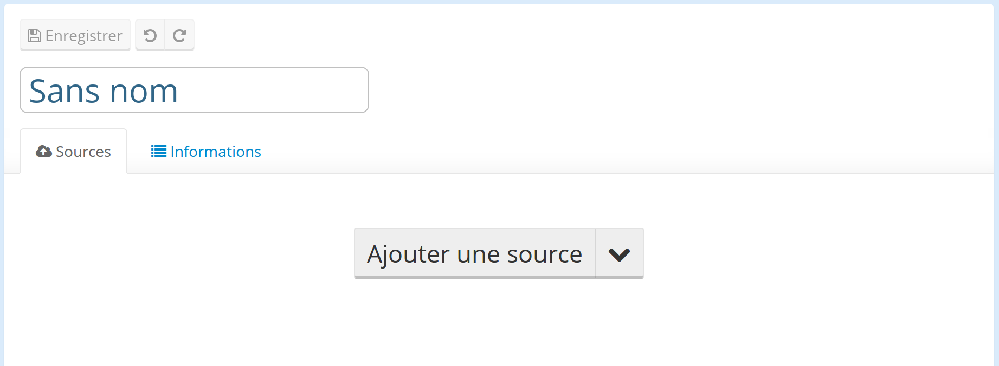
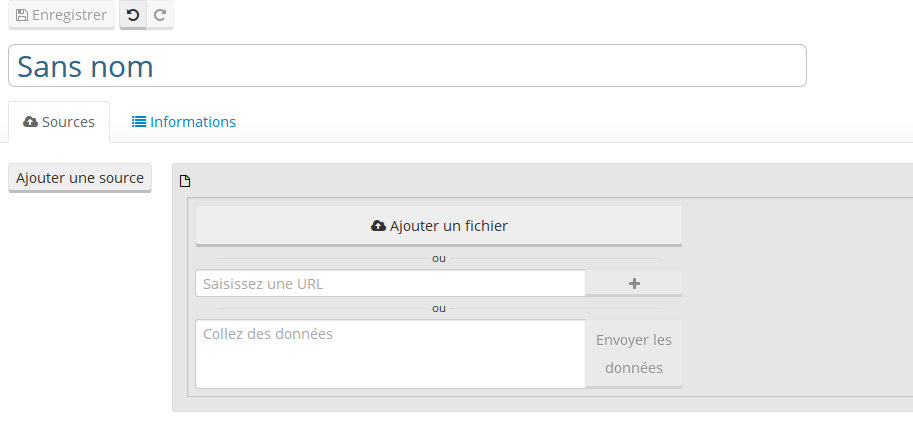

# Créer un jeu de données

Pour créer un nouveau jeu de données, rendez vous sur la console de publication en appuyant sur le bouton "Publier", présent sur la droite du bandeau de navigation. Ce bouton n'apparaît pas pour les utilisateurs qui n'ont pas les droits de publication sur le domaine.

Vous pouvez aussi vous rendre sur la console de publication en vous rendant directement sur l'URL https://<NOM DE DOMAINE>.opendatasoft.com/publish.

### Créer et publier un nouveau jeu de données

Le processus de création de jeux de données est très simple:

1. Cliquez sur "Nouveau".

    

2. Ajouez une nouvelle source de données en cliquant sur le bouton "Ajouter une source".

    

    Cette étape n'est pas strictement nécessaire: vous pouvez créer un jeu de données sans source de données, en ajoutant simplement des métadonnées dans l'onglet "information".

3. Définissez votre source de données.

    

    Vous avez plusieurs possibilités:

    * **Ajouter un fichier** au format supporté par la plateforme.
    * Spécifier une **URL** (HTTP, HTTPs ou FTP) qui pointe vers un fichier au format supporté par la plateforme.
    * Spécifier une **URL** qui pointe vers un point d'entrée d'API supporté par la plateforme.
    * **Collez de la données**, par exemple en effectuant un copier-coller depuis une feuille de calcul Excel.

    Il vous est possible de définir plusieurs ressources pour un jeu de données unique. Cependant, chacune de ses ressources doivent impérativement être organisées selon le même *schéma de données* (par exemple, en ajoutant un fichier CSV et un fichier XMLS, dont les noms des colonnes sont identiques).

4. **Sauvegardez** et **Publiez** votre nouveau jeu de données.

    

### Types de fichiers supportés

La table suivante reprend les formats supportés et décrit les options de configuration pour chacun de ceux-ci.

<table>
<tr><th>Format</th><th>Extensions</th><th>Description</th></tr>
<tr><td>CSV</td><td>.csv, .tsv, .txt, .dat</td><td>La plateforme vous permet de configurer l'encodage du fichier, le délimiteur ainsi que d'autres options utiles.</td></tr>
<tr><td>Microsoft Excel</td><td>.xls, .xlsx</td><td></td></tr>
<tr><td>Feuilles de calcul OpenDocument</td><td>.ods</td><td></td></tr>
<tr><td>GeoJSON</td><td>.json, .geojson</td><td></td></tr>
<tr><td>JSON</td><td>.json</td><td>Les documents JSON simples sont supportés. La plateforme vous permet de spécifier le chemin vers la racine (contenant une liste d'objets à considérer comme des lignes distinctes) et le chemin des propriétés (vers l'objet qui détient l'ensemble des champ pour chaque ligne).</td></tr>
<tr><td>KML</td><td>.kml</td><td></td></tr>
<tr><td>Shapefile</td><td> .zip</td><td>Une archive zip contenant au moins les fichiers suivants: <NOM>.shp, <NOM>.dbf, <NOM>.prj</td></tr>
<tr><td>MapInfo</td><td>.zip</td><td>Une archive zip contenant soit les fichiers <NOM>.mid et <NOM>.mif, soit les fichiers <NOM>.map, <NOM>.tab, <NOM>.id et <NOM>.dat</td></tr>
<tr><td>OpenStreetMap</td><td>.osm</td><td></td></tr>
</table>

Le support des formats de fichiers peut être étendu pour répondre à des besoin spécifiques (par exemple pour supporter des DTD XML complexes ou des formats de données à plat non standard). N'hésitez pas à contacter l'équipe de support pour obtenir plus d'information sur l'extension du support des formats.

La plateforme OpenDataSoft supporte les fichiers compressés (zip et bzip2).

### Connexion à un point d'entrée d'API distant

Dans certains cas il est utile de *connecter* un jeu de données à une source de données externe qui expose ses données sur une API HTTP.

La plateforme OpenDataSoft supporte nativement les APIs suivants (contactez l'équipe de support pour les activer sur votre domaine):

 * [L'API JCDecaux Developer](https://developer.jcdecaux.com/)
 * [L'API REST ArcGIS](http://resources.arcgis.com/en/help/rest/apiref/)
 * [L'API HTTP Netatmo](https://dev.netatmo.com/doc)

OpenDataSoft peut également développer et intégrer des APIs web spécifiques. Notre toolkit dédié permet de développer des connecteurs performants et sécurisés supportant le traitement incrémental des fichiers.
