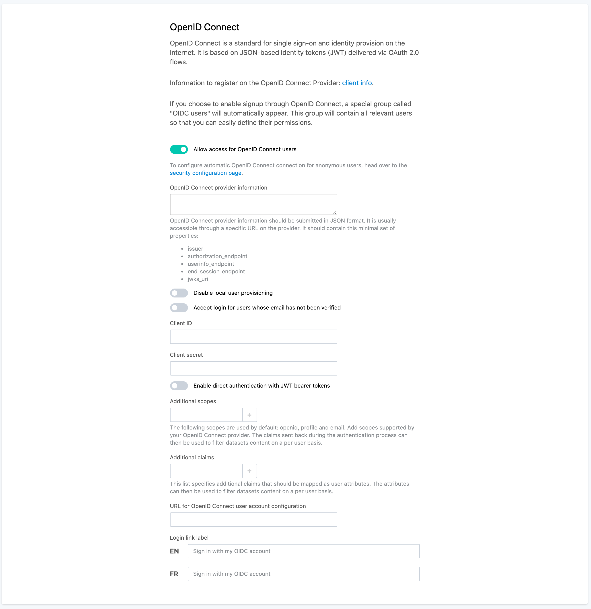

Single sign-on with OpenID Connect
==================================

.. admonition:: Caution
   :class: caution

   The availability of this feature depends on the license of the Opendatasoft domain.

Register your OpenID Connect provider on your domain
----------------------------------------------------

1. Navigate to the signup page in the domain configuration interface.

2. Check "Allow access for OpenID Connect users"

3. Copy your provider discovery document in the "OpenID Connect provider information field".

   This document should be formatted in JSON and can usually be retrieved from your provider endpoint. It must at least contain
   the following attributes:

   - ``issuer``
   - ``authorization_endpoint``
   - ``userinfo_endpoint``
   - ``end_session_endpoint``
   - ``jwks_uri``

4. If you would like to disable local user creation, making sure only existing users can connect to the platform through OpenID Connect, check the "Disable local user provisioning" checkbox.

5. Input the application credentials associated with your Opendatasoft domain.

   As you have registered your Opendatasoft domain as an OpenID Connect client on your provider, you should get a pair of
   credentials, namely ``Client ID`` and ``Client secret``.

   These credentials are used to authenticate requests made by the Opendatasoft plateform on the provider endpoint.

   Simply copy these credentials in the "Client ID" and "Client secret" fields.

6. If you would like to use JWT tokens to impersonate API calls on the Opendatasoft platform, check the "Enable direct authentication with JWT bearer tokens" checkbox.

7. List optional additional scopes

   Scopes in OpenID Connect are used to define the set of information (claims) an application would like to receive about a connected user.
   By default, Opendatasoft uses the following scopes: openid, profile and email. These scopes make it possible to authenticate a user
   and to retrieve their email, first name and last name.

   You can use additional scopes to add claims as additional attributes in a user's profile and use them in
   :doc:`datasets security filters </configuring_domain/01_managing_security/portal>`

8. List optional additional claims

   Claims are attributes that are collected during the authentication process and that describe the user. By default, Opendatasoft only
   stores the `sub` claim. It is possible to store additionnal claims in the user profile. These claims can then be used in
   :doc:`datasets security filters </configuring_domain/01_managing_security/portal>`.

9. Input the URL on which the user can edit their user profile on the identity provider. When set, a link to this URL will be shown to the user in their user account page. If left blank, no URL will be shown to the user in their account page.

10. Customize the OpenID Connect login link text. If left blank, a localized default message will be displayed.

Register your domain on your identity provider
----------------------------------------------

The configuration of the identity provider is implementation-dependant, but it usually consists into specifiying on the identity provider
the value of the redirection URI, which should be under the form ``https://<YOUR DOMAIN>/oidc/authenticate``.

Some providers may support a preformated configuration document in JSON format. This document can be downloaded from the following
address: ``https://<YOUR DOMAIN>/oidc/client_info``

Single logout
-------------

The Opendatasoft platform supports single logout with OpenID Connect by means of the draft protocol OpenID Connect Back-Channel Logout.

