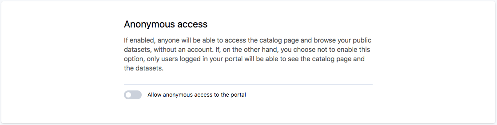
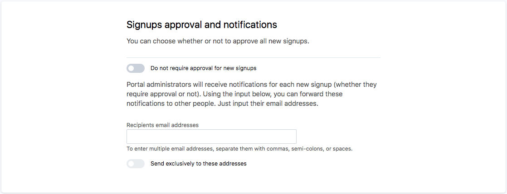
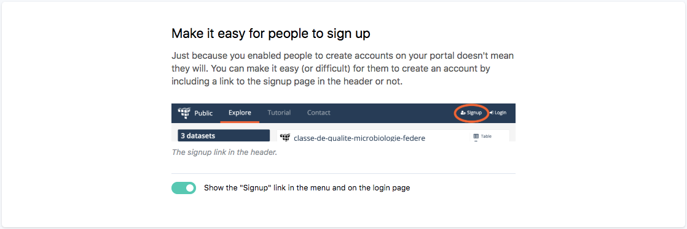
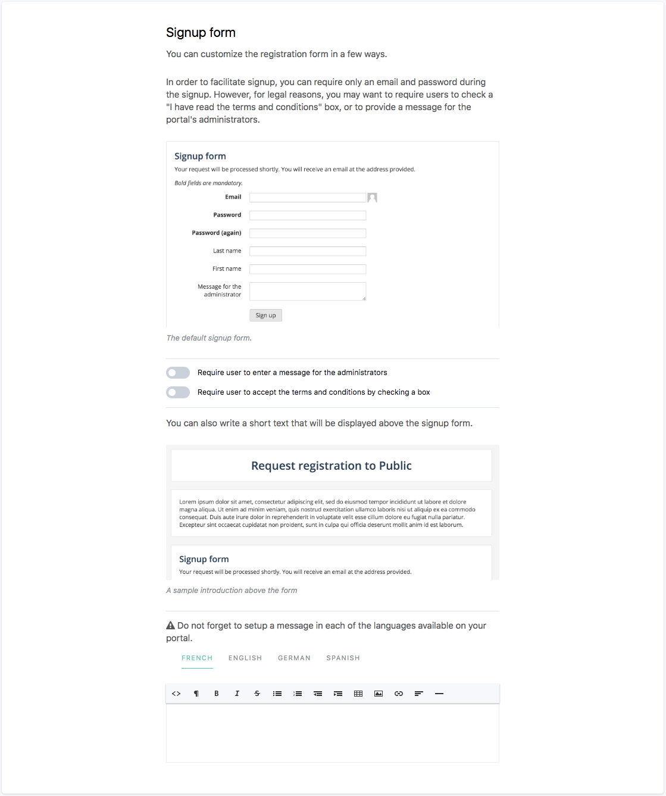
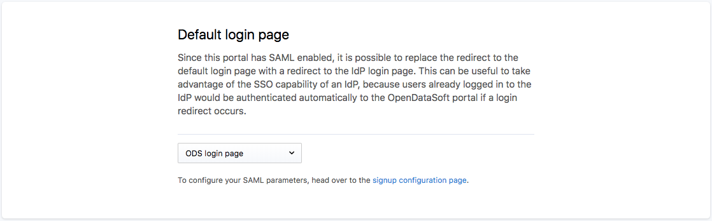

Configuring your portal's general security policy
=================================================

Public or private?
------------------

The most important choice is whether your portal should be public or private. That is whether you want anonymous users
to be able to access the portal or if you'll require people to signup before they can access anything.

.. important::

   Making your portal public doesn't mean that anybody will have access to all of the datasets! You'll always be able
   to limit what the general public can see through the use of sensible default security parameters for your datasets
   and explicit parameters on each single dataset.

   See the :doc:`dedicated section </publishing_data/09_managing_dataset_security/security>` for more information about dataset
   security.

This setting can be found in the **security** subsection of the **configuration** section of your portal's backoffice.

Note that if you decide not to allow anonymous users to access your portal, they will be redirected to the login page
unless you'd rather they land on a specific page you've written.

Signup policy
-------------

No matter your choice of public or private, you can then decide on who will be able to become a registered member of
your portal. In order to do this, go to the **Configuration/Signup** subsection of your portal's backoffice.

Closed signup policy
~~~~~~~~~~~~~~~~~~~~

If you decide not to allow people to signup freely, the only way of adding members to your portal will be through
:doc:`direct email invitation </managing_domain/01_managing_users_and_groups/users>`.

Open signup policy
~~~~~~~~~~~~~~~~~~

If on the other hand you allow people to register, you'll then have to decide whether you want to manually approve each
access request to your portal or not. Note that whatever your decision, each member of the portal able to manage users
will receive a notification for each new access request.

Do not forget to add the signup button to your header's menu or people won't see a signup form until they try to access
a restricted area of your portal.

The signup process is usually very straightforward: an email, a password and that's it. You can however decide to
customize the experience by setting up a custom text as disclaimer, request users to accept your terms and conditions
and even require that they leave a message for the portal's administrator (useful when you want to manually approve
access requests).

User session timeout
--------------------

By default, all authenticated users are automatically logged out after a 2-week inactivity period. This duration can
be changed in the **Configuration/Security** section of the backoffice.

Note that every user request to the portal resets the timeout, so sessions can actually last longer than the
timeout duration.

Single sign-on
--------------

If your organisation already has its own identity management system, you can set up a bridge between your identity
provider and your Opendatasoft portal. This will give general access to your portal to each of
your organisation's members.

Opendatasoft supports two types of identity providers:

- :doc:`SAML 2.0 ready identity providers </configuring_domain/01_managing_security/saml>`
- :doc:`OpenID Connect ready identity providers </configuring_domain/01_managing_security/oidc>`

About local users and linked users
~~~~~~~~~~~~~~~~~~~~~~~~~~~~~~~~~~

When a **SAML** or an **OpenID Connect** identity provider is configured on a domain, a user can belong to 3 categories.

- A standard **Opendatasoft user** that was invited by e-mail or signed-up on a domain: this user logs in on the domain using the standard sign-in interface with their usual Opendatasoft username and password, and the account is accessible on the whole Opendatasoft network. Opendatasoft users are represented throughout the platform with the |icon-world| pictogram.

- A **local user** that authenticates through the organization's identity provider: this user logs in on the domain exclusively via the organization's identity provider, and as it is only available on a specific domain, it can be limited in the use of features relying on the Opendatasoft network. Local users are represented throughout the platform with the |icon-id-card| pictogram.

- A **linked user** that has a standard Opendatasoft account, but associated on this specific domain with an identity from the organization's identity provider. This user is a standard Opendatasoft user that can both authenticate through the Opendatasoft sign-in interface and the organization's identity provider. Since linked users are Opendatasoft users with SAML authentication abilities, they are represented throughout the platform with both the |icon-world| and the |icon-id-card| pictograms.

**Local user**

Every user that has a user account on the identity provider trusted by a domain and doesn't have an Opendatasoft user account can connect through. During the first connection, a local user will be created for the user based on the domain's identity provider settings.

These local users have the permission to explore the public datasets of the domain by default. Extra permissions can be given to these users at the domain level, on individual datasets or via groups (other than the ``SAML users`` or ``OpenID Connect users`` groups, of which they are automatically members).

The creation of new local users via an identity provider authentication can be disabled using the "Disable local user provisioning" checkbox in the identity provider configuration (SAML or OpenID Connect) configuration. Disabling local user provisioning will however not prevent existing local users from signing.

**Linked user**

Users that have an Opendatasoft user account can link this account to another account at the identity provider. This procedure is called account linking.

After the link has been established, linked users who log in through through their identity provider will be logged in to their Opendatasoft user account. They'll still be able to lo in with their Opendatasoft password though.

There are 2 methods for linking an Opendatasoft user account:

- The first one is to click on ``Link your account to a SAML account on this domain`` or ``Link your account to an OpenID connect account on this domain`` in the identity tab of the user account settings:

.. image:: /managing_account/07_managing_identities/images/account_identities.png
    :alt: "Link your account to a SAML account on this domain" link in the identity tab of the user account settings

- The other method is to create the link during the user account creation process by clicking the link to complete the registration through SAML. This actually speeds up the user account creation process and allows for a quick account linking:

.. image:: images/saml__validation-link--en.png
    :alt: Account registration in SAML enabled domains

.. admonition:: Note
   :class: note

   Linking during sign-in is only supported with SAML identity providers.

Default login page selection
~~~~~~~~~~~~~~~~~~~~~~~~~~~~

The Opendatasoft platform allows to choose the login page that will be displayed to users when they click on a login link
or try to access a restricted page.

If the identity provider login page is selected as default, the authentication flow (SAML or OpenID Connect) will be initiated automatically if an anonymous user clicks on the login link or try to access a restricted page like the backoffice. When the Iidentity provider login page is selected, users who wish to connect to the platform using their Opendatasoft credentials have the option to do so by manually visiting the domain login page at ``https://<platform-url>/login/``.

Using user attributes to filter data
~~~~~~~~~~~~~~~~~~~~~~~~~~~~~~~~~~~~

Users which have been logged in through identity federation (SAML 2.0 or OpenID Connect) may have been set specific profile attributes. 
These attributes can be used to filter the content of the datasets these users can access.

To do so, you can edit the :doc:`security configuration </publishing_data/09_managing_dataset_security/security>` of a specific dataset 
and use the #attr function in the filter query of the **SAML** or **OpenID Connect** security  group attached to the dataset. 
This way, users belonging to these groupes will only be able to see dataset records which match the filtering query as explained below.

Through the #attr function, it is possible to filter dataset records in such a way that the only records returned are the ones that match
a value set in the user attributes sent by the identity provider. For the following examples, we assume that we have the 3 users, with respective
usernames and SAML attributes ``user-country`` and ``user-language`` given by the following table.

.. list-table::
   :header-rows: 1

   * * User
     * user-country
     * user-language
   * * User1
     * France
     * French
   * * User2
     * Canada
     * French
   * * User3
     * United States
     * English

And a dataset with records given by the following table.

.. list-table::
   :header-rows: 1

   * * country
     * language
     * message
   * * Worldwide
     * English
     * Hello world
   * * France
     * French
     * Bonjour à tous les Français
   * * Canada
     * French
     * Bonjour à tous les Canadiens
   * * Canada
     * English
     * Hello to all Canadians
   * * United States
     * English
     * Hello to all Americans

We can restrict these users so that they see only messages that apply to their respective countries, with the query ``#attr(country, user-country)``.

User1 sees

.. list-table::
   :header-rows: 1

   * * country
     * language
     * message
   * * France
     * French
     * Bonjour à tous les Français

User2 sees

.. list-table::
   :header-rows: 1

   * * country
     * language
     * message
   * * Canada
     * French
     * Bonjour à tous les Canadiens
   * * Canada
     * English
     * Hello to all Canadians

User3 sees

.. list-table::
   :header-rows: 1

   * * country
     * language
     * message
   * * United States
     * English
     * Hello to all Americans

We can also restrict these users so that they only see messages that are in their respective language, with the query ``#attr(language, user-language)``.

User1 sees

.. list-table::
   :header-rows: 1

   * * country
     * language
     * message
   * * France
     * French
     * Bonjour à tous les Français
   * * Canada
     * French
     * Bonjour à tous les Canadiens

User2 sees

.. list-table::
   :header-rows: 1

   * * country
     * language
     * message
   * * France
     * French
     * Bonjour à tous les Français
   * * Canada
     * French
     * Bonjour à tous les Canadiens

User3 sees

.. list-table::
   :header-rows: 1

   * * country
     * language
     * message
   * * Worldwide
     * English
     * Hello world
   * * United States
     * English
     * Hello to all Americans

Since it is a function of the query language, it can also be grouped with the usual operators, for instance, we can restrict users to only seeing messages that fit their country and languages with the query ``#attr(language, user-language) AND #attr(country, user-country)``.

User1 sees

.. list-table::
   :header-rows: 1

   * * country
     * language
     * message
   * * France
     * French
     * Bonjour à tous les Français

User2 sees

.. list-table::
   :header-rows: 1

   * * country
     * language
     * message
   * * Canada
     * French
     * Bonjour à tous les Canadiens

User3 sees

.. list-table::
   :header-rows: 1

   * * country
     * language
     * message
   * * United States
     * English
     * Hello to all Americans

