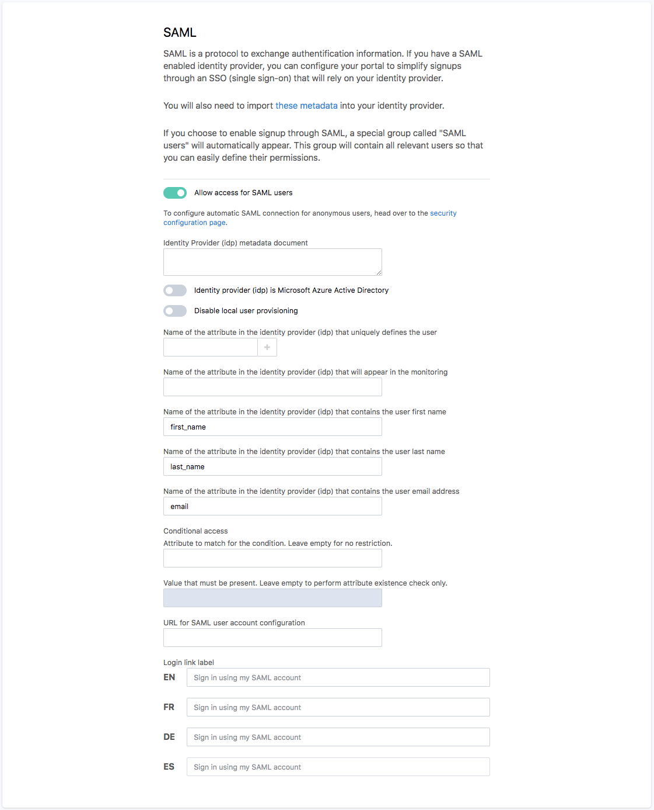

Single sign-on with SAML
========================

.. admonition:: Caution
   :class: caution

   The availability of this feature depends on the license of the Opendatasoft domain.

Register your SAML identity provider on your domain
---------------------------------------------------

1. Navigate to the signup page in the domain configuration interface.

2. Check "Allow access for SAML users"

3. Paste your identity provider metadata document in the "Identity provider metadata document" field.

4. If you're identity provider is Microsoft Azure Active Directory, check the related checkbox.

5. If you would like to disable local user creation, making sure only existing users can connect to the platform through SAML, check the "Disable local user provisioning" checkbox.

6. Input the set of attributes sent by the identity provider that uniquely define a user.

   If the users are defined by their NameID and the NameID format used by your identity provider is not transient, there is no need to fill anything.

   For instance, if your users are defined by the attribute "FirstName" and "LastName" transmitted by your identity provider, first input "FirstName" in the box and press enter, then "LastName" and press enter again.

7. Input the attributes mappings for the username, last name, first name and email address.

   Here, you need to declare the fields names as they are sent by the identity provider.

   For instance, if your identity provider transmits the connected user's first name in an attribute called "GivenName",
   this is what you will need to type in the "First name" field.

   If for any reason your identity provider doesn't send all of these elements, let the corresponding fields blank. The
   platform will automatically generate them based on other available attributes.

8. Input an access condition.

   The first box is the name of the attribute to check for, and the second one the value of that attribute.
   If you just want to check for the presence of an attribute, without value restriction, just leave the second box blank.
   If both fields are left blank no condition is set and any successful login on the identity provider side will trigger a login on your Opendatasoft domain.

   For instance, if your identity provider sends a list of "Roles" for the users and you want to make sure that only users that have a role can get access, input "Roles" in the first box under "Conditionnal access". If you only want users with the role "DataAccess" to be able to connect to the domain, input "DataAccess" in the second box.

9. Input the URL on which the user can check their user profile on the identity provider. When set, a link to this URL will be shown to the user in their user account page. If left blank, no URL will be shown to the user in their account page.

10. Input a custom EntityID for the Service Provider. If left blank the URL of the Service Provider metadata document will be used as the EntityID. If your identity provider doesn't support EntityIDs in URL format, you can set any EntityID here.

11. Customize the SAML login link text. If left blank, a localized default message will be displayed.

Register your domain on your identity provider
----------------------------------------------

The configuration of the identity provider is implementation-dependant, but it always consist of importing the service
provider metadata document to enable a identity federation.

You can download the metadata document for your Opendatasoft domain on
``https://<YOUR DOMAIN>/saml2/metadata.xml``

Single Log Out
--------------

The Opendatasoft platform supports the standard SAML Single Log Out flow using the HTTP-Redirect binding. That means that if the identity provider supports it, a log out from a SAML-connected user will trigger a log out from the identity provider, and log out requests from the identity provider will trigger a log out of the user on the platform.
