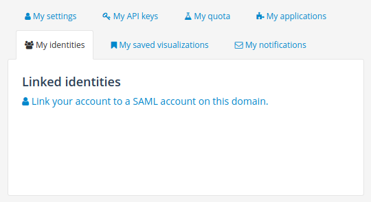
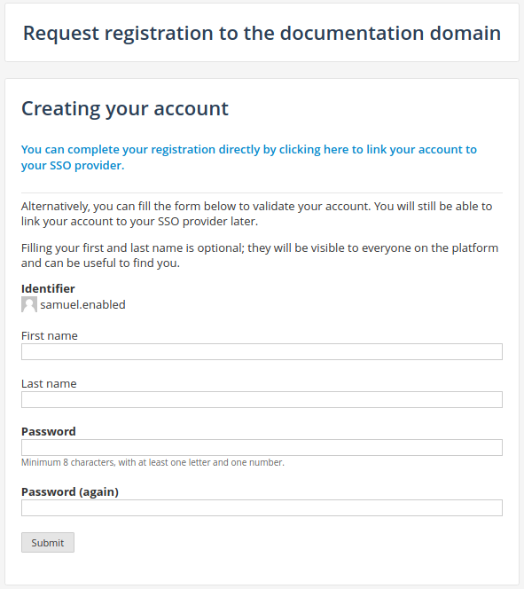
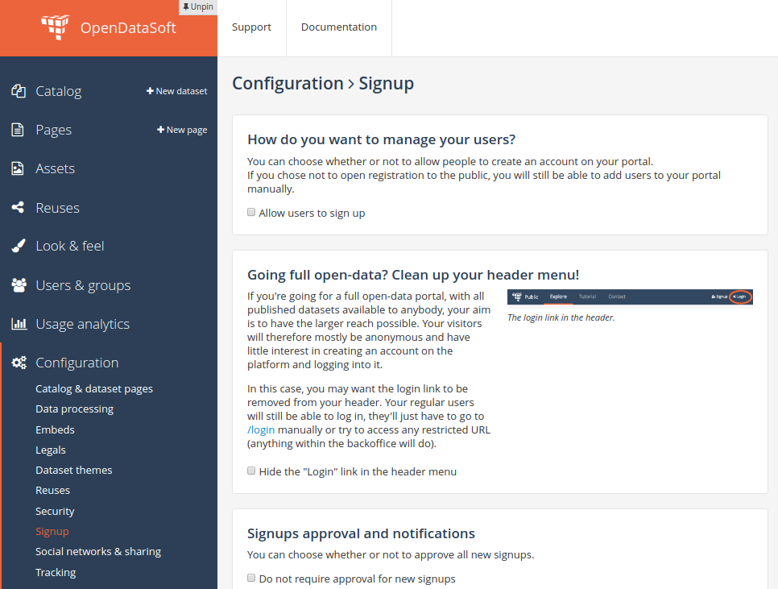
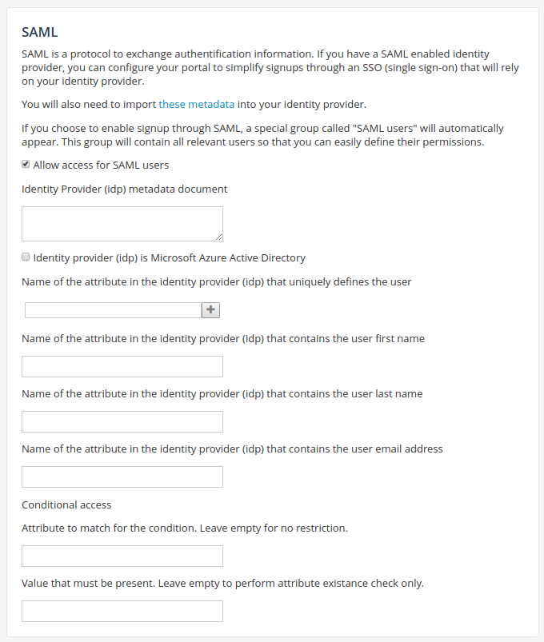
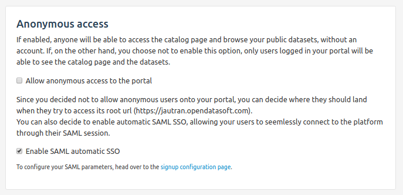

Federate identity with SAML
===========================

Some organizations already have a user directory service that manages their users authentication and permission, and see little value in using the built in OpenDataSoft user management features. In order to address this use case, the OpenDataSoft platform supports external Identity Providers (IdP) through the SAMLv2 standard. This allows for setting up an identity federation between your domain, which will act as a service provider, and this IdP. This federation allows users of your domain to connect to the platform using the identity provider, and if they have one, reuse their active security context to create a SSO mechanism. Such a federation permits user access through 2 different modes: the transient mode, where users are created on the fly when validated by the IdP, and the linked mode, where an OpenDataSoft user account is linked to a SAML identity through a set of properties known by the IdP. Those two modes can coexist on a domain, but a single user can only connect through one mode.

Transient mode
--------------

In the transient mode, every user that has a user account on the IdP trusted by a domain, and doesn't have a OpenDataSoft user account can connect through SAML. A transient user will be created for the user, based on SAML settings for the domain. These settings are the account mapper (the set of IdP-sent parameters that uniquely identify a user) and the the attribute mapper (the parameters that correspond to the user first name, last name and email address). These transient users have the permission to explore the public datasets of the domain. Extra permissions can be given to these users by using the generic ``SAML users`` group. Transient users may not be assigned any special permissions on individual datasets or added to groups (other than the ``SAML users`` group, of which they are automatic members).

The transient mode can be disabled altogether using the "Disable transient authentication mode" checkbox in the SAML configuration. If transient mode is disabled, only linked users will be able to connect through SAML.

Linked mode
-----------

In the linked mode, users that have an OpenDataSoft user account can link this account to particular values of the set of parameters defined in the account mapper setting. After the link has been established, users who log in through SAML will be logged to their OpenDataSoft user account. Linked users may be assigned the same permissions and added to groups just like normal users (as they are normal users). They are also automatic members of the ``SAML users`` group. This mode allows a more fine-grained permission control, while retaining most of the advantages of the transient mode. The only drawback is the necessity for users to create an account on the domain before linking it to their SAML identity. There are two method for linking an OpenDataSoft user account. The first one is to click on ``Link your account to a SAML account on this domain`` in the identity tab of the user account settings.

The other method is to create the link during the user account creation process, by clicking the link to complete the registration through SAML. This actually speeds up the user account creation process and allows for a quick account linking.

Automatic Single Sign On
------------------------

The OpenDataSoft platform offers a mechanism to automatically log in users when they first visit the domain. It works by starting the SAML authentication flow for anonymous users, as if they had clicked "log in with SAML", as soon as they encounter (almost) any page in the domain. This feature only makes sense for private domains as it prevents anonymous access to the domain. When Automatic Single Sign On is activated, users who wish to connect to the platform using their OpenDataSoft credentials have the option to do so by manually visiting the domain login page at ``https://<platform-url>/login/``

Single Log Out
--------------

The OpenDataSoft platform supports the standard SAML Single Log Out flow using the HTTP-Redirect binding. That means that if the IdP supports it, a log out from a SAML-connected user will trigger a log out from the IdP, and log out requests from the IdP will trigger a log out of the user on the platform.

Register and configure an identity provider
-------------------------------------------

1. Navigate to the signup page in the domain configuration interface.

2. Check "Allow access for SAML users"

3. Paste your identity provider metadata document in the "IDP metadata document" field.

4. If you are using Microsoft Azure Active Directory as an IDP, check the related checkbox.

5. If you wish to disable transient connection mode, thereby making sure only linked users can connect to the platform through SAML, check the related checkbox.

6. Input the set of attributes sent by the IDP that uniquely define a user.

   If the users are defined by their NameID and the NameID format used by your IdP is not transient, there is no need to fill anything.

   For instance, if your users are defined by the attribute "FirstName" and "LastName" transmitted by your IdP, first input "FirstName" in the box and press enter, then "LastName" and press enter again.

7. Input the attributes mappings for the username, last name, first name and email address.

   Here, you need to declare the fields names as they are sent by the identity provider.

   For instance, if your identity provider transmits the connected user's first name in an attribute called "GivenName",
   this is what you will need to type in the "First name" field.

   If for any reason your identity provider doesn't send all of these elements, let the corresponding fields blank. The
   platform will automatically generate them based on other available attributes.

8. Optionally input an access condition.

   The first box is the name of the attribute to check for, and the second one the value of that attribute.
   If you just want to check for the presence of an attribute, without value restriction, just leave the second box blank.

   For instance, if your identity provider sends a list of "Roles" for the users and you want to make sure that only users that have a role can get access, input "Roles" in the first box under "Conditionnal access". If you only want users with the role "DataAccess" to be able to connect to the domain, input "DataAccess" in the second box.

9. Optionally configure automatic single sign on

   The automatic single sign on configuration can be found by navigating to the security page in the domain configuration interface.

Configure your identity provider
--------------------------------

The configuration of the identity provider is implementation-dependant, but it always consist of importing the service
provider metadata document to enable a identity federation.

You can download the metadata document for your OpenDataSoft domain on
``https://<YOUR DOMAIN>.opendatasoft.com/saml2/metadata.xml``

Using user attributes to filter data
------------------------------------

Through the #attr function, it is possible to filter a dataset records in such a way that the only records returned are the ones that match a value set in the user attributes sent by the IdP. For the following examples, we assume that we have the 3 users, with respective usernames and SAML attributes ``user-country`` and ``user-language`` given by the following table.

.. list-table::
   :header-rows: 1

   * * User
     * user-country
     * user-language
   * * User1
     * France
     * French
   * * User2
     * Canada
     * French
   * * User3
     * United States
     * English

And a dataset with records given by the following table.

.. list-table::
   :header-rows: 1

   * * country
     * language
     * message
   * * Worldwide
     * English
     * Hello world
   * * France
     * French
     * Bonjour à tous les Français
   * * Canada
     * French
     * Bonjour à tous les Canadiens
   * * Canada
     * English
     * Hello to all Canadians
   * * United States
     * English
     * Hello to all Americans

We can restrict these users so that they see only messages that apply to their respective countries, with the query ``#attr(country, user-country)``.

User1 sees

.. list-table::
   :header-rows: 1

   * * country
     * language
     * message
   * * France
     * French
     * Bonjour à tous les Français

User2 sees

.. list-table::
   :header-rows: 1

   * * country
     * language
     * message
   * * Canada
     * French
     * Bonjour à tous les Canadiens
   * * Canada
     * English
     * Hello to all Canadians

User3 sees

.. list-table::
   :header-rows: 1

   * * country
     * language
     * message
   * * United States
     * English
     * Hello to all Americans

We can also restrict these users so that they only see messages that are in their respective language, with the query ``#attr(language, user-language)``.

User1 sees

.. list-table::
   :header-rows: 1

   * * country
     * language
     * message
   * * France
     * French
     * Bonjour à tous les Français
   * * Canada
     * French
     * Bonjour à tous les Canadiens

User2 sees

.. list-table::
   :header-rows: 1

   * * country
     * language
     * message
   * * France
     * French
     * Bonjour à tous les Français
   * * Canada
     * French
     * Bonjour à tous les Canadiens

User3 sees

.. list-table::
   :header-rows: 1

   * * country
     * language
     * message
   * * Worldwide
     * English
     * Hello world
   * * United States
     * English
     * Hello to all Americans

Since it is a function of the query language, it can also be grouped with the usual operators, for instance, we can restrict users to only seeing messages that fit their country and languages with the query ``#attr(language, user-language) AND #attr(country, user-country)``.

User1 sees

.. list-table::
   :header-rows: 1

   * * country
     * language
     * message
   * * France
     * French
     * Bonjour à tous les Français

User2 sees

.. list-table::
   :header-rows: 1

   * * country
     * language
     * message
   * * Canada
     * French
     * Bonjour à tous les Canadiens

User3 sees

.. list-table::
   :header-rows: 1

   * * country
     * language
     * message
   * * United States
     * English
     * Hello to all Americans
