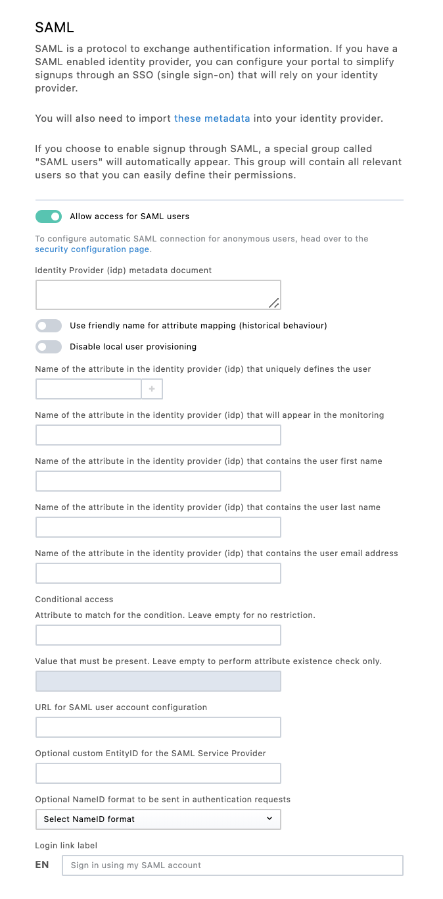

Single sign-on with SAML
========================

.. admonition:: Note
   :class: note

   The availability of this feature depends on the license of the Opendatasoft domain.

Registering your SAML identity provider on your domain
------------------------------------------------------

Step 1: Allow access for SAML users
~~~~~~~~~~~~~~~~~~~~~~~~~~~~~~~~~~~~

Enable SAML so that authentication for your portal users can be delegated to your own identity service.

1. From the back office, go to **Configuration > Signup**.

2. Toggle on **Allow access for SAML users**.

A list of configuration settings appears:

Step 2: Configure SAML settings
~~~~~~~~~~~~~~~~~~~~~~~~~~~~~~~

1. Paste your identity provider metadata document into the **Identity provider (idp) metadata document** field.

2. If you want to disable local user creation, making sure only existing users can connect to the platform through SAML, toggle on **Disable local user provisioning**.

3. Enter the set of attributes sent by the identity provider that uniquely define a user in the corresponding field:

   - For example, if your users are defined by the ``FirstName`` and ``LastName`` attributes transmitted by your identity provider, enter ``FirstName`` in the field and click **+**. Then, enter ``LastName`` in the field that appears and click **+**.
   - If the users are defined by their ``NameID`` and the ``NameID`` format used by your identity provider is not transient, leave the field empty.

4. Enter the attribute mappings for the username, last name, first name, and email address in the corresponding fields. In this step, you need to declare the field names as they are sent by the identity provider:

   - For example, if your identity provider transmits the connected user's first name in an attribute called ``GivenName``, enter ``GivenName`` in the **First name** field.
   - If your identity provider doesn't transmit all of these elements, leave the corresponding fields blank. The platform will automatically generate them based on other available attributes.

5. Enter an access condition:

   - In the **Attribute to match for the condition** field, enter the name of the attribute to check for.
   - In the **Value that must be present** field, enter the value for this attribute. If you want to check for the presence of an attribute without value restriction, leave this field blank.

   For example, if your identity provider sends a list of ``Roles`` for the users and you want only users with a role to be able to connect to the domain, enter ``Roles`` in the **Attribute to match for the condition** field.
   If you only want users with the ``DataAccess`` role to be able to connect to the domain, enter ``DataAccess`` in the **Value that must be present** field.

   .. admonition:: Note
      :class: note
      
      If you leave both fields blank, no condition is set. Any successful login on the identity provider side will trigger a login on your Opendatasoft domain.

6. Enter the URL on which the user can edit their user profile on the identity provider in the **URL for SAML user account configuration** field.

  - When set, a link to this URL will be shown to the user on their user account page.
  - If left blank, no URL will be shown to the user on their account page.

7. Enter a custom EntityID for the Service Provider.
    
   - If left blank, the URL of the Service Provider metadata document will be used as the EntityID.
   - If your identity provider doesn't support EntityIDs in URL format, you can set any EntityID here.

8. Customize the SAML login link text. If left blank, a localized default message will be displayed.

Registering your domain on your identity provider
-------------------------------------------------

The configuration of the identity provider is implementation-dependant, but it always consists of importing the service provider metadata document to enable an identity federation.

You can download the metadata document for your Opendatasoft domain on
``https://<YOUR DOMAIN>/saml2/metadata.xml``.

Single logout
-------------

The Opendatasoft platform supports the standard SAML Single Logout flow using the HTTP-Redirect binding: 

1. If supported by the identity provider, a log out from a SAML-connected user will trigger a log out from the identity provider.
2. Log out requests from the identity provider will trigger a log out of the user on the platform.
