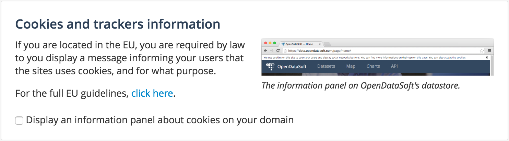

Displaying legals
=================

Cookies and trackers informations
---------------------------------

If you are located in the EU, you are required by law to you display a message informing your users that the sites uses cookies, and for what purpose.

You can choose to display this message in the ``Configuration`` menu, in the ``Legals`` section :

You can access the full EU guidelines through `this link <http://ec.europa.eu/ipg/basics/legal/cookies/index_en.htm>`_.

Portal Terms and Conditions
---------------------------

You can specify terms and conditions different from those of OpenDataSoft by either giving an url pointing to a page with your terms and conditions (be it on a page within the platform or on an external one), or pasting the terms' text.

You can choose between these options in the ``Legals`` section, in the ``Configuration`` menu :

.. image:: images/legals__terms-en.png
