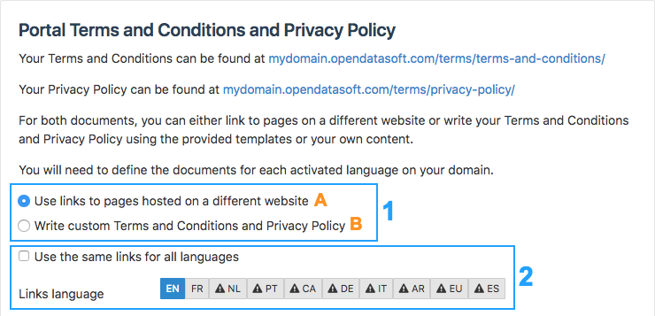
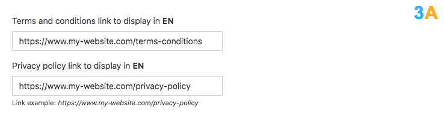
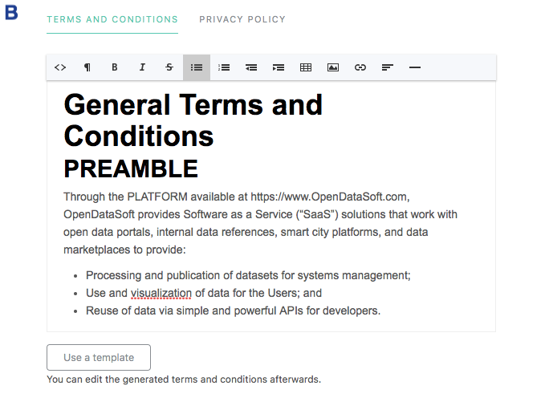
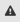

Displaying legals
=================

Cookies and trackers informations
---------------------------------

If you are located in the EU, you are required by law to you display a message informing your users that the sites uses cookies, and for what purpose.

You can choose to display this message in the ``Configuration`` menu, in the ``Legals`` section :

.. image:: images/legals__cookies-en.png

You can access the full EU guidelines through `this link <http://ec.europa.eu/ipg/basics/legal/cookies/index_en.htm>`_.

Portal Terms and Conditions and Privacy Policy
----------------------------------------------

.. admonition:: Warning
   :class: danger

   It is a legal obligation to specify both the Terms and Conditions and the Privacy Policy of an OpenDataSoft domain. Since there are none by default, each OpenDataSoft domain administrator must specify these conditions of use, especially before opening the portal to all users.

To specify the Terms and Conditions and the Privacy Policy of a portal, go to Configuration > Legals. In this subsection of the back office menu, look for the "Portal Terms and Conditions and Privacy Policy" area.

1. Choose one way of adding both the Terms & Conditions and the Privacy Policy on the domain. Click either:

- "*Use links to pages hosted on a different website*", if both Terms & Conditions and Privacy Policy are already hosted on another website (if this option is chosen, follow the section **A** of step 3),
- or, "*Write custom Terms and Conditions and Privacy Policy*", to directly write or paste the conditions of use on the OpenDataSoft platform (if this option is chosen, follow the section **B** of step 3).

2. If the domain is available in more than one language: choose whether to display the conditions of use in only one language or to make them available in several languages.

- Tick the "*Use the same texts for all languages*" box to use the same documents for all available languages (i.e. if the Terms & Conditions and Privacy Policy are only written and available in the language of the portal country, e.g. English, no matter the language selected by the user on the portal, the conditions of use will be displayed in English).
- Untick the "*Use the same texts for all languages*" box to specify different documents depending on the language. In that case, all available languages are displayed in the form of clickable grey boxes containing the code of each available language. The language codes are preceded by |icon-attention| if all documents have not been specified.

.. admonition:: Important
   :class: important

   If the "*Use the same texts for all languages*" option is left unticked, step 3 will have to be repeated until each language has both its Terms & Conditions and Privacy Policy specified. There must not be any |icon-attention| left.

3. Depending on the option chosen in step 1, follow the procedure of section A or B.

**A**. To link already hosted Terms & Conditions and Privacy Policy to the platform:

   a. In the first textbox, paste the link leading to the Terms & Conditions.
   b. In the second textbox, paste the link leading to the Privacy Policy.

**B**. To write or paste the Terms & Conditions and Privacy Policy directly on the platform:

   a. In the textbox of the Terms and Conditions tab, write or paste the Terms and Conditions.
   b. In the textbox of the Privacy Policy tab, write or paste the Privacy Policy.

.. admonition:: Note
   :class: note

   Fill-in Terms & Conditions and Privacy Policy templates are available, based on the French law (in French and English languages) and the US law (in English language) only. Click the Use a template button under the textbox to use a template. The generated conditions of use can be edited in the textbox afterward.

