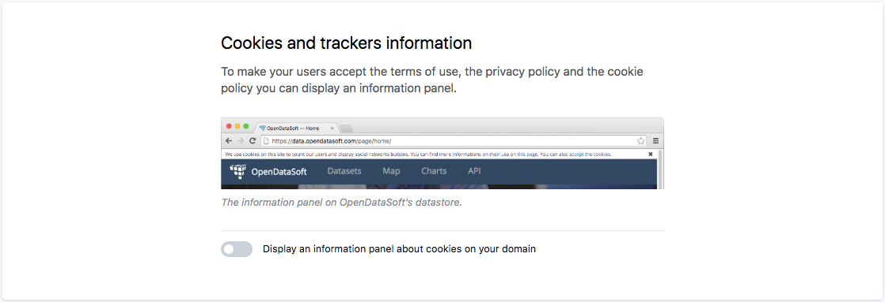
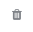

Displaying legals
=================

Cookies and trackers information
--------------------------------

If you are located in the EU, you are required by law to display a message informing your users that the sites uses cookies, and for what purpose.

You can choose to display this message in the ``Configuration`` menu, in the ``Legals`` section :

You can access the full EU guidelines through `this link <http://ec.europa.eu/ipg/basics/legal/cookies/index_en.htm>`_.

Portal Terms and Conditions and Privacy Policy
----------------------------------------------

.. admonition:: Warning
   :class: danger

   It is a legal obligation to specify both the Terms and Conditions and the Privacy Policy of an Opendatasoft domain. Since there are none by default, each Opendatasoft domain administrator must specify these conditions of use, especially before opening the portal to all users.

To specify the Terms and Conditions and the Privacy Policy of a portal, go to Configuration > Legals. In this subsection of the back office menu, look for the "Portal Terms and Conditions and Privacy Policy" area.

.. image:: images/cgu_1.png

.. image:: images/cgu_2.png

.. image:: images/cgu_3.png

1. Choose one way of adding both the Terms & Conditions and the Privacy Policy on the domain. Click either:

- "*Use links to pages hosted on a different website*", if both Terms & Conditions and Privacy Policy are already hosted on another website (if this option is chosen, follow the section **A** of step 3),
- or, "*Write custom Terms and Conditions and Privacy Policy*", to directly write or paste the conditions of use on the Opendatasoft platform (if this option is chosen, follow the section **B** of step 3).

2. If the domain is available in more than one language: choose whether to display the conditions of use in only one language or to make them available in several languages.

- Tick the "*Use the same texts for all languages*" box to use the same documents for all available languages (i.e. if the Terms & Conditions and Privacy Policy are only written and available in the language of the portal country, e.g. English, no matter the language selected by the user on the portal, the conditions of use will be displayed in English).
- Untick the "*Use the same texts for all languages*" box to specify different documents depending on the language. In that case, all available languages are displayed in the form of clickable grey boxes containing the code of each available language. The language codes are preceded by |icon-attention| if all documents have not been specified.

.. admonition:: Important
   :class: important

   If the "*Use the same texts for all languages*" option is left unticked, step 3 will have to be repeated until each language has both its Terms & Conditions and Privacy Policy specified. There must not be any |icon-attention| left.

3. Depending on the option chosen in step 1, follow the procedure of section A or B.

**A**. To link already hosted Terms & Conditions and Privacy Policy to the platform:

   a. In the first textbox, paste the link leading to the Terms & Conditions.
   b. In the second textbox, paste the link leading to the Privacy Policy.

**B**. To write or paste the Terms & Conditions and Privacy Policy directly on the platform:

   a. In the textbox of the Terms and Conditions tab, write or paste the Terms and Conditions.
   b. In the textbox of the Privacy Policy tab, write or paste the Privacy Policy.

.. admonition:: Note
   :class: note

   Fill-in Terms & Conditions and Privacy Policy templates are available, based on the French law (in French and English languages) and the US law (in English language) only. Click the Use a template button under the textbox to use a template. The generated conditions of use can be edited in the textbox afterward.

.. _licenses-config:

Licenses
--------

When configuring the metadata for a dataset in the Information tab, it is important to define the license that explicitly specifies how others can use the data.

Reusers - external developers, data analysts, etc. - are more likely to work with properly licensed data than contacting data producers and ask them for more information.

Work with your legal team to find the most appropriate license for your data.

Configure licenses
~~~~~~~~~~~~~~~~~~

In the back office, you can configure the licenses available when adding the metadata for a dataset.

1. From the left menu under Configuration, select Legals.
2. Go to the Licenses area.
   
   .. image:: images/license_configuration.png

3. In the Labels column, add a license label for each language available on the domain. The label will be displayed in the drop-down selection in the back office and the Information tab of the published dataset in the front office.
4. Click the Add license button.
5. In the URLs column, add the URL to the official website of the defined license to find more information about that license. You can only add one URL per language available on the domain.
  
  .. admonition:: Note
     :class: note
     
     Adding a URL for a license is optional, but it is good practice to provide an official definition of the license to make the data easily reusable.
     If you have a custom license, you can add the URL to a page hosted on your corporate website or your Opendatasoft platform.

6. Click the Save button in the top right corner of the page.

To delete a license, click on the |icon-trash| button.

Default licenses
~~~~~~~~~~~~~~~~

By default, a set of licenses, including country-specific licenses, is available.

The following licenses are available on all portals:

.. list-table::
   :header-rows: 1

   * * Label
     * URL
     * Description

   * * Public domain
     * `<https://en.wikipedia.org/wiki/Public_domain>`_
     * The material is freely available. It can be used without any permission.

   * * Open Database License
     * `<https://opendatacommons.org/licenses/odbl/1-0/>`_
     * The database falls under the Open Data Commons. This license grants you with "a worldwide, royalty-free, non-exclusive, terminable license to Use the Database". If you publicly use any adapted version of this database, or works produced from an adapted database, you must also offer that adapted database under the ODbL.

   * * CC0 1.0
     * `<https://creativecommons.org/publicdomain/zero/1.0/>`_
     * The material licensed under CC0 1.0 was released to the public domain by its author. You can use it without any permissions.

   * * CC BY 4.0
     * `<https://creativecommons.org/licenses/by/4.0/>`_
     * You can copy, redistribute, remix, transform, and build upon the material for any purpose, even commercially, but you must give appropriate credit to the original author.

   * * CC BY-SA 4.0
     * `<https://creativecommons.org/licenses/by-sa/4.0/>`_
     * You can copy, redistribute, remix, transform, and build upon the material for any purpose, even commercially, but you must give appropriate credit to the original author. You must also release your contributions under the same license as the original material.

   * * CC BY-NC 4.0
     * `<https://creativecommons.org/licenses/by-nc/4.0/>`_
     * You can copy, redistribute, remix, transform, and build upon the material for non-commercial purposes, but you must give appropriate credit to the original author.

   * * CC BY-NC-SA 4.0
     * `<https://creativecommons.org/licenses/by-nc-sa/4.0/>`_
     * You can copy, redistribute, remix, transform, and build upon the material for non-commercial purposes, but you must give appropriate credit to the original author. You must also release your contributions under the same license as the original material.

.. |icon-attention| image:: images/icon_attention.png
    :width: 20px
    :height: 22px

