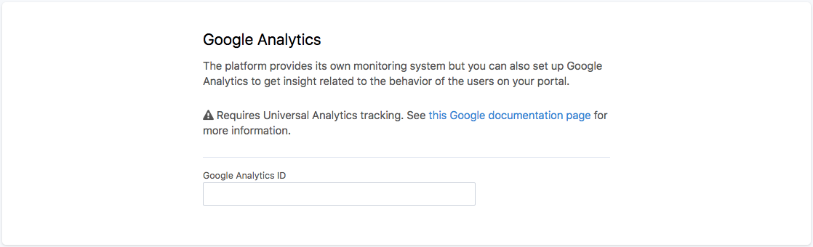
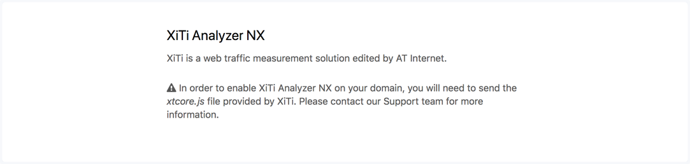
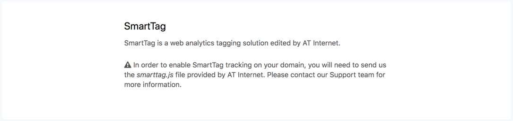

Third-party analytics
=====================

The monitoring tools provided by Opendatasoft focus on API calls and usages, which is useful to gather precise information on how
data is consumed (see :doc:`Analyzing domain usage </managing_domain/03_analyzing_domain_usage/index>`). But it can be limiting when trying to measure more broadly the audience of a portal (i.e. referral sources, visitors geographical origin, time spent on the portal, etc.).

Third-party services, specialized in measuring audience, can give additionnal analytics such as those mentioned above. Opendatasoft supports integrations with Google Analytics, and XiTi and SmartTag by AT Internet.

All third-party analytics integrations are activated and configured from Configuration > Tracking in the back office.

.. admonition:: Important
   :class: important

   For most integrations, Opendatasoft must be involved to allow the activation of a third-party service from the back office.

Google Analytics
----------------

Google Analytics is an analytics solution edited by Google. It allows tracking on all pages of an Opendatasoft domain, back office included.

To activate and configure Google Analytics:

1. In the Configuration > Tracking section of the back office, go to the Google Analytics area.
2. Fill in the Google Analytics ID in the related textbox.
3. Click on the Save button in the top right corner.

XiTi Analyzer NX
----------------

XiTi is an analytics solution edited by AT Internet. It allows tracking on all the pages of an Opendatasoft domain, back office included.

The activation of XiTi on an Opendatasoft domain involves the Opendatasoft team.

1. Contact support@opendatasoft.com and send: a ``xtcore.js`` file, as well as your XiTi identifiers, both provided by XiTi.
2. After verification of the JavaScript file by Opendatasoft, if it is approved, XiTi is available on the Opendatasoft domain.
3. In the Configuration > Tracking section of the back office, go to the XiTi area.
4. Fill in the following configurations in their related textboxes: XTSD Code (mandatory), XTSITE Code (mandatory), Level 2 Site ID, and Root used in page names.
5. Click on the Save button in the top right corner. XiTi is now activated on the domain.

SmartTag
--------

SmartTag is an analytics solution edited by AT Internet. It allows tracking on all the pages of an Opendatasoft domain, back office included.

The activation of SmartTag on an Opendatasoft domain involves the Opendatasoft team.

1. Contact support@opendatasoft.com and send a ``smarttag.js`` file, provided by SmartTag.
2. After verification of the JavaScript file by Opendatasoft, if it is approved, SmartTag is available on the Opendatasoft domain.
3. In the Configuration > Tracking section of the back office, go to the SmartTag area.
4. Click the "Enable SmartTag" toggle button.
5. Click on the Save button in the top right corner. SmartTag is now activated on the domain.
