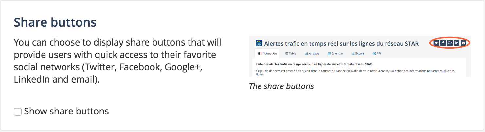
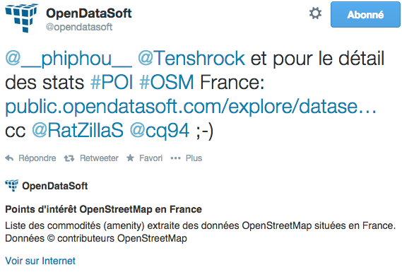
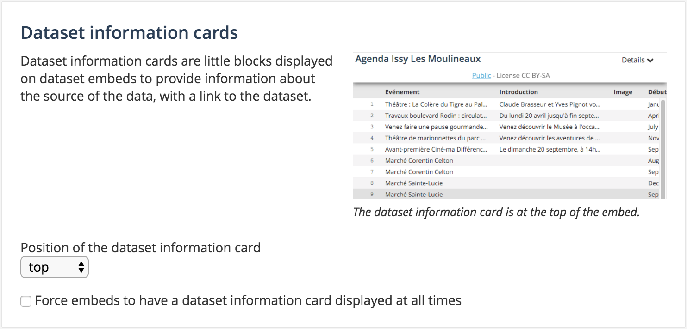

Improving user sharing
======================

Integrating social medias
-------------------------

**Share on social medias buttons**

You can choose to display share buttons that will provide users with quick access to their favorite social networks (Twitter, Facebook, Google+, LinkedIn and email).

You can enable these share buttons in the ``Social networks & sharing`` section, in the ``Configuration`` menu

**Twitter cards**

If a user tweets a link to a dataset on your portal, a summary can be displayed (the title and description of your dataset), associated with a Twitter account of your choice.

This is a feature provided by Twitter itself. It should work by default without additional configuration, except if your domain is not **whitelisted for summary card** by twitter.

You can check this by previewing a summary on the `Twitter Card page <https://cards-dev.twitter.com/validator>`_. Simply put the URL of one of your public dataset in the Card URL field on this page.

If after clicking on *Preview*, your domain does not appear as **whitelisted for summary card**, you have to request approvals, by clicking on the *Request Approval* button. You also have to input your ``Twitter handle`` to associate your portal with these approved Twitter Cards, in the ``Social networks & sharing`` in the ``Configuration`` menu.

.. image:: images/links__twittercards-configuration-en.png

Dataset information cards
-------------------------

When embedding visualizations, users have the option to display an additional information card on top of the embed.

In the ``Embeds`` section in the ``Configuration`` menu, you can configure the position of this information card (top or bottom).

You can also force the display of the information card on every embed using the checkbox *Force embeds to have a dataset information card displayed at all times*
