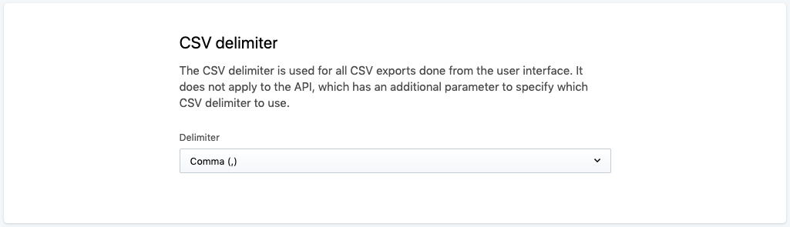
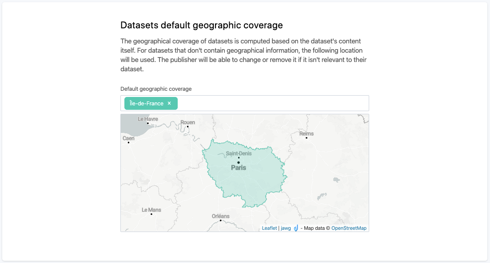

Regional settings
=================

Domain timezone
---------------

.. image:: images/regional_settings.png

The time of the events reported in notification emails (reports and alerts) is based on the domain timezone. By default, the timezone of all Opendatasoft domains is UTC.

To change the timezone of a domain, go to Configuration > Regional settings. In this subsection of the back office is displayed the Domain timezone configuration.

1. Click on the Timezone drop-down menu.
2. Choose the right timezone.
3. Click on the Save button in the top right corner of the page.

.. admonition:: Note
   :class: note

   It is also possible to directly write a city or zone in the textbox. A selection of matching existing timezones will appear.

CSV delimiter
-------------

The preferred delimiter for CSV files, usually depending on geographical location, can either be a comma or a semicolon. The CSV delimiter configuration allows to define what delimiter will be used by default for catalog and dataset exports in CSV format (see :doc:`Exporting data </exploring_catalog_and_datasets/04_getting_involved/exporting_data>`).

.. admonition:: Note
   :class: note

   This configuration does not apply to the API, which has its own way of choosing the delimiter for CSV exports (see API Search v1 and `API Search v2 <https://help.opendatasoft.com/apis/ods-search-v2/#exporting-datasets>`_).

To define the default delimiter for CSV exports, go to Configuration > Regional settings. In this subsection of the back office is displayed the CSV delimiter configuration.

1. Click on the Delimiter drop-down menu.
2. Choose either "Comma (,)" or "Semicolon (;)".
3. Click on the Save button in the top right corner of the page.

Datasets default geographic coverage
------------------------------------

The :ref:`geographic coverage metadata <geographic-coverage-metadata>` indicates the location of the data contained in the dataset. Although the metadata can be set individually for each dataset afterward, it is possible to configure the default location(s) that will be automatically set as geographic coverage metadata for all datasets created afterward.

1. In the Default geographic coverage textbox, write the name of the chosen location.
2. A drop-down selection of existing locations matching the name that was previously typed appears. Click on the right location.
3. (optional) Repeat steps 1 and 2 of this procedure to add other default locations (e.g. if the data of the portal involves more than one administrative division).
4. Click on the Save button in the top right corner of the page.

.. admonition:: Caution
   :class: caution

   If more than one default location are added, they must be at the same administrative level (e.g. countries, cities, regions, etc.).
