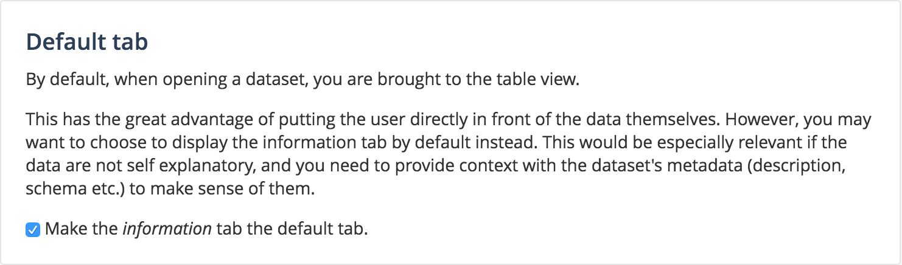

Configure catalog & dataset pages
=================================

This section explains which features can be configured on the catalog and dataset pages.

Catalog page
------------

**Geographic filter**

If you have datasets with geographic metadatas, you can give users the possibility to filter the catalog for datasets in a specific area using a mini-map in the filters bar.
See :doc:`Navigating the catalog </exploring_catalog_and_datasets/01_navigating_the_catalog/catalog>` for more details.

This feature can be enabled or disabled in the ``Configuration`` section in the menu bar, then on the ``Catalog page & dataset pages`` link

.. image:: images/tabs__geofilter-config--en.png

Dataset page
------------

Users can explore and analyze datasets using different visualizations and tools, each one available in a tab in the dataset page.
See :doc:`Visualizing data </exploring_catalog_and_datasets/02_looking_up_a_dataset/visualizing_data>` for more details.

**Default tab**

By default the dataset is opened on the **table view**, but you can choose to display the **information tab** instead. The table view by default is useful to give users with a direct access to the data, whereas the information tab by default is interesting to provide users with context and description first.

