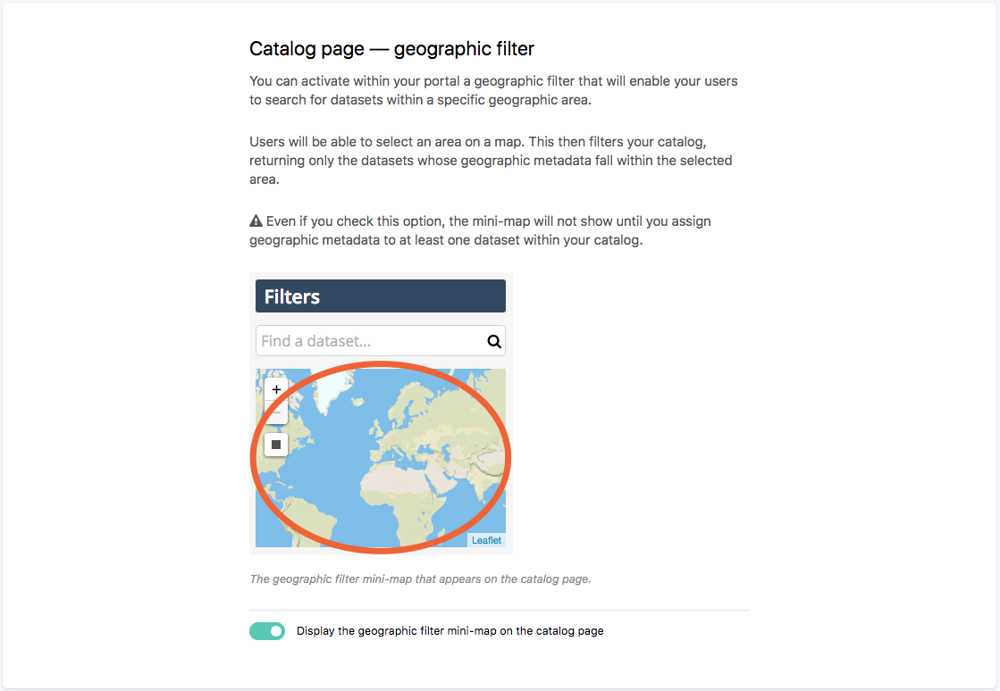
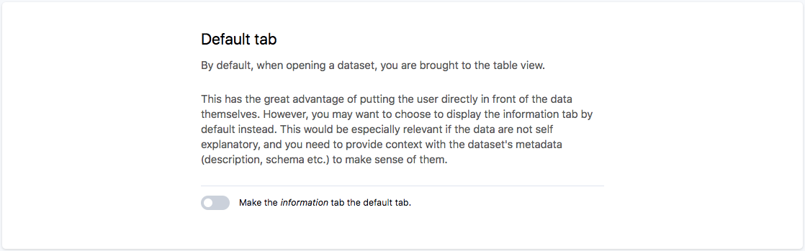

Configure catalog & dataset pages
=================================

This section explains which features can be configured on the catalog and dataset pages.

Catalog page
------------

**Geographic filter**

If you have datasets with geographic metadatas, you can give users the possibility to filter the catalog for datasets in a specific area using a mini-map in the filters bar.
See :doc:`Navigating the catalog </exploring_catalog_and_datasets/01_navigating_the_catalog/catalog>` for more details.

This feature can be enabled or disabled in the ``Configuration`` section in the menu bar, then on the ``Catalog page & dataset pages`` link

Dataset page
------------

Users can explore and analyze datasets using different visualizations and tools, each one available in a tab in the dataset page.
See :doc:`Visualizing data </exploring_catalog_and_datasets/02_looking_up_a_dataset/visualizing_data>` for more details.

**Default tab**

By default the dataset is opened on the **table view**, but you can choose to display the **information tab** instead. The table view by default is useful to give users with a direct access to the data, whereas the information tab by default is interesting to provide users with context and description first.

Geographic filter
-----------------

The geographic filter allows to search datasets in the catalog based on the geographical location of their data (see :ref:`Filtering the catalog using the geographic filter <using-the-minimap>`). By default, this filter is not activated.

.. admonition:: Important
   :class: important

   The geographic filter can either enable filtering at international level or only on a specific, chosen country.

   * When the geographic filter is configured for a specific country, very precise refining is available, through multiple administrative levels available.
   * When the geographic filter is configured at international level, users can filter the catalog with almost every country of the world, but most of the time, precise refining is not possible. For most countries, only the highest administrative levels are available.

To activate and configure the geographic filter:

1. Click on the "Enable geographic filter" toggle button.
2. Choose for which country the geographic filter will be available, using the drop-down selection. To configure the geographic filter at international level, choose "All countries" and skip to step 3 of this procedure.

    a. Choose the highest administrative division available in the geographic filter, using the drop-down selection.
    b. Choose the lowest administrative division available in the geographic filter, using the drop-down selection. Users will be able to refine with administrative divisions comprised between the defined highest and lowest ones.

3. Define the default filter that will be used first when the geographic filter is activated.
4. Click on the Save button in the top right corner.
