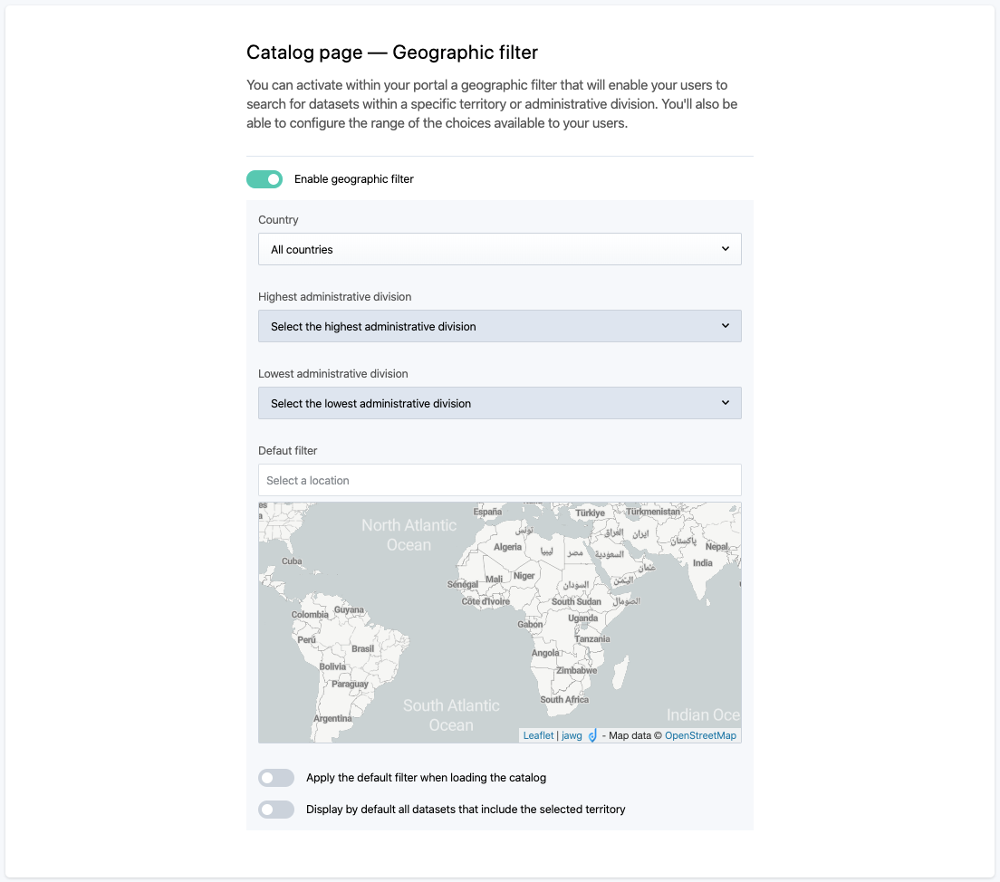

Configure catalog & dataset pages
=================================

This section explains which features can be configured on the catalog and dataset pages.

Default tab
-----------

By default the dataset is opened on the **table view**, but you can choose to display the **information tab** instead. The table view by default is useful to give users with a direct access to the data, whereas the information tab by default is interesting to provide users with context and description first.

Catalog page — Geographic filter
--------------------------------

The geographic filter allows to search datasets in the catalog based on the territory covered by the data they contain (see :ref:`Filtering the catalog using the geographic filter <using-the-minimap>`). By default, this filter is not activated.

.. admonition:: Important
   :class: important

   The geographic filter can either enable filtering across the entire world, or only on a specific, chosen country.

   * When the geographic filter is configured for a specific country, very precise refining is available, through multiple available administrative divisions.
   * When the geographic filter is configured for the entire world, users can filter the catalog with almost every country of the world, but most of the time, precise refining is not possible. For most countries, only the highest administrative divisions are available.

To activate and configure the geographic filter:

1. Click on the "Enable geographic filter" toggle button.
2. Choose for which country the geographic filter will be available, using the drop-down selection. To configure the geographic filter for the entire world, choose "All countries" and skip to step 3 of this procedure.

    a. Choose the highest administrative division available in the geographic filter, using the drop-down selection.
    b. Choose the lowest administrative division available in the geographic filter, using the drop-down selection. Users will be able to refine with administrative divisions comprised between the defined highest and lowest ones.

3. Define the default filter that will be used first when the geographic filter is activated.
4. (optional) Switch the "Apply the default filter when loading the catalog" toggle button for the default filter to be automatically activated and applied on the catalog at loading.
5. (optional) Switch the "Display by default all datasets that include the selected territory" toggle button for all datasets related to a chosen territory to be dislayed by default.
6. Click on the Save button in the top right corner.
