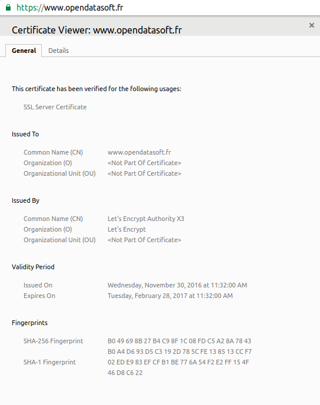

Customizing your domain URL
===========================

When a domain is created it has one URL, in the form ``<domain>.opendatasoft.com``. As the domain URL is a very important tool for discoverability, branding and ease of access, there will often be a need to customize this URL. As such, the OpenDataSoft platform allows for adding URLS to a domain. These customization options are currently not exposed in the back office, and must be requested by sending an email to support@opendatasoft.com. The customization options are detailed below.

OpenDataSoft URLs
-----------------

It is possible to add an additional opendatasoft URL that will be used to access the domain. It is in the form ``<alias>.opendatasoft.com``, where ``alias`` is a word composed of lowercase alphanumeric characters and hyphens.

Own subdomain
-------------

It is also possible to link your OpenDataSoft domain to a custom subdomain whose authoritative DNS server you control. For instance a company called "Example" might want to set up their domain in order to have ``data.example.com`` directing to it. This can be done in two steps: first create a DNS record of the ``CNAME`` type for your subdomain with the default URL as a value. ``A`` or ``AAAA`` types records are not supported by the platform as the IP address of your domain is susceptible to change. Then, please contact the OpenDataSoft support in order to have the URL corresponding to the subdomain registered as an alias. This step is necessary because the OpenDataSoft platform makes use of virtual hosts internally.

HTTPS
-----

.. image:: img/custom_urls__green-lock--en.png
    :alt: Connections to OpenDataSoft are private.

The OpenDataSoft platform use HTTPS by default, and as such, requests made to OpenDataSoft URLs and custom subdomains are HTTPS enabled. If you opted to add an OpenDataSoft URL, the SSL configuration is the same as with the default URL. However, if you choose to use a custom subdomain, the SSL will be handled through `Let's Encrypt <https://letsencrypt.org/>`_. In both case no action is required from you to set it up.

Language handling
-----------------

If you have multiple languages on your domain and use language-specific subdomains, you can request that the subdomains force languages for users that access the domain through them. For instance, if you have two subdomains ``data.example.co.uk`` and ``daten.example.de``, you can request that users accessing the domain through the former be served english content, and those accessing it through the latter be served german content.
