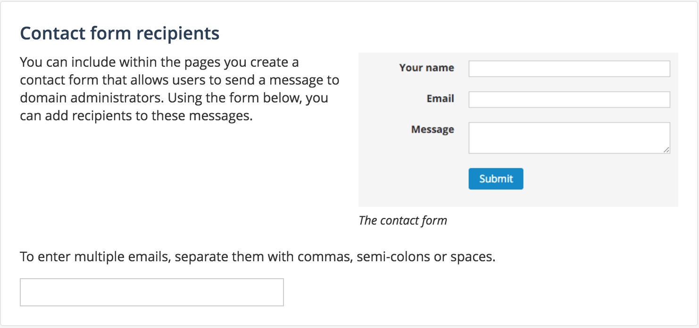

Engaging users
==============

Comments
--------

*Disqus*

Encouraging reuses
------------------

One of the main goals of Open Data is to have your data reused, thus producing new analyses or new services. Listing these reuses on the related datasets' pages will help promote both the reuse itself and your data.

You can access the configuration for reuses in the Back office > Configuration > Reuses

Enabling the reuse feature on your portal will display a new Reuses section at the bottom of the information tab on each dataset page. Additionaly, this section will provide a form through which users can submit their reuses and will list all approved reuses.
[Screenshot form]

In order to be displayed on a dataset's page, new reuses must be reviewed and approved by an administrator.
[Screenshot BO > Reuses]

When the reuse feature is enabled, you can additionally allow anonymous users (users without an account) to submit reuses. This is recommended on Open Data portals or portals which do not allow external users to create an account.
[Screenshot]

**Notifications**
By default the portal will send a notification to the administrators for every reuse submission. 
You can add additional recipients email adresses in the form "New reuses notifications recipients".
[Screenshot]

If you want to send these notifications only to one specific address, specify it in the form and check "Send notifications exclusively to these addresses". For example if you want to send these notifications only to opendata@yourdomain.com :
[Screenshot]

Contact form recipients
-----------------------

Within the pages you create you can include a contact form that allows users to send a message to domain administrators. You can add recipients to these messages in the ``Social networks & sharing`` section, in the ``Configure`` menu.

User feedback
-------------

*Feedback feature*