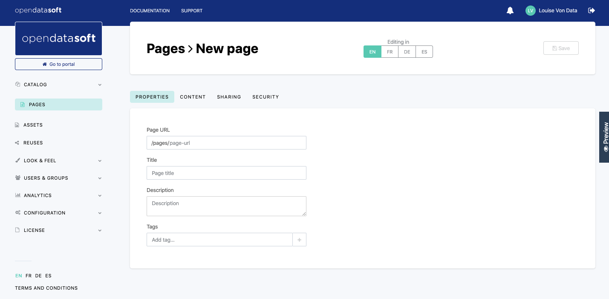

Creating a content page
=======================

The Opendatasoft platform allows the creation of content pages, entirely built with HTML and CSS. These content pages can be used for various types of usage: portal homepages, dashboards that mix editorial content and data visualizations based on the datasets published on the portal, pages dedicated to specific topics (i.e. explanation on the open data project of the portal, the license etc.).

To create a new content page:

1. Go to the Pages section of the back office.
2. Click on the New Page button.
3. In the Properties tab, fill in the following properties:

   - Page URL (mandatory): write the page slug, which is both the unique identifier of the page, and the last part of the URL to access the page. This property is mandatory: the page cannot be fully created nor saved if it does not have a defined page slug.
   - Title: choose a title for the page, which will be displayed as the browser tab title, and in the list of content pages. The title can be configured in more than one language, depending on how many languages are available for the portal.
   - Description: write a description for the page, which will be displayed in the list of content pages, right under the title.
   - Tags: enter one or more tags related to the page, which will be displayed in the list of content pages, in the "Tags" column.

4. Click on the Save button.

Writing the page
----------------

.. admonition:: Important
   :class: important

   In the page header, next to the title of the page, are displayed language buttons to manage the content page in the different languages available for the portal. Click on a language button to adapt and translate the page content in this language. Keep in mind that if a content page is not configured in one language, users that navigate the portal in that same chosen language will only see a blank page.

The content of the page is written and managed from the Content tab.

The Content tab is composed of the drop-down template selector, and the HTML and CSS editor right below. By default, the selected template is the Custom one, which allows the creation of a content page from scratch. Other templates are available: they are predefined content pages made for various purposes (homepages, contact pages, etc.), that should be edited only to adapt the portal.
On the right of the Content tab is also displayed a Preview button. It opens a preview of the page as the users would see it
on the portal, without having to save the page first.

To choose a page template:

1. Click on the Template drop-down selector.
2. Choose a template from the selection.

.. admonition:: Note
   :class: note

   When selecting another template while one is already in place and has already been modified, a window appears to confirm the template change.

To reset the template (i.e. erase the custom modifications and go back to the original state of the template):

1. Click on the Reset template button. A related window appears.
2. Click on the "Reset the content" button to confirm the resetting of the template, and deletion of all custom modifications.

.. admonition:: Note
   :class: note

   Although content pages can be shared using their URL, they can also be made available to the portal users via the navigation bar, or even set as main landing page (i.e. homepage) of the portal. These configurations are set in the Look & feel > Navigation section of the back office (see :doc:`Configuring the navigation menu </customizing_look_and_feel/02_configuring_navigation/navigation>`).
