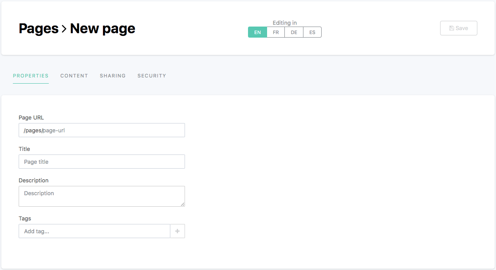

Creating a content page
=======================

The Opendatasoft platform allows the creation of content pages, entirely built with HTML and CSS. These content pages can be used for various types of usage: portal homepages, dashboards that mix editorial content and data visualizations based on the datasets published on the portal, pages dedicated to specific topics (i.e. explanation about the open data project of the portal, the license etc.).

To create a new content page:

1. Go to the Pages section of the back office.
2. Click on the New Page button.
3. In the Properties tab, fill in the following properties:

   - Page URL (mandatory): write the page slug, which is both the unique identifier of the page, and the last part of the URL to access the page. This property is mandatory: the page cannot be fully created nor saved if it does not have a defined page slug.
   - Title: choose a title for the page, which will be displayed as the browser tab title, and in the list of content pages. The title can be configured in more than one language, depending on how many languages are available for the portal.
   - Description: write a description for the page, which will be displayed in the list of content pages, right under the title.
   - Tags: enter one or more tags related to the page, which will be displayed in the list of content pages, in the "Tags" column.

4. Click on the Save button.
