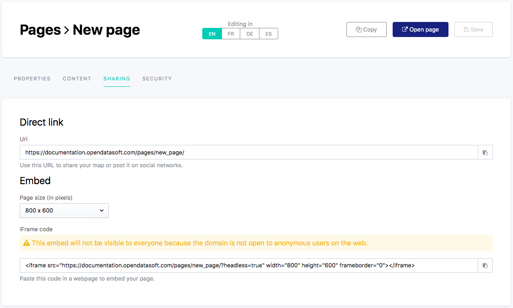

Sharing & embedding a content page
==================================

The Sharing tab of a content page displays several options to share or embed that page.

.. admonition:: Important
   :class: important

   Sharing and/or embedding a content page however depends on the security configured for both the domain and the page itself.

Sharing a page via a direct URL
-------------------------------

The "Direct link" area contains a URL to share a direct access to the page.

Click on the copy button |icon-copypaste| to copy the URL.

Embedding a page via an iFrame
------------------------------

The "Embed" area contains the iframe code of the content page (see :doc:`Sharing & embedding data visualizations </exploring_catalog_and_datasets/04_getting_involved/sharing_embedding_data_visualizations>` for more information about iframes).

1. Choose the size of the page, from the drop-down list.
2. Click on the copy button |icon-copypaste| to copy the iframe code.

