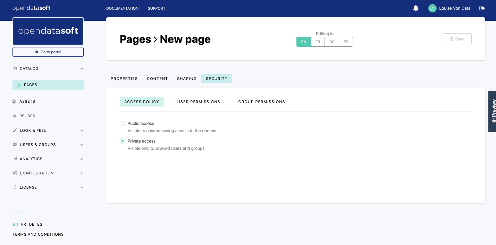
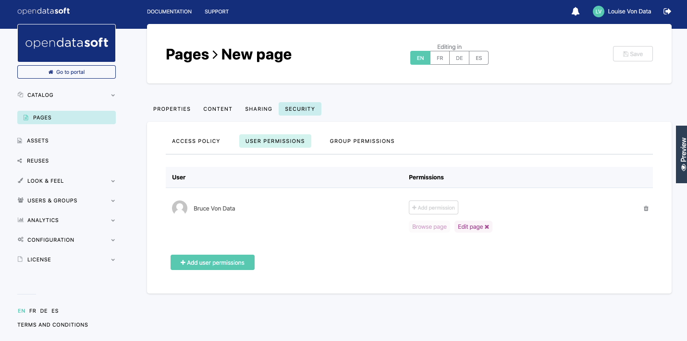

Managing the security of a page
===============================

To manage a content page security, go to the Pages section of the back office, in the Security tab of the chosen content page.

.. admonition:: Important
   :class: important

   General permissions at the domain level have priority over permissions at the page level. For example, if a user has the *Browse all pages* permission, they can access any page, even the private ones. They don't need to be added to the page and granted security permissions for that private page.

Choosing an access policy
-------------------------

Content pages created with the Opendatasoft platform can either be accessible by anyone allowed on the portal or restricted to specifically defined users.

To choose the access policy of a content page:

1. Go to Security > Access policy.
2. Perform one of the following actions:

  - Click the **Public access** button to let any user access the page, as long as they have access to the portal; or
  - click the **Private access** button to restrict the access to the page to specifically defined users and/or groups of users.

.. admonition:: Caution
   :class: caution

   If a user has access to a content page created from datasets that they aren't allowed to access, all related visualizations will not load. However, that user will be able to read all other information displayed on the content page, such as text.

Managing page permissions for users and groups
----------------------------------------------

.. admonition:: Important
   :class: important

   Users and groups must be added in the Users & Groups section beforehand. Otherwise, they can't be found in a page security management. No matter the access policy or the permission, permissions can indeed be given to users individually or through groups of users, but both users and groups must already be listed in the Users & Groups section of the back office (where users are invited to the portal and where groups are created).

There are 2 permissions available in the security management of a content page:

- *Browse page*: it allows the user/group of users to access the page and its content. This permission is set by default for all users added to the security management section of the page.
- *Edit page*: it allows the user/group of users to access the back office to edit the content of the page.

These permissions have different impacts depending on the chosen access policy.

- *Browse page* permission:

  - For a private page, the *Browse page* permission gives access to that page, hence the importance of adding users to the security management section. Otherwise, nobody (except users with the general domain-level *Browse all pages*) can access the page and its content.
  - For a public page, the *Browse page* permission doesn't change anything to the access security of that page because it is already accessible by anybody who has access to the domain.

- *Edit page* permission: this permission is relevant for both private and public pages and gives edition rights on the page to any user/group of users added to the security management section of the page and granted with this *Edit page* permission.

Adding and deleting users or groups of users from a page
^^^^^^^^^^^^^^^^^^^^^^^^^^^^^^^^^^^^^^^^^^^^^^^^^^^^^^^^

Adding users or groups to a page
~~~~~~~~~~~~~~~~~~~~~~~~~~~~~~~~

1. Go to Security > User permissions or Security > Group permissions, depending on whether a user or a group will be added.
2. Click the **Add user/group permissions** button at the bottom of the table.
3. Select one or more users/groups of users from the list. A search bar is also available to search a user/group by name.
4. (optional) If all added users/groups are going to be granted the *Edit page* permission as well as the default *Browse page* permission, it is possible to grant that permission now. Otherwise, permissions can be granted afterward. To grant the *Edit page* permission, at the top of the "Add user/group permissions" window, in the "Grant these permissions" section:

  a. Click the **Add permission** button.
  b. Click the *Edit page* permission button.

5. Click the **Add user/group permissions** button at the bottom of the Add user/group permissions window.
6. Click the **Save** button in the top right corner.

Deleting users or groups from a page
~~~~~~~~~~~~~~~~~~~~~~~~~~~~~~~~~~~~

1. Go to Security > User permissions or Security > Group permissions, depending on whether a user or a group will be deleted.
2. In the table, the first column indicates the name of the user or the group of users. The second column indicates the corresponding permission(s). The third column displays the |trash-button| button. Click that |trash-button| button to delete a chosen user/group of users.
3. Click the **Save** button in the top right corner.

Managing page permissions for users and groups of users
^^^^^^^^^^^^^^^^^^^^^^^^^^^^^^^^^^^^^^^^^^^^^^^^^^^^^^^

Managing page security permissions can mean 2 things:

- granting a user or a group of users a new page permission, or
- deleting a page permission for a user or a group of users.

Granting page permissions for users or groups
~~~~~~~~~~~~~~~~~~~~~~~~~~~~~~~~~~~~~~~~~~~~~

1. Go to Security > User permissions or Security > Group permissions, depending on whether the new permission must be granted to a user or a group of users.
2. In the table, the first column indicates the name of the user or the group of users. The second column indicates the corresponding permission(s). In this second column, click the **Add permission** button to add a new permission to a chosen user or group of users.
3. Click on the permission to grant.
4. Click the **Save** button in the top right corner.

.. admonition:: Note
   :class: note

   Since there are only 2 page permissions, including the default *Browse page* permission, the only permission left to be granted is *Edit page*.

Deleting page permissions for users or groups
~~~~~~~~~~~~~~~~~~~~~~~~~~~~~~~~~~~~~~~~~~~~~

1. Go to Security > User permissions or Security > Group permissions, depending on whether the new permission must be deleted for a user or a group of users.
2. In the table, the first column indicates the name of the user or the group of users. The second column indicates the corresponding permission(s). In this second column, click on a chosen permission to delete it.
3. Click the **Save** button in the top right corner.

.. admonition:: Note
   :class: note

   It isn't possible to delete the *Browse page* permission. The only page permission that can be deleted is *Edit page*. To prevent a user from accessing a page, the page must be private (see `Choosing an access policy`_), and the user must be deleted from the page security (see `Deleting users or groups from a page`_).

