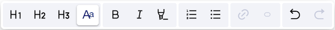
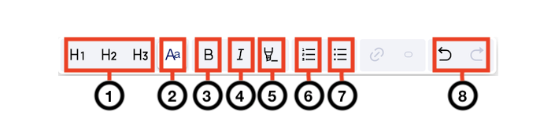

Adding text
===========

You can add some text to a block using the text editor.

Selecting the block type
------------------------

You need to define the block type before you configure the content you want to add.

1. From the preview pane, click the block you want to edit.
2. From the left side pane, select **Text** as the block type.
3. Click **Next**.

If you change your mind, you can change the block type afterward.
The block configuration will be reset after you change the block type.

Adding text to a block
----------------------

1. From the preview pane, click the block you want to edit.
2. From the left side pane, select **Text** as the block type.
3. Click **Next** to continue with the configuration.
4. Enter your text in the block.
5. Format the text using the text editor and the toolbar.
6. Click **Save** to save your work. 

Text editor overview
--------------------

.. localizedimage:: images/text-editor.png

The left side pane of the text editor allows you to perform the following actions:

  - Controlling block alignment (right, center, or left)
  - Inserting or removing lists
  - Inserting separators
  - Undoing and redoing actions

.. admonition:: Note
    :class: note
 
    When configuring the alignment, you can only use a single option (right, center, or left) for the whole block.
    You cannot define a different text alignment for a heading, a paragraph, or a list within a block.

Formatting text using the toolbar
---------------------------------

When entering some text in a block, you can format it using the editor toolbar.

Format text
~~~~~~~~~~~

1. In the text block, select the text you want to format.
2. Use the icons from the toolbar that appears to format your text.

Toolbar overview
~~~~~~~~~~~~~~~~

.. list-table::
   :header-rows: 1
   :widths: 20 30 50

   * * Annotation
     * Name
     * Description
   * * 1
     * Headings
     * | You can choose from three levels of headings:
        
       - Heading 1 (H1)
       - Heading 2 (H2)
       - Heading 3 (H3)
        
   * * 2
     * Paragraph
     * Adds regular body text.
   * * 3
     * Bold
     * Makes the text bold.
   * * 4
     * Italic
     * Italicizes the text.
   * * 5
     * Highlight
     * Highlights the text.
   * * 6
     * Ordered list
     * Creates an ordered list from the selected text.
   * * 7
     * Unordered list
     * Creates an unordered list from the selected text.
   * * 8
     * Undo and redo
     * Undoes and redoes the last actions that you performed.
