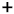
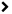
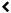

Navigate on a Map Builder map
=============================

Overview of the interactive map of Map Builder
----------------------------------------------

.. localizedimage:: images/navigate-on-map.png
    :alt: Screenshot of Map Builder in preview mode

The interactive map contains the same buttons as in any OpenDataSoft map:

* polygon |icon-polygon|, circle |icon-circle| and square |icon-square| buttons to draw on the map and filter on certain areas, along with the edit shape |icon-edit| and delete shape |icon-trash-map| buttons to go with them
* |icon-fullscreen| to view your map in fullscreen mode

.. admonition:: Note
   :class: note

   The fullscreen mode button won’t appear if your map is embedded within an iframe, due to technical limitations.

* zoom in |icon-zoom-in| and zoom out |icon-zoom-out| buttons
* localize |icon-localize| button to focus the map on your current location

However, any interactive map created with Map Builder also contains specific features, whether they are optional or not:

* a search bar, to make research on your map
* the list of all the layers contained in the map, which you can hide or display
* on the bottom right-hand corner of the map, a box containing the caption of each layer displayed, to better understand the map

Display or hide layers
----------------------

.. localizedimage:: images/layer-hidden.png
    :alt: Screenshot of Map Builder in preview mode, when a layer is hidden

By default, all your map layers are displayed on your map. The list of all the layers that compose your Map Builder map is displayed on the top right-hand corner of the map.

You can hide layers in case you only want to focus on specific layers or even on just one very layer. To hide a layer, simply click on it. You will see that the layer disappears from the map, and that its title and description in the list turn light gray and are detached from the active, displayed layers.

.. admonition:: Note
   :class: note

   If the map was configured on a monolayer mode, you will only be able to display one layer at a time. It means that if you display one specific layer, all the other layers will automatically be hidden.

Understand the map: captions
----------------------------

.. localizedimage:: images/caption-map.png
    :alt: Screenshot of Map Builder with an enlarged caption

For a better understanding of the map, each layer can have a related caption you can refer to. All available captions are displayed on the bottom right-hand corner of the map, under the list of layers. To go from one caption to another, simply click the |icon-left| and |icon-right| buttons.

By default, the caption box is reduced to showing the most important information only, and to not take too much space on the map. You can only see the name of the layer it refers to and its captions. To expand this box and see more details, simply click the |icon-up| button.

Use the search bar
------------------

You can use the search bar to make research on your map. To do so, simply enter a keyword in the search bar at the top left-hand corner of the map. By default, the search bar will return location results. If you click on a location result, the map will automatically move to that selected location.

.. localizedimage:: images/search-bar.png
    :alt: Zoom on the results of a research in Map Builder

However, the search bar will also suggest searching the keyword in the displayed data, meaning into the datasets that compose the layers of your Map Builder map.

.. localizedimage:: images/search-interface.png
    :alt: Screenshot of Map Builder when using the search bar

.. |icon-circle| image:: images/icon-circle.png
    :width: 14px
    :height: 14px

.. |icon-square| image:: images/icon-square.png
    :width: 14px
    :height: 14px

.. |icon-edit| image:: images/icon-edit.png
    :width: 16px
    :height: 16px

.. |icon-fullscreen| image:: images/icon-fullscreen.png
    :width: 20px
    :height: 20px

.. |icon-zoom-out| image:: images/icon-zoom-out.png
    :width: 13px
    :height: 12px

.. |icon-localize| image:: images/icon-localize.png
    :width: 16px
    :height: 16px

