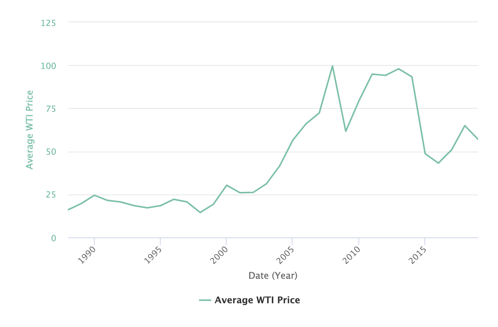
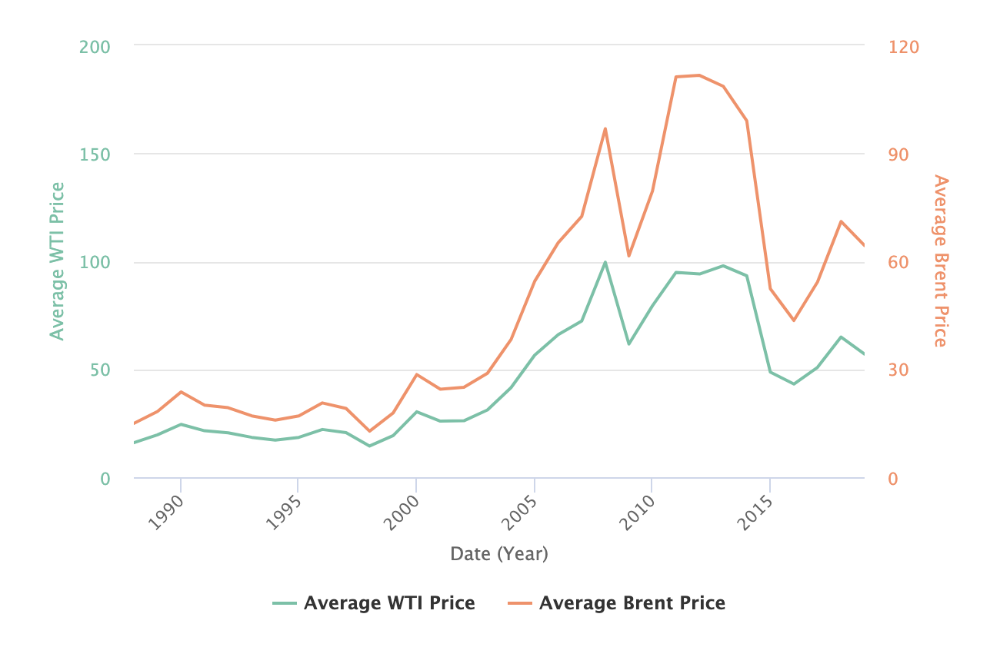
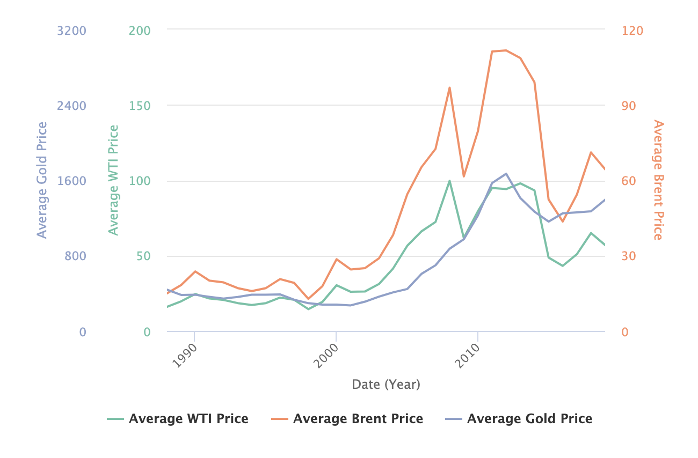
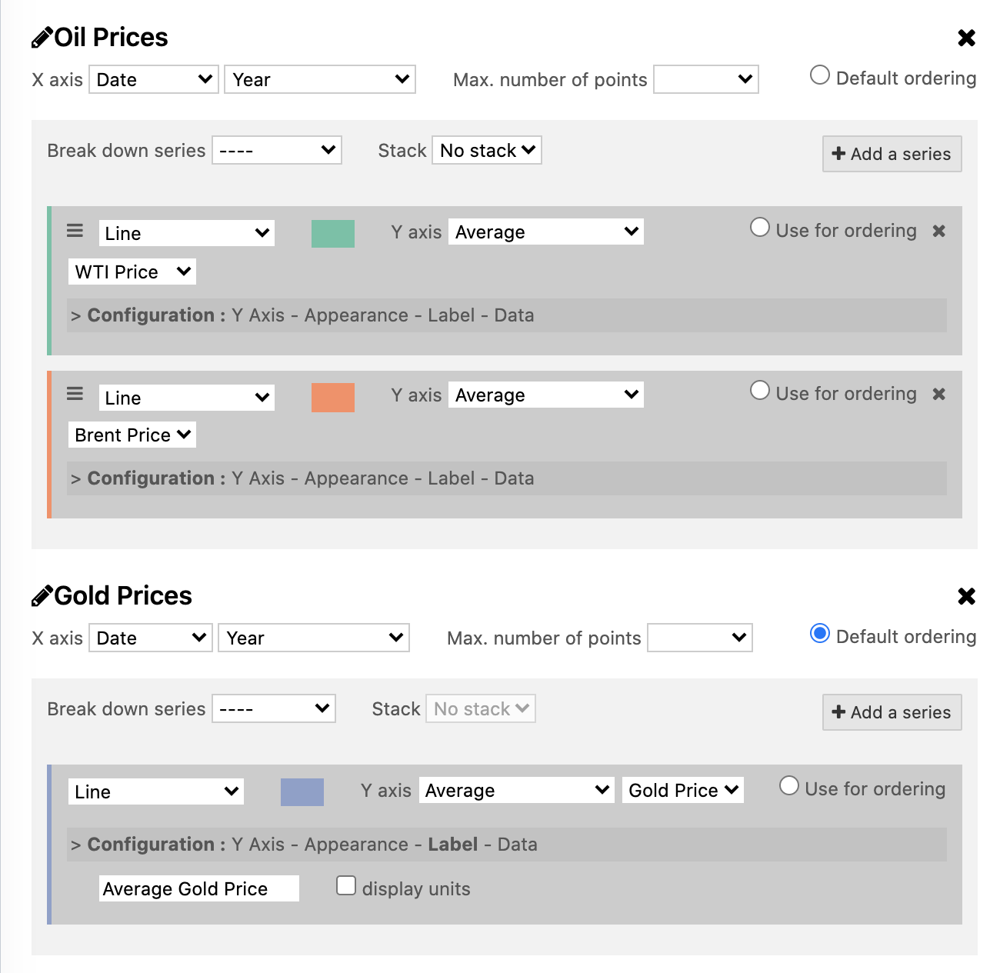

Analyzing with the Chart Builder
================================

The Chart Builder tool allows you to visualize multiple datasets on a single customized chart.

It is usually made available by the domain administrator via a **Charts** link in the header menu. You can also access the Chart Builder through the following URL: ``http://<DOMAIN ADDRESS>/chart``.

The Chart Builder is more flexible than **Analyze** tab. With the Chart Builder, you're not limited to one dataset. You can combine different sources from your domain and the Opendatasoft network.

After you create and save a chart, you can share it, embed it, or use it as a widget.

.. admonition:: Prerequisite
   :class: important

   Before you begin, see how to :doc:`configure visualizations </publishing_data/07_configuring_visualizations/03_configuring_analyze_view/analyze>` for a dataset.

First layer
-----------

Click on **Add a dataset to this layer** to start importing data to your chart.

The list of available datasets is displayed: you can search or browse by category to find your datasets.
As usual, you can preview and filter a dataset before importing it.

As an example, let's take the public dataset "`Entreprises immatriculées en 2015`" from `Data Infogreffe` domain.
You can click **Filter data** to refine the data, but in our case, select the dataset.

In the configuration, you can choose the appropriate type of graph. Select **Column chart**.

By default, Y-axis is set to **Count**, and the plot is a **Line**.

Next to this selection menu, you click on the color box to pick another color for the columns.

In the **Configuration** settings, click on **Appearance**, then **display values on chart**. This adds a label with a numerical value on top of each column.
Under **Y-Axis**, you can set the scientific display for the *Y* scale.

Finally, add a threshold color under `Color threshold: type *17000* next *Y >*` and choose another color.
You can add multiple thresholds with different colors.

Here is what this layer looks like with these settings and two thresholds:

.. image:: images/chart-onelayer.png

Adding a series
---------------

You can add a data representation on the same dataset by clicking on **Add a series**.

The **X-Axis** parameters will be the same, but you can customize the type of curve and tweak the appearance parameters on the new series.

Try changing the type from **Line** to **Spline** to see a nice curve on top of the initial column chart.

You can reorder the series by clicking and dragging. The series order affects the chart legend, and the series at the top has priority on the **Y-Axis** parameter.

Stacking layers
---------------

You create data visualizations with multiple layers. Such visualizations can help you find trends in data.

Creating a chart with multiple layers
-------------------------------------

For example, you can create a data visualization to find whether oil prices are correlated with gold prices.

This example of chart relies on the following datasets:

 - `Oil Prices <https://documentation-resources.opendatasoft.com/explore/dataset/oil-prices/>`__ that contains monthly oil prices from 1988 to 2019, and
 - `Gold Prices <https://documentation-resources.opendatasoft.com/explore/dataset/gold-prices/>`__ that contains monthly gold prices from 1988 to 2019.

This chart compares Brent and WTI prices with gold prices between 1989 and 2019.

Step 1: Add a first layer
^^^^^^^^^^^^^^^^^^^^^^^^^

1. Access the Chart Builder.

2. Click on the **Add a dataset to this layer** button.

3. Search for "Oil Prices" and select the "Oil Prices" dataset.

A line has been added to the chart.

Step 2: Add a series
^^^^^^^^^^^^^^^^^^^^

Add another series to show Brent prices:

1. Click on the **Add a series** button.

2. On the line that appears, change **WTI Price** to **Brent Price** and leave the other parameters unchanged.

A second line has been added to the chart.

Step 3: Add another layer
^^^^^^^^^^^^^^^^^^^^^^^^^

Add the "Gold Prices" dataset to see whether there is a correlation between oil prices and gold prices:

1. Click on the **Add a dataset to this layer** button.

2. Search for "Gold Prices" and select the "Gold Prices" dataset.

The default visualization is a line with the average gold price.

You can click on the pencil icon |edit-pencil| of a layer to change the selected dataset or refine the query.

.. |edit-pencil| image:: images/edit.png

3. On the "Gold Price" layer, click **Configuration > Label**.

4. Enter ``Gold Average Price`` in the **Alternate series title** field.

The chart should look like this (you may have different colors): |second-layer|

Step 4: Finalize the chart configuration
^^^^^^^^^^^^^^^^^^^^^^^^^^^^^^^^^^^^^^^^

Add a title to the chart.

1. Enter a name for this chart in the **Chart title** field.

Here is the final configuration:

2. Click on the **Save this chart** button to create a short URL that you can embed or share.

Here is the final result of the chart:

.. image:: images/chart-layers-final.png

Other examples of charts
------------------------

Column Chart
^^^^^^^^^^^^

.. image:: images/column-chart.png

Polar Chart
^^^^^^^^^^^

.. image:: images/polar-chart-example.png
