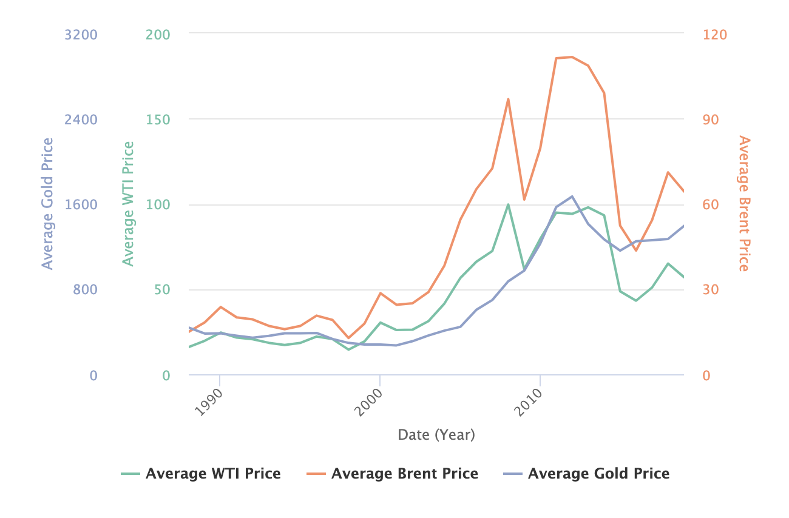
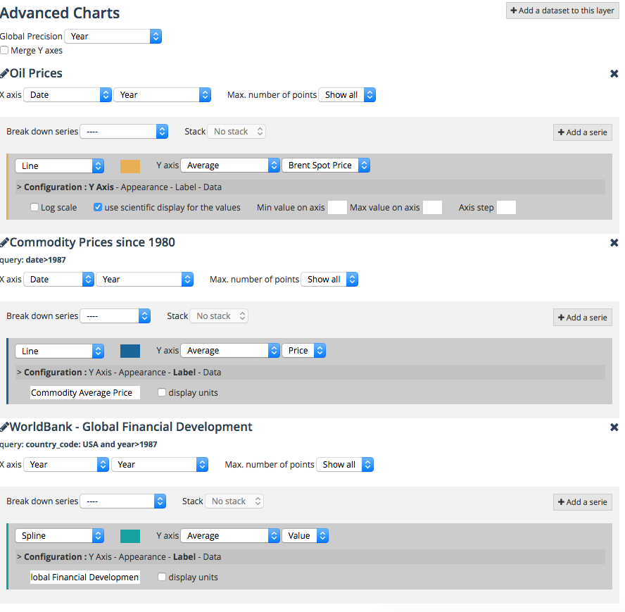
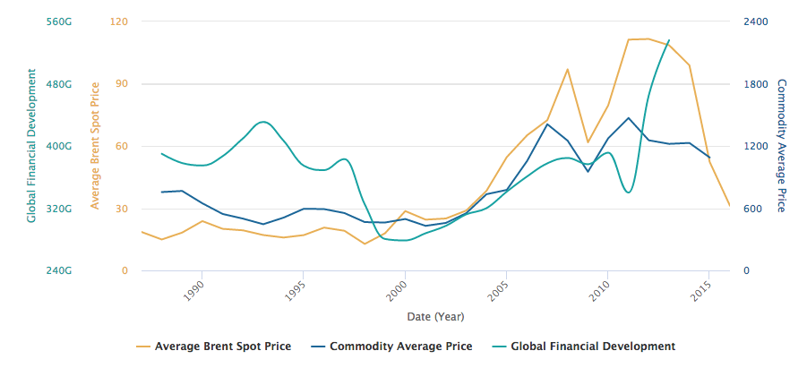

Analyzing with the Chart Builder
================================

.. admonition:: Prerequisite
   :class: important

   Read how to :doc:`configure visualizations </publishing_data/07_configuring_visualizations/03_configuring_analyze_view/analyze>` for a dataset beforehand.

With the Chart Builder tool, you can visualize multiple datasets on a single customized chart. You can save your chart and easily share it, embed it, or use it as a widget.

It is usually made available by the domain administrator in the top menu link under the codename `Charts`. The Map Builder can also be accessed using its URL: ``http://<DOMAIN ADDRESS>/chart``.

.. admonition:: Note
   :class: note

   You can also build charts with `Analyze` tab on a dataset page, but these are limited to the current dataset. With the Chart Builder you have much more possibilities, combining different sources from your domain and from the OpenDataSoft network.

First layer
-----------

Click on ``Add a dataset to this layer`` to start importing data to your chart.

The list of available datasets is displayed: you can search or browse by category to find your datasets.
As usual you can preview and filter a dataset before importing it.

As an example, let's take the public dataset "`Entreprises immatriculées en 2015`" from `Data Infogreffe` domain.
You can ``Filter data`` to refine the data, but in our case let's just ``✓ Select`` the dataset.

In the configuration, you can choose the appropriate type of graph. Select ``Column chart``

By default Y-axis is set to *Count*, and the plot is a *Line*.
You can choose the type of graph best suited to your data. Try selecting *Column chart* instead of *Line*.

Next to this selection menu, you click on the color box to pick another color for the columns.

In the `Configuration` settings, click on `Appearance`, then *display values on chart*. This adds a label with a numerical value on top of each column.
Under `Y-Axis` you can set the scientific display for the *Y* scale.

Finally, add a threshold color under `Color threshold: type *17000* next *Y >*` and choose another color.
You can add multiple thresholds with different colors.

Here is what this layer looks like with these settings and two thresholds:

.. image:: images/chart-onelayer.png

Adding a serie
--------------

You can add a data representation on the same dataset by clicking on ``Add a serie``.

The `X-Axis` parameters will be the same, but you can customize the type of curve and tweak the appearance parameters on the new serie.

Try changing the type from ``Line`` to ``Spline`` to see a nice curve on top of the initial column chart.

You can reorder the series by clicking and dragging. The series order affects the chart legend and the serie in the top has priority on the `Y-Axis` parameter.

In the next section we will add another dataset to our chart.

Stacking layers
---------------

Let's elaborate another data visualization, this time with multiple layers.

**First Layer**

We will start the same way as before, click on ``Add a dataset to this layer`` then search for "Oil Prices" to add the `Oil Prices <https://public-us.opendatasoft.com/explore/dataset/oil-prices>`_ dataset.

No need to filter it, just note that the data starts from the year 1987. We will use 1987 as the starting point for the other layers.

When you first import a dataset in Advanced Charts, the default visualization of this dataset is imported: in this case you can see two lines: `WTI Spot Price` and `Brent Spot Price`.

**Second Layer**

Let's add another dataset! Look for "Commodity Prices" to find `Commodity Prices since 1980 <https://public.opendatasoft.com/explore/dataset/commodity-prices-since-1980>`_ dataset from the OpenDataSoft public collection.

This time, add the filter "`date>1987`" so that the X-axis will match with the first layer. Then import the ~20 000 records.

The default visualization is a line with the average commodity price.

You should see your query filter just under the dataset name: "`query: date>1987`".

.. admonition:: Note
   :class: note

   You can click on the pencil icon |edit-pencil| of a layer to change the selected dataset or refine the query.

.. |edit-pencil| image:: images/edit.png

Under Configuration > Label, set "`Commodity Average Price`" as the alternate serie title (more accurate than the default title)

This should look like this (you may have different colors): |second-layer|

**Third Layer**

For the final layer, we are going to use `Global Financial Development` from WorldBank to see if there are some correlation between those.

There are more than a million records: for the chart to make sense, we will limit the records to the USA. Like the previous layer, we will also keep only records after year 1987.

These conditions translate to this query: "country_code: USA and year>1987`"

As for the second layer, configure a more explicit label name for the legend: "Global Financial Development"

**Last details**

Let's finish with a few last details to polish the Chart appearance

- Set ``Global Precision`` to `Year` instead of `Month` so that the legend reflects the data precision.

- Delete `WTI Spot Price` serie (click on the X cross) and set the X-axis to a Year precision instead of Month

- Choose ``Spline`` instead of ``Line`` in the Global Financi`al Development curve to smoothen the curve a bit.

- Now you can type a name in ``Chart title`` and click ``Save this chart`` to save create a short URL that you can embed or share!

Here are the resulting parameters:

And the final result of the chart:

Other charts examples
---------------------

**Column Chart**

.. image:: images/column-chart.png

**Polar Chart**

.. image:: images/polar-chart-example.png
