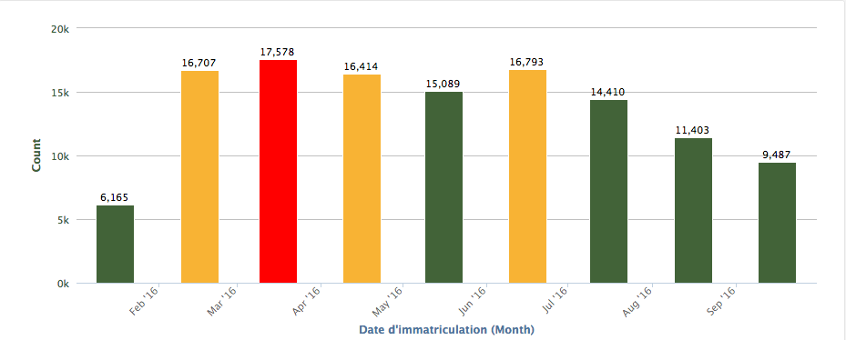

Analyzing data
==============

.. note:: Read how to :doc:`configure visualizations </sourcing_and_processing_data/configuring_visualizations/analyze>` for a dataset beforehand.

With the `Charts` tool, you can visualize multiple datasets on a single customized chart.
You can save your charts and easily share them, embed them, or display them as widgets.

.. warning:: Charts currently takes temporal data only (i.e. X axis as dates)

First layer
-----------

Click on ``Add a dataset to this layer`` to start importing data to your chart.

The list of datasets available will appear: you can search or browse by category to find your datasets.
As usual you can preview and filter the dataset before importing it.

For this example, let's take the public dataset "`Entreprises immatriculées en 2015`" from `Data Infogreffe` domain.
You can ``Filter data`` to refine the data, but in our case let's just ``✓ Select`` the dataset.

In the configuration, you can choose the appropriate type of graph. Select ``Column chart``

By default Y-axis is set to *Count*, and the plot is a *Line*.
You can choose the type of graph best suited to your data. Try selecting *Column chart* instead of *Line*.

Next to this selection menu, you click on the color box to pick another color for the columns.

In the `Configuration` settings, click on `Appearance`, then *display values on chart*. This adds a label with a numerical value on top of each column.
Under `Y-Axis` you can set the scientific display for the *Y* scale.

Finally, add a threshold color under `Color threshold: type *17000* next *Y >* and choose another color.
You can add multiple thresholds with different colors.

Here is what this layer looks like with these settings and two thresholds:

In the next section we will add another layer to our chart.

Stacking layers
---------------

Customizing icons
-----------------
