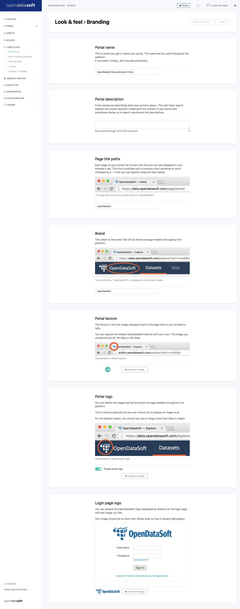

Branding your portal
====================

OpenDataSoft gives you the ability to deeply customize the look and feel of your portal. You can apply your own branding (brand name, logo, portal name, etc) thanks to the "Look & feel" menu of your portal's back office.

The "Branding" page guides you through the selection of your portal name, the page title and favicon displayed by web browsers, and the brand and logo displayed on the portal and the login menu.

    Branding page
