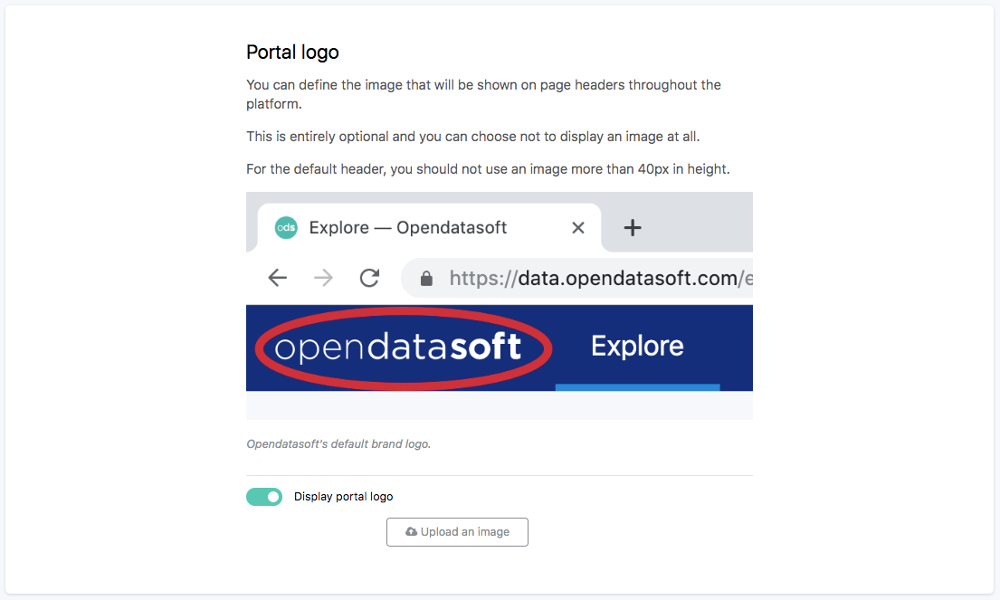

Branding your portal
====================

Opendatasoft portals can be customized according to a chosen corporate branding. Go to Look & feel > Branding to choose a portal name, write a portal description, choose a page title prefix, define the brand name or add a portal favicon or logo.

Choosing a portal name
----------------------

The portal name is used throughout the platform. By default, the portal name is the domain identifier (i.e. the name written in the URL of the portal).

To choose a new portal name:

1. In the Portal name area of the Branding configuration interface, click on the textbox.
2. Write a new portal name.
3. Click on the Save button in the top right corner.

Writing a portal description
----------------------------

The portal description helps search engines and social networks understand the content of the Opendatasoft portal. It may also show up in search results and links descriptions.

To write a new portal description:

1. In the Portal description area of the Branding configuration interface, click on the expandable textbox.
2. Write a new portal description.
3. Click on the Save button in the top right corner.

Choosing a page title prefix
----------------------------

The page title prefix is displayed in the browser's tab. It is usually preceded by the name of the page that is currently visited, both being separated with a `—` sign.

To choose a page title prefix:

1. In the Page title prefix area of the Branding configuration interface, click on the textbox.
2. Write a page title prefix.
3. Click on the Save button in the top right corner.

Defining a brand name
---------------------

The brand name is used throughout the platform, in every header.

To define the brand name:

1. In the Brand area of the Branding configuration interface, click on the textbox.
2. Write the brand name.
3. Click on the Save button in the top right corner.

Adding a portal favicon
-----------------------

The favicon is the small image displayed in the browser's tab, next to the page title. The default favicon is Opendatasoft's logo. It should be replaced with images that are either 16x16px or 32x32px.

To add a new portal favicon:

1. In the Portal favicon area of the Branding configuration interface, click on the Upload an image button.
2. Choose a favicon using the file finder.
3. Once the favicon has been selected, click on the Save button in the top right corner.

Adding a portal logo
--------------------

The logo is displayed in every header, throughout the platform. The addition of a portal logo is optional. If one is added, for a default header, we advise not to upload an image which height is 40px maximum.

To add a new portal logo:

1. In the Portal logo area of the Branding configuration interface, make sure the Display portal logo toggle button is activated.
2. Click on the Upload an image button.
3. Choose a logo using the file finder.
4. Once the logo has been selected, click on the Save button in the top right corner.

Adding a login page logo
------------------------

The login page logo is displayed in the page where users can log in the portal. By default, Opendatasoft's logo is displayed. It should be replaced with an image which width is 450px maximum.

To add a new login page logo:

1. In the Login page logo area of the Branding configuration interface, click on the Upload an image button.
2. Choose a logo using the file finder.
3. Once the logo has been selected, click on the Save button in the top right corner.
