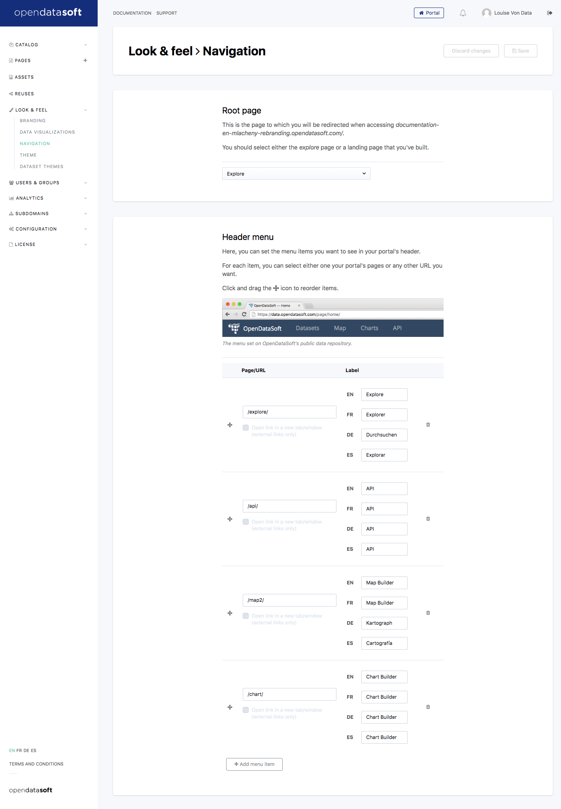

Configuring the navigation menu
===============================

Once your page content has been fully defined, you might want to *plug* your page in your domain's menu. This can easily
be done by editing the menu components in the *Domain > Portal > General settings* section.

