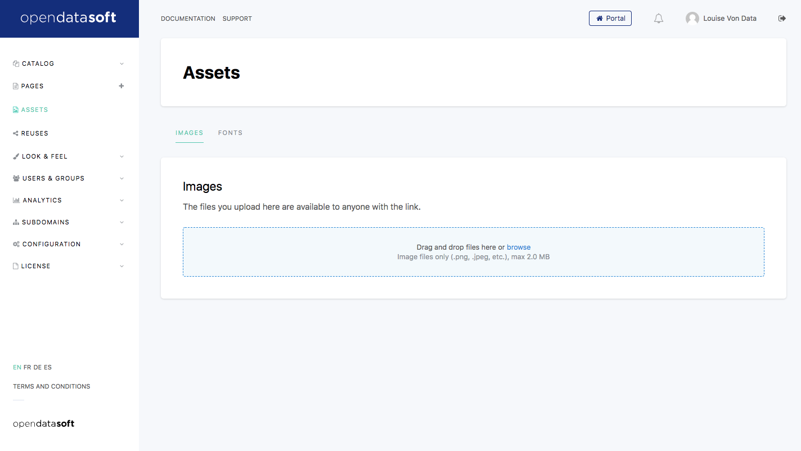

Adding assets
=============

Assets are static files that are uploaded in an Opendatasoft domain, in order to be usable throughout that same domain (e.g. in the domain :ref:`stylesheet <stylesheet>`, in content pages, etc.). Either images or fonts files can be added as assets in the domain.

This feature is available in the **Assets** section of the back office of an Opendatasoft domain.

Adding an image as an asset
---------------------------

All image files formats are accepted as assets: .gif, .png, .jpeg, .jpg, .tiff, .bmp and .svg.

Added files must not exceed 2.0 MB. For larger files, an external file-hosting service should be used.

1. Go to the **Assets** section of the back office.
2. Make sure the Images tab (default) is selected.
3. Either drag and drop the image file in the corresponding area, or click on "browse" to select the image file using a file picker.

Adding a font as an asset
-------------------------

The following font files formats are accepted as assets:

- .ttf
- .woff
- .otf

Added files must not exceed 500.0 KB. For larger files, an external file-hosting service should be used.

1. Go to the **Assets** section of the back office.
2. Click on the Fonts tab.
3. Either drag and drop the font file in the corresponding area, or click on "browse" to select the font file using a file picker.
