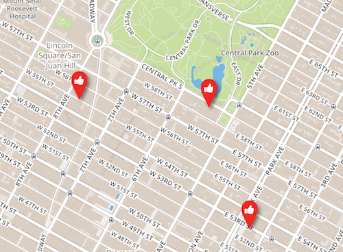

Choosing a base map
===================

Mapbox integration
------------------

`Mapbox <https://www.mapbox.com/>`_ is a mapping platform that allows you to build and design your own maps; they also
provide a dozen different map styles that you can directly use. If you have a Mapbox account, you can configure it into
OpenDataSoft so that your users can display your data over these map styles.

If you don't have a Mapbox account, you can create one for free, although it is going to have a small number of allowed
"map views". See `Mapbox plans <https://www.mapbox.com/plans/>`_ for more information.

Once you are logged on the Mapbox website with your account, you can go on
`your account page <https://www.mapbox.com/account/apps/>`_ and copy your Default Public Token or create a new Public
access token; this is the key that will be used by OpenDataSoft to display maps on the behalf of your own Mapbox
account.

Go to *Look & feel*, then *Data visualizations* ; you will find a Mapbox configuration form where you can
enter your Mapbox public access token. A message will confirm whether your access token is valid or not.

.. ifconfig:: language == 'en'

    .. image:: images/basemaps__mapbox-integration--en.png
       :alt: Mapbox integration configuration

.. ifconfig:: language == 'fr'

    .. image:: images/basemaps__mapbox-integration--fr.png
       :alt: Configuration de l'intégration Mapbox

Below the Mapbox integration token, you will be able to select one of Mapbox's
default styles, or choose "Custom" to enter the MapID of a map you created on Mapbox.

.. ifconfig:: language == 'en'

    .. image:: images/basemaps__mapbox-custom-tiles--en.png
       :alt: Custom tiles configuration

.. ifconfig:: language == 'fr'

    .. image:: images/basemaps__mapbox-custom-tiles--fr.png
       :alt: Configuration des tuiles personnalisées
