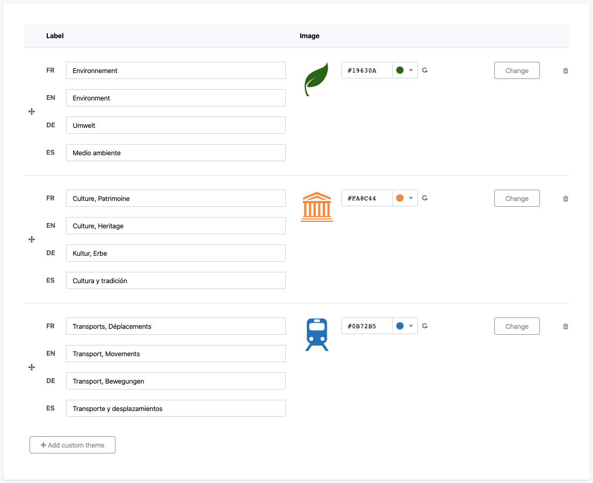

Managing the dataset themes
===========================

All published datasets of an Opendatasoft portal should belong to at least one theme. Dataset themes indeed help categorizing the datasets based on what the data they contain is about. Although each dataset's theme is defined in its edition interface like any other metadata, the list of available dataset themes for the portal is configured from the Look & feel > Dataset themes interface.

Dataset themes are managed from the table which comprises 2 columns:

- Label, from which the label of the dataset theme is defined ;
- Image, from which the icon of the dataset theme is configured.

The dataset themes table also contains 2 options:

- a reorder [reorder] button, displayed on the left of the Label column, to change the order of the dataset theme among the others ;
- a trash [trash] button, displayed on the right of the Image column, to delete a dataset theme.

By default, X dataset themes are configured on a newly created Opendatasoft domain:

- [list]

Defining a new dataset theme
----------------------------

1. Click on the Add custom theme button below the dataset theme table.
2. In the Label column, define the label of the new dataset theme. There must be one label per language available on the portal.
3. In the Image column, click the Select button.
4. Choose one of the 4 available methods to define the icon of the dataset theme:

   - "Upload an image" allows to choose ones own image using a file picker
   - "Select a pictogram from a list" allows to choose an icon from the Opendatasoft icon library
   - "Enter an image URL" allows to add ones own image via a URL
   - "No image" (default) allows to leave the dataset theme without any associated icon.

5. Click the Save button in the top right corner of the page.
