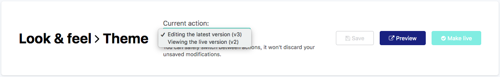

Customizing portal themes
=========================

The default theme of all Opendatasoft portals can be entirely customized, not only in terms of layout and colors, but also regarding specific areas such as header, footer and catalog cards. Theme configurations and managed from the **Look & feel > Theme** subsection of the back office.

.. image:: images/theme_interface.png

The Theme interface comprises 3 main blocks.

- The header (1), which not only displays the title of the interface, but also a *Current action* drop-down menu to manage versioning (see :ref:`Versioning themes <theme_versioning>`). 3 important buttons are also displayed in the header:

  - Save, to save the new configurations
  - Preview, to open in a new tab the Opendatasoft portal with the newly applied configurations
  - Make live, to define the newly applied configurations as the new, live theme available on the Opendatasoft portal

* The **API key for offline development** management block (2), which allows the use and generation of new API keys (see note right below for more information).

.. admonition:: Note
   :class: note

   It is possible to create stylesheets outside the platform, with any standard web developping tool, and to push them to the platform using an API key. For an easier and quicker usage, the `Opendatasoft Portal Development Kit <https://github.com/opendatasoft/ods-portal-devkit>`_ is at disposal: it is an open source project created by Opendatasoft, that can be downloaded on Github.

   To find and use a theme API key, click on the **API key for offline development** block to expand it. The current API key is displayed in the block, ready to be copied and used.

   It is also possible to generate a new API key by clicking on the Generate new key button. However, be careful when generating new API keys: only the current one can be used, which means that generating a new API key revokes all previous ones.

- A block of 6 tabs (3), each one allowing to configure a part of an Opendatasoft portal theme (see :ref:`Customizing a portal theme <theme_customization>`):

  - :ref:`Layout options <layout_options>`, to modify the general layout of the portal
  - :ref:`Colors <colors>`, to change colors of backgrounds, texts, borders, links, etc.
  - :ref:`Stylesheet <stylesheet>`, to add more style to the portal with CSS
  - :ref:`Header <header_footer>`, to modify the header with HTML code
  - :ref:`Footer <header_footer>`, to modify the footer with HTML code
  - :ref:`Catalog card <catalog_card>`, to modify the catalog cards with HTML code

.. _theme_versioning:

Versioning themes
-----------------

Portal themes are versioned, which means that each customized new theme has a version number assigned to it. Once a theme is finished and made live, another version is automatically created: it is the new draft theme on which to work until it is ready to be live.

The *Current action* drop-down menu displayed in the header indicates on which version one is currently working on. It also allows to select previous themes that were already made live.

.. admonition:: Important
   :class: important

   Once a theme is live, it is completely locked: it is not possible to make any other modifications. Only the latest, draft version can be modified.

While working on the latest draft version of the portal theme, it is possible to preview what the portal will look like with this new theme. A Preview button is indeed displayed between the Make live and Save buttons, to open a new tab with the portal configured with the draft theme.

.. admonition:: Note
   :class: note

   Only users able to edit the domain properties can preview the latest theme version. If sharing the URL with other users who were not granted the right permissions, they would see the portal with the live theme.

.. _theme_customization:

Customizing a portal theme
--------------------------

.. _layout_options:

Layout options
^^^^^^^^^^^^^^

The **Layout options** tab allows to customize the portal layout, which by default relies on a 12-columns grid system inherited from the `Bootstrap CSS framework <http://getbootstrap.com/css/#grid>`_.

More specifically, in this tab, it is possible to modify:

- the *Gutter width*, which is the space (in pixels) between the various elements that compose an interface of the portal (columns, rows and boxes)
- the **Responsive breakpoints**, which are the various screen widths (in pixels) at which the layout should change to adapt to the available space (e.g. the portal layout should differ depending on whether it is used from a mobile phone or a desktop, because the screen of a mobile phone is much smaller than that of a desktop). A web interface that adapts depending on the screen width is indeed called "responsive". There are 3 configurable breakpoints between 4 standard screen size associated with common devices:

   - *Mobile to tablet*: to go from an extra-small screen to a small screen
   - *Tablet to desktop*: to go from a small screen to a medium screen
   - *Desktop to large desktop*: to go from a medium screen to a large screen

.. admonition:: Note
   :class: note

   Mobile, Tablet, Desktop and Large desktop are used as reference because they are common devices that illustrate quite well the 4 standard screen sizes (extra-small , small , medium and large) that can be encountered. Keep in mind however that Mobile for example doesn't mean that the user is actually using a mobile device, but rather that the browser used by the user only offers an extra-small display area.

To modify a layout option:

1. Write a new width, in pixels, in the chosen textbox.
2. Click on the Save button in the top right corner.

To reset any layout option to its default value, click on the |icon-trash| button.

.. _colors:

Colors
^^^^^^

The **Colors** tab allows to customize the colors used in the texts and links, backgrounds and borders of the portal.

.. admonition:: Important
   :class: important

   If a :ref:`custom stylesheet <stylesheet>` has been created for the portal, the CSS rules that is contains will have precedence over the colors defined in the Colors tab.

The color of following elements of an Opendatasoft portal can be configured in this tab:

.. list-table::
   :header-rows: 1

   * * Category
     * Configurable elements
   * * Text
     * - *Text* (main)
       - *Links*
       - *Links in the header*
       - *Links in the footer*
       - *Titles*
       - *Section titles*
       - *Highlight* (active element)
   * * Background
     * - *Page background*
       - *Boxes background*
       - *Section titles background*
       - *Header background*
       - *Footer background*
   * * Borders
     * - *Boxes border*

To modify a theme color:

1. In the chosen textbox, write the hexadecimal code of the new color, or click the color button to choose a new color using either the Nice colors, or the Color wheel.
2. Click on the Save button in the top right corner.

To reset to the color of the currently live portal theme, click on the |icon-reset| button.

.. _theme_colors_variables:

.. admonition:: Note
   :class: note

   Theme colors can be used in the domain stylesheet, as CSS variables:

   .. code-block:: css

      var(--variable-name)

   The available variables are: ``text``, ``links``, ``titles``, ``page-background``, ``highlight``, ``boxes-background``, ``boxes-border``, ``section-titles``, ``section-titles-background``, ``header-background``, ``header-links``, ``footer-background`` and ``footer-links``.

   These CSS variables are compatible with all browsers, because the Opendatasoft platform automatically replaces all variables with their real theme color values.

.. _stylesheet:

Stylesheet
^^^^^^^^^^

The **Stylesheet** tab displays an editor in which to add pure CSS style rules. It allows the push even further the customization of a portal theme. All rules added in this tab will have precedence over the configurations defined in the other theme tabs.

To change the style of an element, find the element's class and change the desired CSS property. Class names are written as block, element, modifier: ``.ods-block[--blockmodifier][__element][--elementmodifier]``.

.. admonition:: Note
   :class: note

   When using specific images and fonts for the customization of the domain, don't hesitate to upload them as assets in the platform (see :doc:`Adding assets </customizing_look_and_feel/03_adding_assets/assets>`). It allows to easily copy the assets URLs and paste them in the CSS code.

.. _header_footer:

Header and Footer
^^^^^^^^^^^^^^^^^

The **Header** and **Footer** tabs each display an editor in which to add pure HTML. Although both the header and the footer can be partially customized via the :ref:`Colors <colors>` tab, these tabs allow to push even further the customization of these areas of the portal.

Both the header and the footer are wrapped within independent AngularJS applications, which means that standard Angular directives such as ``ng-if``, ``ng-class``, ``ng-show`` and ``ng-hide`` can be used.

.. admonition:: Note
   :class: note

   To collapse the header into a click-to-expand side menu below a certain viewport width, use the ``ods-responsive-menu`` directive.

Placeholders can also be used when customizing the header and the footer: they will be replaced with the content specified in the domain customization options such as menu items, language selectors and logos.

The following placeholders are available in the **Header** tab:

.. list-table::
   :header-rows: 1

   * * Placeholder
     * Information
   * * ``##menu##``
     * Main menu, with links to chosen pages
   * * ``##secondary-menu##``
     * Menu containing links to login page and user account
   * * ``##logo##``
     * Portal logo configured in Branding
   * * ``##brand##``
     * Portal brand configured in Branding
   * * ``##language##``
     * Links to change the language of the portal

The following placeholders are available in the **Footer** tab:

.. list-table::
   :header-rows: 1

   * * Placeholder
     * Information
   * * ``##legal##``
     * Link to the Terms & Conditions defined for the portal, configured in Legals
   * * ``##language##``
     * Language picker for the languages specified for the portal
   * * ``##ods-logo##``
     * Opendatasoft logo

.. admonition:: Important
   :class: important

   JavaScript is not allowed for security reasons.

.. _catalog_card:

Catalog card
^^^^^^^^^^^^

The **Catalog card** tab displays an editor in which to add pure HTML. It allows to customize the catalog cards displayed in the catalog of the portal, which represent the published datasets of that portal (see :ref:`Exploring a dataset from the catalog <exploring_dataset>`).

The following directives allow to retrieve information related to a dataset, which could be included in the catalog card.

.. admonition:: Note
   :class: note

   Directives used in the Catalog card tab come with a standard style, which can be modified in the :ref:`Stylesheet <stylesheet>` tab.

.. list-table::
   :widths: 50 50
   :header-rows: 1

   * * Directive
     * Information
   * * ``ods-catalog-card``
     * **Mandatory**. Wraps the whole catalog card for the other directives to work
   * * ``ods-catalog-card-theme-icon``
     * Retrieves the dataset's theme and includes the related icon
   * * ``ods-catalog-card-body``
     * Provides useful style and behaviour handling edge cases (e.g. datasets without records)
   * * ``ods-catalog-card-title``
     * Retrieves the title of the dataset
   * * ``ods-catalog-card-description``
     * Retrieves the description of the dataset
   * * ``ods-catalog-card-keywords``
     * Retrieves the keywords defined for the dataset
   * * ``ods-catalog-card-metadata-item``
     * Takes an ``item-key`` and an ``item-title`` attributes. It retrieves a metadata property matching the ``item-key`` (see table below) from the dataset and includes it in the page using ``item-title`` as its label. It should be wrapped by a ``.ods-catalog-card__metadata`` element for better styling but with no obligation.

       Example: ``<ods-catalog-card-metadata-item item-title="Data" item-key="records_count"></ods-catalog-card-metadata-item>``

       The table below lists all available metadata item keys:

       .. list-table::
          :header-rows: 1

          * * Item key
            * Information
          * * ``license``
            * License (will be rendered as a link if possible)
          * * ``language``
            * Content language
          * * ``modified``
            * Date of last modification
          * * ``publisher``
            * Publisher's name
          * * ``references``
            * Link to the original source of the data
          * * ``odi_certificate_url``
            * Link to the ODI certificate
          * * ``records_count``
            * Number of records in the dataset (regardless of filters)
          * * ``attributions``
            * Names of the data owner
          * * ``source_domain``
            * For federated datasets only, the name of the domain the dataset comes from
          * * ``source_domain_title``
            * For federated datasets only, the original title of the dataset on its source domain
          * * ``source_dataset``
            * For federated datasets only, the original identifier of the dataset on its source domain
          * * ``explore.download_count``
            * Number of data downloads for this dataset

