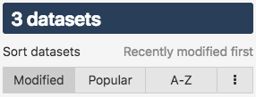

Navigating the catalog
======================

The dataset catalog of an OpenDataSoft portal is accessible from the front office for all users allowed on the portal (e.g. for open portals it could be anyone wheareas for private portals it should be only authenticated users).

The catalog, depending on the portal, can be the default landing page of that portal. However, if that portal has another page as default landing page (e.g. a homepage), a link to the catalog should be in the navigation bar at the very top of the front office. Since this navigation bar is fully customizable, the label of the link to access the catalog can be different from one portal to another (very often, "Data", "Catalog", "Explore" or "Datasets" used as labels).

The structure of a dataset catalog however remains the same no matter the portal.

.. image:: images/catalog_fullinterface.png
   :alt: Full interface of the catalog, with both sides

On the left side (1), are displayed:

- the number of datasets currently displayed,
- a catalog sort option to change the order of the datasets,
- a variety of filters for the catalog to find specific datasets,
- different possibilities to download the catalog.

On the right side (2), are displayed the datasets. Each dataset is represented as a rectangle called a "catalog card". On each card, the dataset's main metadata are displayed, along with quick links to visualize the data.

Sorting the catalog
-------------------

By default, a dataset catalog is sorted by last modification date: in other words, the most recently modified datasets are displayed in first position, at the top of the catalog.

It is possible to change in which order the catalog cards are displayed with the catalog sorting option below the number of datasets, on the left side of the interface.

The catalog can be sorted by 10 different methods:

- *Alphabetically* (one of the 3 most popular methods "A-Z"): the datasets are sorted by their titles, in an alphabetical order.
- *Unalphabetically*: the datasets are sorted by their titles, in an unalphabetical order.
- *Recently modified first* (one of the 3 most popular methods "Modified"): the datasets are sorted from the most recently modified to the least recently modified.
- *Least mostly modified first*: the datasets are sorted from the least recently modified to the most recently modified.
- *Most records first*: the datasets are sorted from the one with the biggest amount of records to the one with the least records.
- *Least records first*: the datasets are sorted from the one with the least records to the one with the biggest amount of records.
- *Most downloads first*: the datasets are sorted from the most downloaded one to the least downloaded.
- *Least downloads first*: the datasets are sorted from the least downloaded one to the most downloaded.
- *Most popular first* (one of the 3 most popular methods "Popular"): the datasets are sorted from the most popular one to the least popular.
- *Least popular first*: the datasets are sorted from the least popular one to the least popular.

To modify the sorting method, 2 possibilities:

A. Click one of the 3 most popular methods: "Modified", "Popular", "A-Z".
B. 1. Click the |icon-seemore| button to display all available sorting methods.
   2. Click the chosen sorting method in the list.

Once the new sorting method is chosen, the catalog automatically updates.

Filtering the catalog
---------------------

When navigating a catalog with only a few datasets, it is easy to scroll down and check all the datasets available. But when navigating catalogs with dozens, even hundreds of datasets, scrolling down isn't an option.
As an end-user on an open data portal, the reason for visiting that portal may not be just curiosity. The reason for being on the portal may be for a precise purpose ; to find specific data or to search for data from a specific topic, time period or even geographic area.

For these reasons and more, a variety of filtering options are available, below the number of datasets and the catalog sorting option, on the left side of the interface.

.. image:: images/filtering_catalog.png
   :alt: All options to filter the catalog: search bar, mini map and metadata filters

It is possible to filter:

- by textual research, using the search bar
- by geographic area, using the mini map
- by metadata, using the available metadata-based filters

Using the search bar
^^^^^^^^^^^^^^^^^^^^

The search bar should be used to make textual searches in the catalog. When doing a textual search, the platform will look for a match between the search and the metadata from all the available datasets (title, description, keywords etc.). The catalog will be filtered to only display those matching datasets.

.. admonition:: Note
   :class: note

   If there is no match after the textual search, the information "Your search didn't match any dataset." will be displayed instead of the catalog cards.
   Each textual search being recorded, the administrators of an OpenDataSoft portal know about each search without a match. That way, knowing the interests and needs of their end-users, they might publish new datasets in the future to answer these interests and needs.

To make a textual search:

1. Click on the search bar area.
2. Type the word to search in the datasets.
3. Press enter for the search to be taken into account, and the catalog filtered according to the typed word.

Using the mini map
^^^^^^^^^^^^^^^^^^

Under the search bar is a mini map that should be used to make geographic searches in the catalog. When doing a geographic search, the platform will look for a match between the geographic area drawn on the mini map and the geographic area metadata set for all available datasets. The catalog will be filtered to only display those matching datasets.

.. admonition:: Note
   :class: note

   By default, datasets for which the geographic area metadata has not been set cannot be found when doing a geographic search with the mini map.
   Furthermore, the mini map is only available and displayed on the catalog if at least one of the datasets has this geographic area metadata set.

To make a geographic search:

1. Click on the little rectangle button on the top left of the mini map, which is a drawing tool.
2. Draw a rectangle on the chosen area of the mini map. The catalog directly updates to only display datasets matching the geographic filter applied.

To cancel a selection, and draw on another area:

1. Click on the rectangle button again. The previous shape diseappears.
2. Draw a rectangle on the newly chosen area of the mini map. The catalog directly updates to only display datasets matching the geographic filter newly applied.

Using the selectable filters
^^^^^^^^^^^^^^^^^^^^^^^^^^^^

Under the mini map is a list of selectable filters sorted by categories based on the datasets metadata. These filters should be used to filter the datasets by view (visualizations such as Analyze, Map, Calendar etc.), date, publisher, keyword, theme, language, and any other metadata available as filter category. When searching with the selectable filters, the platform will look for a match between the selected values from the filter categories and the values set in the metadata of the available datasets. The catalog will be filtered to only display those matching datasets.

To use the selectable filters:

1. Choose a category of filters.
2. Under the name of the category of filters are listed values (which are the metadata set for the datasets). Click one of the values. The other values disappear and the catalog directly updates to only display datasets matching the newly applied filter.

.. admonition:: Note
   :class: note

   For some categories, it can be possible to select more than one value. In this case, after clicking on a value, the others do not disappear. Click on any other value to filter even more.

   For other categories, such as "Modification", the values are sorted in a hierarchical way. It means that the year must be selected first, then the months are displayed. Once the month is selected, the days are displayed in order to be selected as well.

Downloading the catalog
-----------------------

Under all the filters are different possibilities to download the catalog. This does not allow to download all of the datasets from the catalog (or the filtered ones), but it allows to download an index of the datasets from the catalog along with their main metadata.

.. image:: images/download_catalog.png
   :alt: Possible formats to download the catalog

It is possible to download the catalog in the following formats:

- XLS
- CSV
- RDF (Turtle)
- RDF (XML)
- RSS feed

Exploring a dataset from the catalog
------------------------------------

Once the right dataset of the catalog has been found, through the searching and filtering options or by scrolling down, it should be time to explore this dataset to see the data and their visualizations.

.. image:: images/catalog_card.png
   :alt: Catalog card of a dataset from a catalog

From the catalog interface, only the catalog card of the dataset is displayed. The catalog card should show the following information:

- a pictogram, to represent the theme of the dataset
- the title of the dataset
- the description of the dataset
- the name of the publisher
- the license of the dataset
- the keywords of the dataset
- links to the available visualizations of the dataset (e.g. Table, Map, etc.)
- links to tabs to share or reuse the dataset (e.g. Export, API)

.. admonition:: Note
   :class: note

   Less information can be displayed: it depends on which metadata have been set before the dataset was published.
   For the links, more or less links can also be available: it depends on which visualizations and tabs are available for the dataset.

To see more of the dataset, either click the catalog card or any of the links to directly access a precise visualization or tab. From the interface dedicated to the dataset, it is possible to:

- visualize the data,
- search the data,
- share and reuse the data,
- react and subscribe to the dataset.

.. |icon-seemore| image:: images/catalog_sort_button.png
    :width: 27px
    :height: 16px
