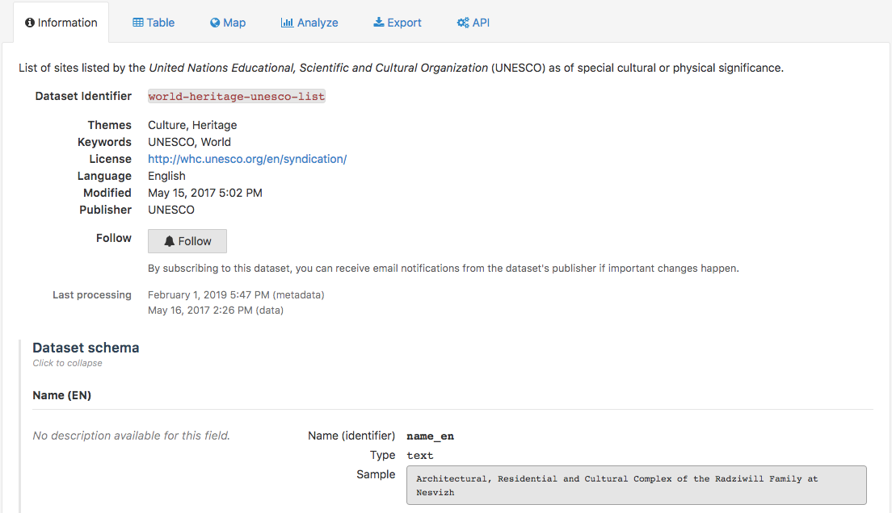

Checking dataset information
============================

The Information tab gives access to all kind of information about the dataset. This tab is often the default landing tab when clicking on a dataset card from the catalog. It also precedes all other visualization, export & API tabs.

The Information tab contains:

- the metadata of the dataset, that have been filled out by the portal administrators
- a Follow button to subscribe to the dataset (see :doc:`Following dataset updates <../04_getting_involved/following_dataset_updates>` for more information)
- the dates of last processing for metadata and data
- the dataset schema, which indicates for each field of the dataset:

  - the label,
  - the description,
  - the technical identifier,
  - the field type,
  - an example of value from this field.

- the reuses listing and reuse submit form (see :doc:`Discovering and submitting data reuses <../04_getting_involved/discovering_submitting_reuses>` for more information)

.. admonition:: Note
   :class: note

   Depending on the portal and dataset configurations, more or less information and features can be displayed in the Information tab of the chosen dataset.
