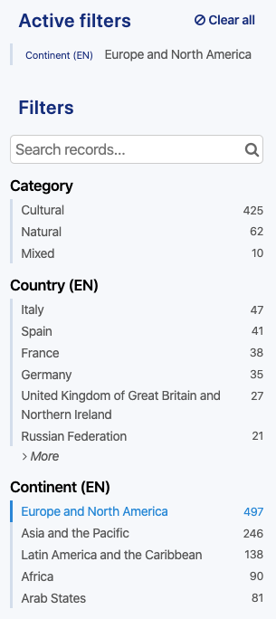

Filtering a dataset
===================

When looking up a dataset, as a user on an open data portal, you may be looking for specific data from the dataset. To find that specific data more easily, instead of scrolling through dozens or hundreds of records, different filtering options are available. The filtering options are located on the left side of the interface.

It is possible to filter:

- by textual research, using the search bar
- by existing value, using the available field-based filters

Using the search bar
--------------------

The search bar should be used to make textual searches in the dataset. When doing a textual search, the platform will look for a match between the search and the records. The dataset will be filtered to only display those matching records.

To make a textual search:

1. Click on the search bar area.
2. Type the word to search in the dataset.
3. Press enter for the search to be taken into account, and the dataset filtered according to the typed word.

.. admonition:: Note
   :class: note

   It is possible to make more advanced searches with the search bar, using the Query language (more info in the :doc:`Searching the data documentation </exploring_catalog_and_datasets/03_searching_the_data/search>`).

Using the selectable filters
----------------------------

Under the search bar is a list of selectable filters sorted by field name and based on the values related to these fields. The portal administrators choose which field should be a dataset filter. When searching with the selectable filters, the platform will only display the records containing the selected value from the chosen field.

To use the selectable filters:

1. Choose a field.
2. Under the name of the field are listed existing related values. Click one of the values. The other values disappear and the dataset directly updates to only display the records containing the chosen value.

.. admonition:: Note
   :class: note

   For some filters, it can be possible to select more than one value. In this case, after clicking on a value, the others do not disappear. Click on any other value to filter even more.

   For other filters, the values are sorted in a hierarchical way. For instance, for date fields, the year must be selected first, then the months are displayed. Once the month is selected, the days are displayed in order to be selected as well.
