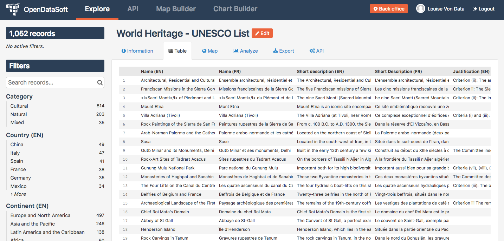

Looking up a dataset
====================

Once the right dataset has been found in the catalog, through the searching and filtering options or by scrolling down, it should be time to look it up. This section of the documentation will focus on the exploration of a chosen dataset, through the Information tab to know more about the metadata, and through all available data visualizations.

.. toctree::
   :maxdepth: 1

   checking_dataset_information
   visualizing_data
   filtering_dataset
