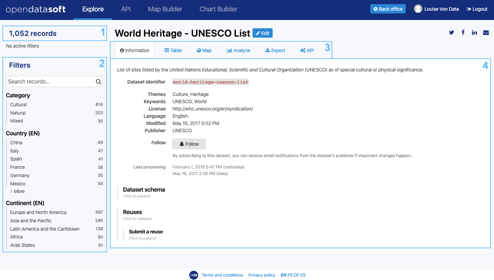

Looking up a dataset
====================

Once the right dataset has been found in the catalog, through the searching and filtering options or by scrolling down, it should be time to look it up. The visualization interface of a dataset is the same, no matter the portal.

On the left side are displayed:

- the number of records in the dataset (1),
- a variety of dataset filters to find specific records and values (2).

On the right side are displayed:

- the available tabs for the dataset (3), which can be:

  - the Information tab, to know more about the metadata,
  - the Table, Map, Analyze, Images and Calendar tabs, to visualize the data in different ways,
  - the :doc:`Export tab, to download the dataset <../04_getting_involved/exporting_data>`,
  - the API tab, to use the dataset with the OpenDataSoft API (see :doc:`Using the API <../04_getting_involved/using_api>`),
  - the :doc:`Comments tab, to discuss the dataset with other users <../04_getting_involved/commenting_via_disqus>`.

- and the content of each tab (4).

This section of the documentation will focus on the exploration of a chosen dataset, through the Information tab to know more about the metadata, and through all available data visualizations.

.. admonition:: Caution
   :class: caution

   The Edit button next to the dataset title, as well as the Back office button in the navigation bar, are only displayed for authenticated users who have the permission to administrate the OpenDataSoft domain.

.. toctree::
   :maxdepth: 1
   :hidden:

   checking_dataset_information
   visualizing_data
   filtering_dataset
