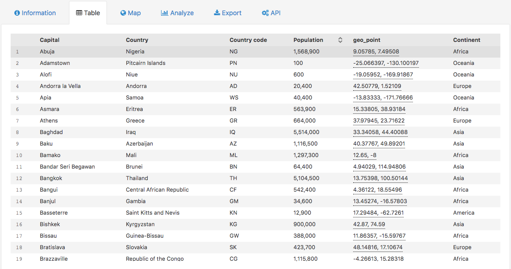
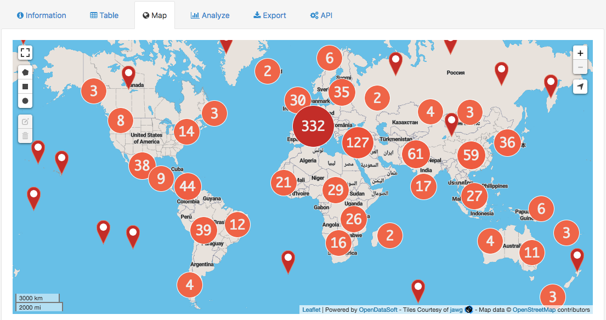
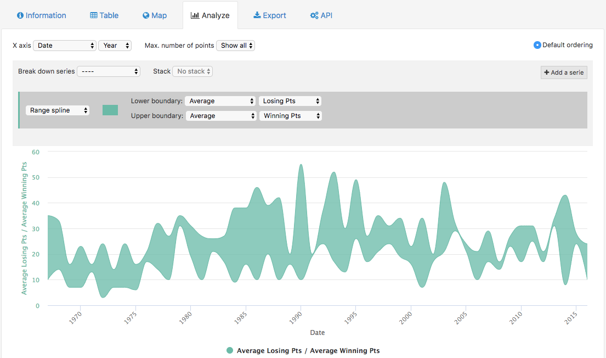
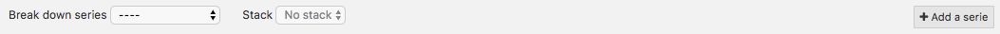
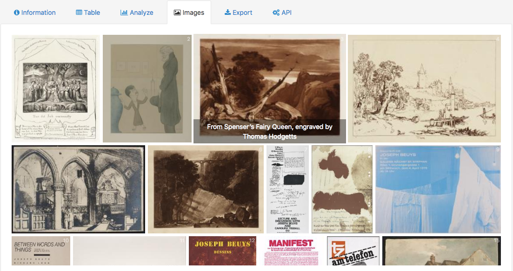
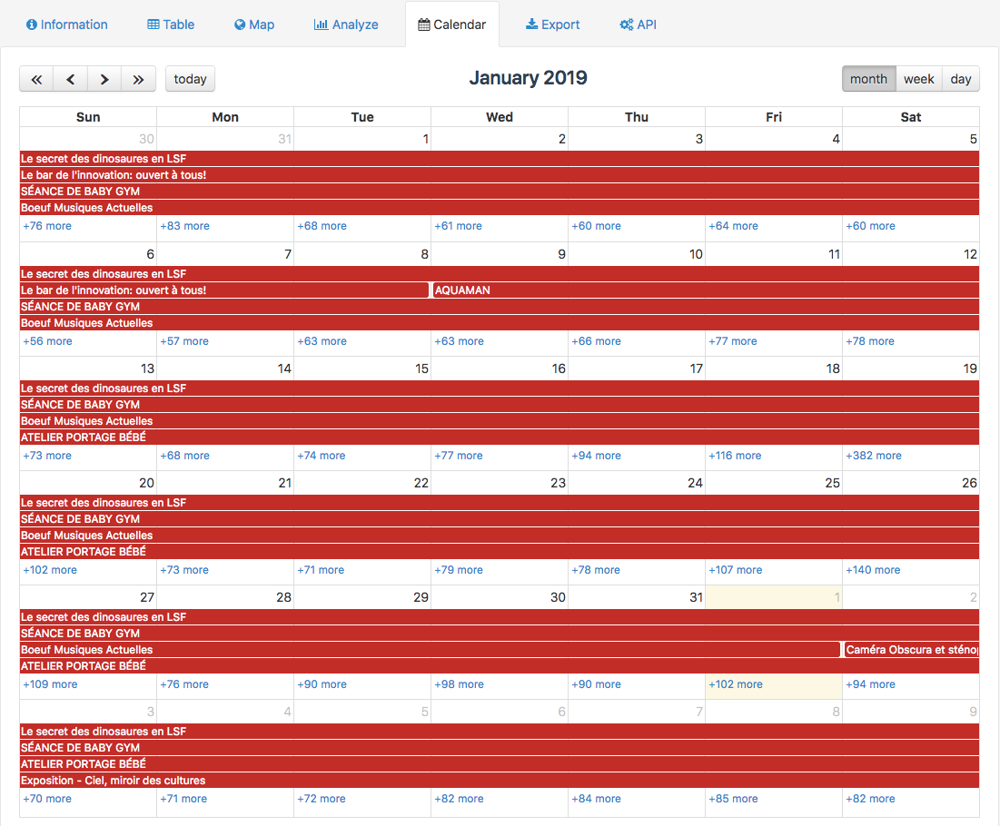
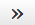

Visualizing data
================

Published datasets on an OpenDataSoft portal can be represented by up to 6 different visualizations. The number of available visualizations for a dataset completely depends on what kind of data the dataset contains. Among these 6 visualizations, there are 5 standard visualizations:

- the Table visualization, to visualize data in a table
- the Map visualization, to visualize data on a map
- the Analyze visualization, to visualize and analyze data through a chart
- the Images visualization, to visualize data through images
- the Calendar visualization, to visualize data in a calendar

The 6th visualization is called the "Custom view". It is completely optional and entirely custom. It means that even the label of the tab is chosen by the portal administrators, and they can differ from one dataset to another, even if they are on the same portal.

Visualizing data in a table
---------------------------

The Table visualization is accessible from the Table tab.

It displays a table containing all available fields from the dataset.

- In the header, the bold labels are the field names.
- In the table, each row represents a record. Each record contains several values.

.. admonition:: Note
   :class: note

   Hover over the field names to display the description of the field.

The Table visualization can be available for any dataset, no matter what kind of data it contains.

Visualizing data on a map
-------------------------

The Map visualization is accessible from the Map tab.

It displays a map, on which there are map markers indicating the geographical location of a record from the dataset. When clicking on a map marker, its related tooltip is displayed. It contains more information about the record.

.. admonition:: Note
   :class: note

   Since the tooltips can be completely customized, their content can differ a lot from one dataset to another. They can also be disabled.

.. admonition:: Note
   :class: note

   Sometimes, the map markers can be replaced by circles containing a number. Those are called "clusters": they appear on a map when there are too many map markers in the same spot for them all to be displayed individually. The number indicated on the cluster indicates how many map markers are "hidden" behind. Zoom in to see the map markers.

The map contains the a variety of buttons that allow to navigate and interact with the map:

* polygon |icon-polygon|, circle |icon-circle| and square |icon-square| buttons to draw on the map and filter on certain areas, along with the edit shape |icon-edit| and delete shape |icon-trash-map| buttons to go with them
* |icon-fullscreen| to view your map in fullscreen mode
* zoom in |icon-zoom-in| and zoom out |icon-zoom-out| buttons
* localize |icon-localize| button to focus the map on your current location

.. admonition:: Caution
   :class: caution

   Maps displayed in the Map tab cannot be customized, except from choosing another basemap when possible. To be able to customize a map, or cross data from different datasets, as well as to save a created map, use the :doc:`Map Builder <../../creating_maps_charts/01_creating_advanced_maps/overview-of-map-builder>`.

Visualizing data through a chart
--------------------------------

The chart visualization is accessible from the Analyze tab.

It displays a default chart, set by the portal administrators. It is however possible, and encouraged, to configure other charts to make other analysis than the default one.

Above the chart are displayed a variety of buttons and options to configure the chart:

- The first line is to configure the base of the chart.

  - X axis: to choose which field to use as X axis (horizontal line)
  - Max. number of points: to choose how many points should be represented on the chart
  - Default ordering: for points to be displayed in a decreasing order in the chart

- The second line is to define how the different series are represented.

  - Break down series: to separate the series into several groups
  - Stack: for series to be stacked one on top of the other
  - Add a serie: to display other series on the chart

- The third and last line is to configure series separately.

  - a scroll-down menu: to choose a chart type for the series
  - a color or color palette: to choose the color of the series
  - Y axis: to choose which field to use as Y axis (vertical line)
  - Use for ordering: for points to be displayed in a decreasing order in the chart, based on the chosen series

.. admonition:: Caution
   :class: caution

   Charts displayed in the Analyze tab can be modified. However, these modifications cannot be saved. To be able to save a created chart, as well as to cross data from different datasets, use the :doc:`Chart Builder <../../creating_maps_charts/02_creating_advanced_charts/analyze>`.

Visualizing data through images
-------------------------------

The images visualization is accessible from the Images tab.

It displays the thumbnails of the images of the dataset. When clicking on a thumbnail, the metadata of the image are displayed. Below the metadata is also displayed a Download image button, to download the selected image.

Visualizing data in a calendar
------------------------------

The calendar visualization is accessible from the Calendar tab.

It displays a calendar on which events of the dataset are displayed. When clicking on an event, its related tooltip is displayed. It contains more information about the event.

.. admonition:: Note
   :class: note

   Since the tooltips can be completely customized, their content can differ a lot from one dataset to another. They can also be disabled.

Above the calendar are displayed a variety of buttons to navigate the calendar:

- |icon-leftleft| and |icon-rightright| to see the dates of the current calendar page a year earlier or later
- |icon-left| and |icon-right| to see the month/week/day earlier or later the current calendar page
- Today to display today's calendar page
- month, week, day for the calendar page to display a whole month, week or just a day

.. |icon-polygon| image:: /creating_maps_charts/01_creating_advanced_maps/images/icon-polygon.png
    :width: 16px
    :height: 16px

.. |icon-circle| image:: /creating_maps_charts/01_creating_advanced_maps/images/icon-circle.png
    :width: 14px
    :height: 14px

.. |icon-square| image:: /creating_maps_charts/01_creating_advanced_maps/images/icon-square.png
    :width: 14px
    :height: 14px

.. |icon-edit| image:: /creating_maps_charts/01_creating_advanced_maps/images/icon-edit.png
    :width: 16px
    :height: 16px

.. |icon-trash-map| image:: /creating_maps_charts/01_creating_advanced_maps/images/icon-trash-map.png
    :width: 15px
    :height: 17px

.. |icon-fullscreen| image:: /creating_maps_charts/01_creating_advanced_maps/images/icon-fullscreen.png
    :width: 20px
    :height: 20px

.. |icon-zoom-in| image:: /creating_maps_charts/01_creating_advanced_maps/images/icon-zoom-in.png
    :width: 14px
    :height: 14px

.. |icon-zoom-out| image:: /creating_maps_charts/01_creating_advanced_maps/images/icon-zoom-out.png
    :width: 13px
    :height: 12px

.. |icon-localize| image:: /creating_maps_charts/01_creating_advanced_maps/images/icon-localize.png
    :width: 16px
    :height: 16px

