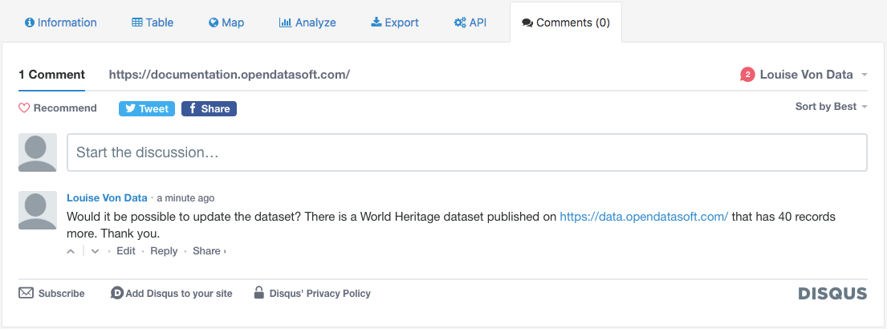

Commenting via Disqus
=====================

.. admonition:: Important
   :class: important

   Since Disqus is an optional feature, it is not activated on every OpenDataSoft portal. The activation of Disqus depends entirely on the portal administrators.

Disqus is a service that can be integrated into an OpenDataSoft portal. It allows users to post comments in order to share ideas, opinions or to ask questions about a dataset. It is also possible to answer another user's comment.

To comment on a dataset, or reply to someone's comment:

1. Go to the Comments tab of the chosen dataset.
2. (optional) If you are not authenticated on Disqus yet, choose an authentication option (through Disqus, Facebook, Google etc. or by creating a whole new Disqus account).
3. Either write a message in the "Start a discussion" texbox, or click on "Reply" under an existing comment to "Join the discussion".
4. Once the comment is fully written, click on the "Post as [Username]" button below the comment textbox.

.. admonition:: Note
   :class: note

   Disqus also allows sharing of comments or whole discussions through social networks.

.. admonition:: Caution
   :class: caution

   Disqus comments are moderated by the portal administrators, that can be recognized by the "MOD" inscription next to their Disqus username. They have the right and possibility to delete comments, as well as to ban users.
