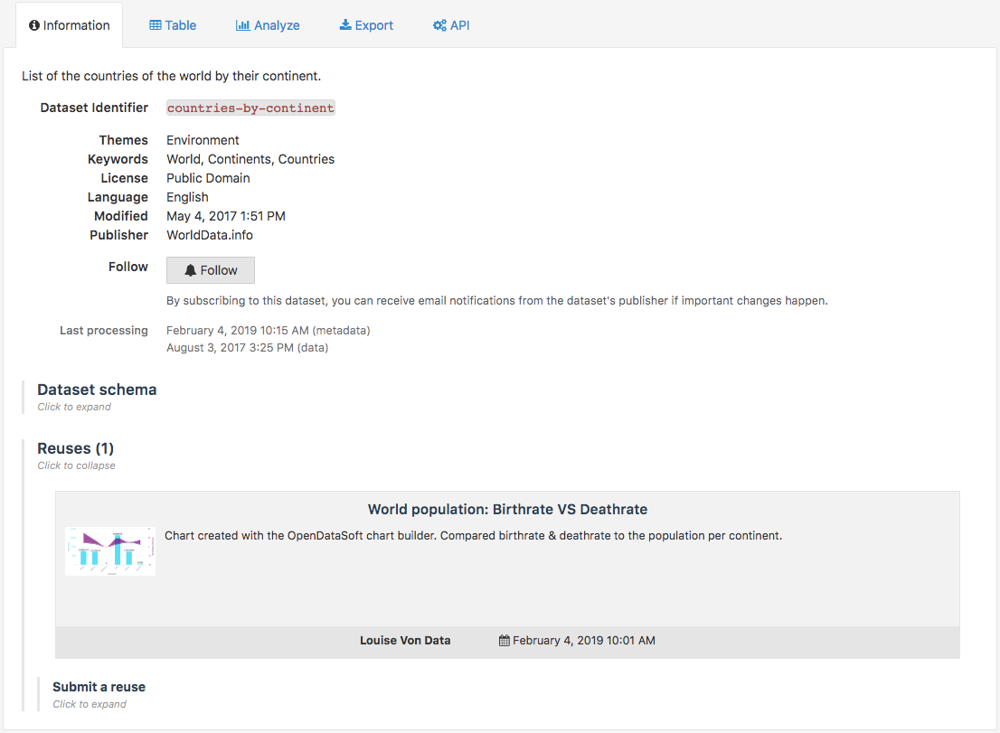
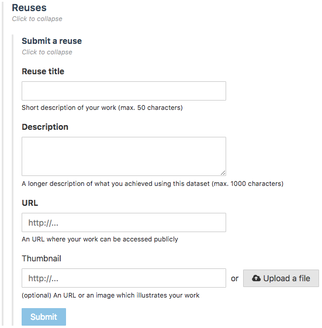

Discovering & submitting data reuses
====================================

.. admonition:: Important
   :class: important

   Since reuses are an optional feature, they are not activated on every OpenDataSoft portal. The activation of reuses depends entirely on the portal administrators.

Data reuses are creations based on data from datasets published on an open data portal. They can take many forms: from the map created with the Map Builder (or a chart with the Chart Builder), to the smartphone application, there are many possibilities of data reuses. As a user of an OpenDataSoft portal, it is possible to either discover the reuses that others have made, or to submit your very own reuse for it to be displayed on the related portal.

Discovering existing reuses
---------------------------

Existing reuses of a dataset, that have been approved by the portal administators, are listed in the Reuses area of the Information tab.

In the list of reuses, each reuse is displayed in a rectangle containing information about that reuse:

- Image preview of the reuse,
- Title of the reuse,
- Description of the reuse,
- Name of the author,
- Date when the reuse was added.

To discover a chosen dataset reuse, click on its rectangle.

Submitting own reuses
---------------------

For the data reuses to be displayed in the Reuses area of the Information tab of a dataset, the users who make these reuses must submit them to the portal administrators.

.. admonition:: Important
   :class: important

   On some OpenDataSoft portals, anonymous users are allowed to submit their reuses, but on other portals, only authenticated users are allowed to do so. This depends entirely on the portal administrators and how they choose to manage the reuse feature.

To submit a reuse, follow the procedure below:

1. In the Reuses area of the Information tab of the dataset used for the reuse, click on "Submit a reuse".
2. Fill in the form:

- Last name *(only for anonymous users)*
- First name *(only for anonymous users)*
- Email *(only for anonymous users)*
- Reuse title: give a title to the reuse
- Description: describe what kind of reuse it is, what it is about etc.
- URL: indicate the URL where the reuse is located
- Thumbnail: upload a image preview of the reuse

3. Click on the Submit button.

Once submitted, the reuse is sent to the portal administrators, who will be notified about it and can approve it. Once approved, the reuse is added to the reuses list of the Information tab.

.. admonition:: Note
   :class: note

   The portal administrators have the possibility to modify the title, description, URL and thumbnail of the reuse. They cannot, however, modify the submitted last name or first name
