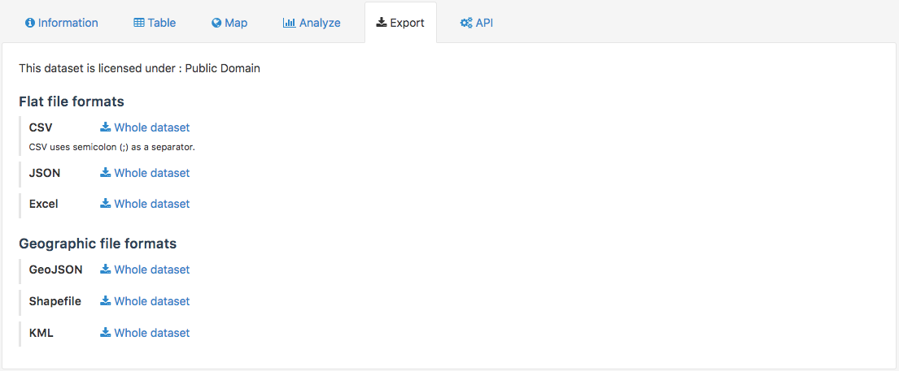

Exporting data
==============

OpenDataSoft datasets can be downloaded in various formats. Standard formats are always available, for any dataset. Other more specific formats can be available, but they depend on the nature of the data (i.e. if the dataset contains geographical coordinates or not).

In the Export tab of a dataset, the following formats can be available:

- CSV
- JSON
- Excel
- GeoJSON
- Shapefile
- KML

.. admonition:: Note
   :class: note

   Using the `OpenDataSoft Search API <https://help.opendatasoft.com/apis/ods-search-v2/#exporting-records>`_, it is possible to download the dataset in other formats.

1. Go to the Export tab of the dataset.
2. Choose the file format to download.
3. Click on "Whole dataset" next to the chosen format.

.. admonition:: Important
   :class: important

   If the dataset is filtered, it is possible to only download the filtered data. To do so, click on "Only the selected records" instead of "Whole dataset".

Exporting and downloading images
--------------------------------

Images imported into the platform can only be downloaded or exported one by one. There is no way to download all the images of a dataset at the same time.

Downloading an image
~~~~~~~~~~~~~~~~~~~~

1. In the front office, go to the Images visualization tab of the dataset containing the image(s) to download.
2. Click on the image to download.
3. At the bottom of the image's metadata, click on the Download image button.

Exporting dataset to retrieve image URL
~~~~~~~~~~~~~~~~~~~~~~~~~~~~~~~~~~~~~~~

1. In the front office, go the Export tab of the dataset containing the image(s) to export.
2. Export the whole dataset, or part of it if it's filtered.
3. Open the exported dataset in the spreadsheet software of your choice.
4. Find the field containing the URLs of the image and retrieve them.
